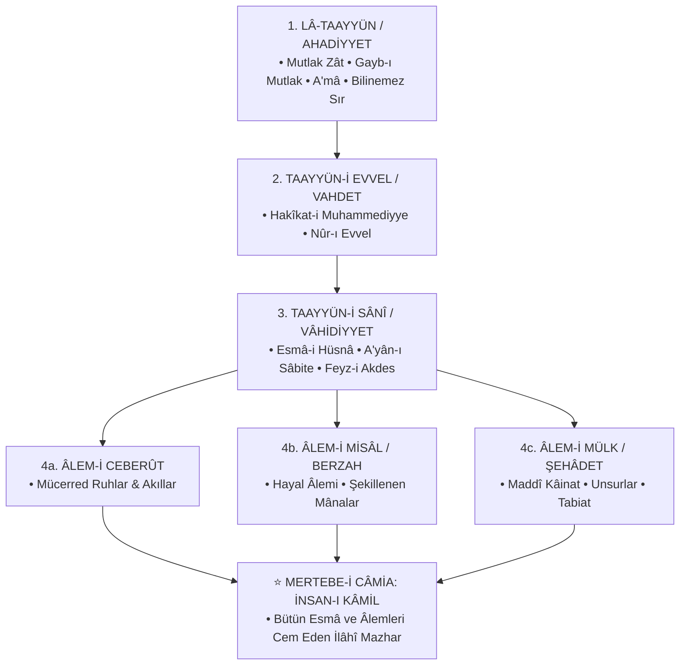

<div align="center">


<br/><br/>

[](https://github.com/arch-yunus/ibn-arabi-studies)
[](LICENSE)
[](texts/)
[](docs/ontology-maps.md)
[](https://github.com/arch-yunus/ibn-arabi-studies)

<br/>

> *«Biz öyle bir topluluğuz ki; sözlerimiz mecaz değil, doğrudan zevk ve keşif mahsulüdür. Dalgaların yüzeyine bakan köpük görür, dibe dalan ise incileri derer.»*  
> — **Muhyiddin İbnü'l-Arabî (eş-Şeyhü'l-Ekber / H. 560–638 / M. 1165–1240)**

<br/>

```text
       ░█░█░█▀█░█▀▄░█░█░█▀▄░█▀█░█░█░█▀▀░▀█▀░█░█░█▀▄░▀█▀░█▀▀░█▀▀
       ░█▀█░█▀█░█▀▄░█░█░█▀▄░█▀█░█▀▄░█▀▀░░█░░█░█░█░█░░█░░█▀▀░▀▀█
       ░▀░▀░▀░▀░▀░▀░▀▀▀░▀░▀░▀░▀░▀░▀░▀▀▀░░▀░░▀▀▀░▀▀░░▀▀▀░▀▀▀░▀▀▀
                  • ÉTUDES AKBARIENNES • AKBARIAN ONTOLOGY •
```

</div>

---

## 📑 Kapsamlı İçindekiler
1. [Külliyatın Vizyonu ve Mahiyeti](#-külliyatın-vizyonu-ve-mahiyeti)
2. [Ekberî Ontoloji Haritası & Merâtibü'l-Vücûd](#-ekberî-ontoloji-haritası--merâtibül-vücûd)
   - [Hazarât-ı Hams (Beş İlâhî Hazret)](#1-hazarât-ı-hams-beş-ilâhî-hazret)
   - [ASCII Ontolojik Akış Haritası](#2-ascii-ontolojik-akış-haritası)
   - [Dairelerin İnşası (*İnşâü'd-Devâir*) & Kozmik Çember](#3-dairelerin-inşası-inşâüd-devâir--kozmik-çember)
3. [Eserlerinden Doğrudan Alıntılar ve Derin Metin Analizleri](#-eserlerinden-doğrudan-alıntılar-ve-derin-metin-analizleri)
   - [*Fusûsü'l-Hikem* (Hikmetlerin Özleri)](#1-fusûsül-hikem-seçkileri)
   - [*el-Fütûhâtü'l-Mekkiyye* (Mekke Fetihleri)](#2-el-fütûhâtül-mekkiyye-seçkileri)
   - [*Tercümânü'l-Eşvâk* ve Şerhi *Zehâirü'l-A'lâk*](#3-tercümânül-eşvâk-ve-şerhi)
   - [*Risâletü'l-Vücûd & Kitâbü'l-İsfâr*](#4-risâletül-vücûd--kitâbül-isfâr)
   - [Diğer Küçük Risaleler (*Şeceretü'l-Kevn*, *Hilyetü'l-Abdâl*)](#5-diğer-küçük-risaleler)
4. [Şeyhü'l-Ekber Hakkında Tarihsel ve Çağdaş Tanıklıklar](#-şeyhül-ekber-hakkında-tarihsel-ve-çağdaş-tanıklıklar)
   - [Şârihler & İrfânî Gelenek (Ekberîlik)](#1-şârihler-ve-irfân-geleneği)
   - [Kelâmî, Fıkhî ve Selefî Eleştiriler](#2-kelâmî-fıkhî-ve-selefî-eleştiriler)
   - [Modern Akademik & Karşılaştırmalı Felsefî Okumalar](#3-modern-ve-çağdaş-felsefi-okumalar)
5. [Fusûsü'l-Hikem: 27 Peygamber ve Hikmet Matrisi](#-fusûsül-hikem-27-hikmet-ve-peygamber-matrisi)
6. [Kapsamlı Ekberî Kavramlar Sözlüğü (*Istılâhât-ı Sûfiyye*)](#-kapsamlı-ekberî-kavramlar-sözlüğü-ıstılâhât-ı-sûfiyye)
7. [Mukayeseli Felsefe Araştırmaları](#-mukayeseli-felsefe-araştırmaları)
   - [İbnü'l-Arabî & Baruch Spinoza](#1-ibnül-arabî--baruch-spinoza-vahdet-i-vücûd-vs-töz-monizmi)
   - [İbnü'l-Arabî & Martin Heidegger](#2-ibnül-arabî--martin-heidegger-seinsfrage--vücûd-mevcûd)
   - [İbnü'l-Arabî & Carl Gustav Jung](#3-ibnül-arabî--carl-gustav-jung-âlem-i-misâl--arketipler)
   - [İbnü'l-Arabî & Meister Eckhart](#4-ibnül-arabî--meister-eckhart-mistik-birlik)
8. [Depo ve Dizin Mimarisi](#-depo-ve-dizin-mimarisi)
9. [İnteraktif Araştırma Motoru (`tools/ekber_cli.py`)](#-interaktif-araştırma-motoru-toolsekber_clipy)
10. [Akademik Müfredat ve Okuma Metodolojisi](#-akademik-müfredat-ve-okuma-metodolojisi)
11. [Akademik Bibliyografya (BibTeX)](#-akademik-bibliyografya-bibtex)
12. [Katkı Protokolü & Akademik Standartlar](#-katkı-protokolü--akademik-standartlar)
13. [Lisans & Telif](#-lisans--telif)

---

## 🏛️ Külliyatın Vizyonu ve Mahiyeti

`ibn-arabi-studies`, Endülüslü arif, mutasavvıf ve metafizikçi **Muhyiddin İbnü'l-Arabî**'nin (1165–1240 / H. 560–638) eserleri, ontolojik doktrini (*Vahdet-i Vücûd*), kavram dağarcığı, hermeneutiği ve tarih boyunca Doğu-Batı düşüncesindeki yankılarını dizinlemek ve araştırmacılara sunmak amacıyla kurgulanmış devasa bir açık kaynak araştırma külliyatıdır.

İbnü'l-Arabî, sadece İslam tasavvufunun değil, dünya metafizik tarihinin en velûd ve sistem kurucu simalarından biridir. Varlığın birliği (*Vahdet-i Vücûd*), İnsan-ı Kâmil nazariyesi, Âlem-i Misâl (Mundus Imaginalis) ontolojisi ve kesintisiz yaratılış (*Tecellî-i Dâim*) doktrinleriyle kendisinden sonraki bütün İslam düşüncesini derinden etkilemiş; Osmanlı'dan İran'a, Hint alt kıtasından modern Batı felsefesine kadar silinmez izler bırakmıştır.

---

## 🧭 Ekberî Ontoloji Haritası & Merâtibü'l-Vücûd

Ekberî düşünce, varlığın birliği (*Vahdet-i Vücûd*) ve bu tek hakikatin farklı tecelli mertebelerinde (*Merâtibü'l-Vücûd*) zuhur etmesi temeline dayanır:

### 1. Hazarât-ı Hams (Beş İlâhî Hazret)



---

### 2. ASCII Ontolojik Akış Haritası

```text
                        [ LÂ-TAAYYÜN / AHADİYYET ]
                     (Mutlak Zât - İdrak Edilemez Sır)
                                   │
                                   ▼
                        [ VÂHİDİYYET / ULÛHİYYET ]
                   (İsimler, Sıfatlar ve Nisbetler Âlemi)
                                   │
                ┌──────────────────┴──────────────────┐
                ▼                                     ▼
       [ A‘YÂN-I SÂBİTE ]                    [ NEFES-İ RAHMÂNÎ ]
     (İlahi İlimdeki Ezeli                 (Varlık Hiyerarşisini
       İstidat Kalıpları)                    Açığa Çıkaran Nefes)
                │                                     │
                └──────────────────┬──────────────────┘
                                   ▼
                        [ ÂLEM-İ CEBERÛT / ERVÂH ]
                         (Mücerred Ruhlar Âlemi)
                                   │
                                   ▼
                        [ ÂLEM-İ MİSÂL / BERZAH ]
                      (Ruh ile Madde Arasındaki Hayal)
                                   │
                                   ▼
                        [ ÂLEM-İ MÜLK / ŞEHÂDET ]
                        (Somut, Duyulur Maddî Evren)
                                   │
                                   ▼
                           [ İNSAN-I KÂMİL ]
               (Bütün Mertebeleri Kendinde Cem Eden Ayna)
```

---

### 3. Dairelerin İnşası (*İnşâü'd-Devâir*) & Kozmik Çember

Şeyhü'l-Ekber, *İnşâü'd-Devâir* risalesinde kâinatı iç içe geçmiş küreler ve daireler halinde resmeder:

```text
                  ┌─────────────────────────────────┐
                  │       MUTLAK GAYB (ZÂT)         │
                  │   "Gizli bir hazine idim..."    │
                  └────────────────┬────────────────┘
                                   │
                                   ▼
                  ┌─────────────────────────────────┐
                  │    KAVS-I NÜZÛL (İniş Yayı)     │
                  │  Ruhlar ➔ Misâl ➔ Cisimler      │
                  └────────────────┬────────────────┘
                                   │
                                   ▼
                  ┌─────────────────────────────────┐
                  │   MADDİ ÂLEM (En Kesif Nokta)   │
                  │         Arz ve Tabiat           │
                  └────────────────┬────────────────┘
                                   │
                                   ▼
                  ┌─────────────────────────────────┐
                  │    KAVS-I URÛC (Çıkış Yayı)     │
                  │    Sülûk ➔ Keşif ➔ Fenâ-Bekâ    │
                  └────────────────┬────────────────┘
                                   │
                                   ▼
                  ┌─────────────────────────────────┐
                  │   İNSAN-I KÂMİL / CEM MAKAMI   │
                  │    Dairenin Tamamlandığı Nokta  │
                  └─────────────────────────────────┘
```

---

## 📜 Eserlerinden Doğrudan Alıntılar ve Derin Metin Analizleri

### 1. *Fusûsü'l-Hikem* Seçkileri

#### 🪞 Âdem Kelimesindeki İlahi Hikmet (*Fass-ı Hikmet-i İlâhiyye*)
> *"Hakk, isimlerinin (esmâ) ve sıfatlarının tecellilerini bütünüyle göreceği kuşatıcı bir varlık dilediğinde âlemi yarattı. Fakat âlem, içinde ruh bulunmayan cilalanmamış bir ayna gibiydi. Âlemde cilalanma henüz gerçekleşmemişti; çünkü Hakk'ın emri kemalini ancak zuhur ile bulur. Âdem'in var edilmesiyle o ayna cilalandı; Âdem, o aynanın cilası ve o suretin ruhu oldu."*  
> — *Fusûsü'l-Hikem, Fasl I* • [Ayrıntılı Metin & Şerh](texts/fusus-al-hikam/01-fass-adem-hikmet-i-ilahiyye.md)

#### 🌊 Nûh Kelimesindeki Tenzihî Hikmet (*Fass-ı Hikmet-i Sübbûhiyye*)
> *"Bil ki tenzih ehli, Hakk'ı sınırlandırmış ve mukayyet kılmıştır. Çünkü sırf tenzih yapan kimse Hakk'ı mahlukattan tecrit ederken O'nu bir yöne hapseder. Teşbih ehli de O'nu sınırlandırmıştır. Hakiki arif ise hem tenzih hem teşbihi cem eder. 'O'nun benzeri hiçbir şey yoktur ve O her şeyi işiten ve görendir.' (Şûrâ, 42/11)"*  
> — *Fusûsü'l-Hikem, Fasl III* • [Ayrıntılı Metin & Şerh](texts/fusus-al-hikam/03-fass-nuh-hikmet-i-subbuhiyye.md)

#### 🏔️ İsmâil Kelimesindeki Yücelik Hikmeti (*Fass-ı Hikmet-i Aliyye*)
> *"Bil ki 'Rabb' isminin senden talep ettiği şey ile senin O'ndan talep ettiğin şey birbirine bağlıdır. Rab, kulun ubûdiyyeti (kulluğu) ile zahir olur; kul ise Rabbin rubûbiyyeti ile kaimdir. Eğer O olmasaydı biz var olamazdık; eğer biz olmasaydık O'nun isimlerinin tecellisi zahir olmazdı."*  
> — *Fusûsü'l-Hikem, Fasl VI* • [Ayrıntılı Metin & Şerh](texts/fusus-al-hikam/07-fass-ismail-hikmet-i-aliyye.md)

#### 🌙 Yûsuf Kelimesindeki Nûrânî Hikmet (*Fass-ı Hikmet-i Nûriyye*)
> *"Hz. Peygamber (s.a.v.) buyurdu: 'İnsanlar uykudadırlar, öldükleri zaman uyanırlar.' İşte bu dünya hayatı baştan başa bir uykudur; içinde görülen şeyler rüyadır. Hz. Yûsuf rüyada on bir yıldız, güneş ve ayın kendisine secde ettiğini gördüğünde, bu suretler Âlem-i Misâl'deki mânanın sembolleriydi."*  
> — *Fusûsü'l-Hikem, Fasl IX* • [Ayrıntılı Metin & Şerh](texts/fusus-al-hikam/09-fass-yusuf-hikmet-i-nuriyye.md)

#### ❤️ Şuayb Kelimesindeki Kalbî Hikmet (*Fass-ı Hikmet-i Kalbiyye*)
> *"Kalp, Hakk'ın tecellilerinin genişliğine göre genişler ve daralır; çünkü tecellide tekrar yoktur (**Lâ tekrâra fi't-tecellî**). Arif kişinin kalbi belli bir inancın ve itikadın düğümüne hapsolmaz. Hakk hangi surette tecelli ederse O'nu o surette tanır. Mukayyed inanç sahipleri ise Hakk'ı yalnızca kendi zihinlerindeki putta/kalıpta kabul eder, gayrısında inkâr ederler."*  
> — *Fusûsü'l-Hikem, Fasl XII* • [Ayrıntılı Metin & Şerh](texts/fusus-al-hikam/12-fass-suayb-hikmet-i-kalbiyye.md)

#### 🕊️ Îsâ Kelimesindeki Nebevî Hikmet (*Fass-ı Hikmet-i Nebeviyye*)
> *"Hz. Îsâ'nın zuhuru, Cebrail'in Hz. Meryem'e üflediği nefes ile gerçekleşti. Bu yüzden onda diriltme (ihyâ) sıfatı baskındır. Cebrail'in nefesi, Rahmân'ın kâinata varlık veren nefesinin (Nefes-i Rahmânî) cüz'î bir mazharı idi. Îsâ (a.s.), Hakk'ın kelimesi ve ruhudur."*  
> — *Fusûsü'l-Hikem, Fasl XV* • [Ayrıntılı Metin & Şerh](texts/fusus-al-hikam/15-fass-isa-hikmet-i-nebeviyye.md)

#### 👑 Muhammed Kelimesindeki Ferdiyyet Hikmeti (*Fass-ı Hikmet-i Ferdiyye*)
> *"Hz. Muhammed'in (s.a.v.) hikmeti 'Ferdiyyet'tir; çünkü o, bu insan türünün en kâmil mazharı ve varlığın ilk taayyünüdür. Hadis-i şerifte buyuruldu: 'Bana dünyanızdan üç şey sevdirildi: Kadın, güzel koku ve gözümün nuru kılınan namaz.' Kadın mazharında Hakk'ı müşahede etmek en kâmil müşahededir."*  
> — *Fusûsü'l-Hikem, Fasl XXVII* • [Ayrıntılı Metin & Şerh](texts/fusus-al-hikam/27-fass-muhammed-hikmet-i-ferdiyye.md)

---

### 2. *el-Fütûhâtü'l-Mekkiyye* Seçkileri

#### 🕊️ Bab 1: Marifet-i Rûh ve Kâbe'deki Ruhanî Genç (*el-Fetâ*)
> *"Mekke'de Harem-i Şerif'te Kâbe'yi tavaf ederken Hacerü'l-Esved'in karşısında nûrânî bir genç (el-Fetâ) ile karşılaştım. O hem konuşan hem susan, hem cisim hem ruhtu. Ona sordum: 'Sen kimsin?' Dedi ki: 'Ben konuşan Kâbe'yim; varlığın sırrıyım.' İşte Fütûhât'ta yazılanlar, o gencin bana remzettiği hakikatlerin açılımıdır."*  
> — *el-Fütûhâtü'l-Mekkiyye, Bab 1* • [İncele](texts/futuhat-al-makkiyya/bab-001-marifet-i-ruh.md)

#### 🌌 Bab 63: Varlığın Aslı ve Hayal Mertebesi
> *"Ey talip! Bil ki sen bir hayalsin; algıladığın ve 'benim dışımda var' dediğin her şey de hayal içinde hayaldir. Hakiki ve mutlak varlık yalnızca Hakk Teâlâ'dır. Kesret (çokluk), vahdet denizinin yüzeyindeki kabarcıklar ve dalgalar gibidir. Suretlere takılıp kalan dalgayı müstakil sanır; tahkik ehli ise denizin tekliğini müşahede eder."*  
> — *el-Fütûhâtü'l-Mekkiyye, Bab 63* • [İncele](texts/futuhat-al-makkiyya/bab-063-alem-i-hayal-ve-kesret.md)

#### 🌬️ Bab 198: İlahî Nefes ve Kozmik Harfler (*Nefes-i Rahmânî*)
> *"Eşya, Rahmân'ın nefesinde açığa çıkan harfler gibidir. İnsan nefes verirken harflerin ağız mahreçlerinde belirmesi gibi; Hakîm olan Yaratıcı da 'Kün' (Ol) emrinin nefesiyle mümkinatın harflerini Âlem levhasına nakşetmiştir. Bütün kâinat, Hakk'ın telaffuz ettiği bitimsiz bir kelimeler manzumesidir."*  
> — *el-Fütûhâtü'l-Mekkiyye, Bab 198* • [İncele](texts/futuhat-al-makkiyya/bab-198-nefes-i-rahmani-ve-huruf.md)

#### ⏳ Bab 390: Zaman ve Anın Hakikati (*Ân-ı Dâim*)
> *"Zaman, seninle tecelli arasındaki nisbetten ibarettir. Ne geçmiş vardır ne gelecek; gerçekte olan yalnızca 'Ân-ı Dâim'dir (Sürekli Şimdiki Zaman). Her nefeste bir yaratılış, her anda yeni bir tecelli zuhur eder; lakin gaflet ehli bunu kesintisiz bir süreklilik zanneder."*  
> — *el-Fütûhâtü'l-Mekkiyye, Bab 390* • [İncele](texts/futuhat-al-makkiyya/bab-390-zaman-ve-an-i-daim.md)

#### 📜 Bab 558: Sâliklere Vasiyetler ve Şeriatın Korunması
> *"Sana vasiyetim şudur: Hiçbir varlığı hakir görme; çünkü Hakk Teâlâ hiçbir şeyi bâtıl ve abes yaratmamıştır. Şeriatın zâhir sınırlarına kıldan ince riayet et; zira zâhir şeriatı korumayanın bâtın hakikati zındıklıktır."*  
> — *el-Fütûhâtü'l-Mekkiyye, Bab 558* • [İncele](texts/futuhat-al-makkiyya/bab-558-vasiyetler-ve-nasihatler.md)

---

### 3. *Tercümânü'l-Eşvâk* ve Şerhi

#### 🌹 Kalbin Evrenselliği (*11. Kaside*)
```text
لقد صارَ قلبي قابلاً كلَّ صورةٍ
فَمَرْعىً لِغِزْلانٍ ودَيْرٌ لرُهْبانِ
وبَيْتٌ لأوْثانٍ وكَعْبَةُ طائفٍ
وألْواحُ تَوْراةٍ ومُصْحَفُ قُرْآنِ
أدِينُ بدِينِ الحُبِّ أنّى تَوَجَّهَتْ
رَكائِبُهُ فالحُبُّ دِيني وإيماني
```

> *"Kalbim her sûreti kabul eder bir hâle geldi;  
> Ceylanların otlağı, keşişlerin manastırı,  
> Putların tapınağı, hacıların Kâbe'si,  
> Tevrat'ın levhaları ve Kur'ân'ın mushafı...  
> Ben aşk dinine tâbiyim; aşkın kervanı hangi yöne yönelirse yönelsin,  
> İşte benim dinim ve imanım odur."*  
>  
> *(Şeyh'in Kendi Şerhi - Zehâirü'l-A'lâk'tan):*  
> *"Bu beyitlerde geçen 'ceylan', ilahi sırların peşinde koşan letaiftir; 'manastır', ruhani makamların tecrit halidir; 'putlar', esmâ tecellilerinin mazharlarıdır. Kalb-i arif, hiçbir tecelli suretinden mahrum kalmayacak kadar genişlemiştir."*  
> — [Ayrıntılı Şiir & Zehâirü'l-A'lâk Tahlili](texts/tarjuman-al-ashwaq/kaside-11-kalbin-evrenselligi-ve-sehri.md)

---

### 4. *Risâletü'l-Vücûd* & *Kitâbü'l-İsfâr*

#### 🌿 Vahdetin İzahı
> *"Eğer kendini bilirsen, varlığının senin olmadığını, ancak O'nun varlığı olduğunu anlarsın. Sen ne O'sun ne de O'ndan gayrısın. O'na bakarken O'nun gözüyle bakarsın; O'nu O'ndan başka kimse göremez ve bilemez."*  
> — *Risâletü'l-Vücûd* • [İncele](texts/minor-treatises/risaletu-l-vucud.md)

#### 🚶‍♂️ Seyrü's-Sülûk ve Üç Sefer
> *"Varlıkta üç büyük sefer vardır:  
> 1. **Hakk'a Sefer:** Kesret karanlığından vahdet nuruna hicret.  
> 2. **Hakk'ta Sefer:** İsimler ve sıfatlar deryasında sonsuz müşahede.  
> 3. **Hakk'tan Halka Sefer:** Cem makamından sonra fark makamına inerek, halkı Hakk ile irşad etme yolculuğu."*  
> — *Kitâbü'l-İsfâr an Netâici'l-Esfâr* • [İncele](texts/minor-treatises/kitabu-l-isfor-an-netaic-il-esfar.md)

---

### 5. Diğer Küçük Risaleler
- 🌳 [Şeceretü'l-Kevn](texts/minor-treatises/seceretu-l-kevn.md): Kâinat Ağacı, Kün emri tohumu ve İnsan-ı Kâmil meyvesi.
- ⭕ [İnşâü'd-Devâir](texts/minor-treatises/insau-d-devair.md): Daireler teorisi, Vücûd-ı Mutlak, Adem-i Mutlak ve Vücûd-ı Mümkin.
- ✨ [Hilyetü'l-Abdâl](texts/minor-treatises/huliyyetu-l-abdal.md): Sülûkün Dört Esası (*Sükût, Uzlet, Cû‘, Seher*).

---

## 💬 Şeyhü'l-Ekber Hakkında Tarihsel ve Çağdaş Tanıklıklar

İbnü'l-Arabî, Doğu ve Batı entelektüel tarihinde hakkında en çok eser yazılan, bir kesim tarafından *Kutbü'l-Ârifîn* ve *Hâtemü'l-Velâye* ilan edilirken diğer kesimce şiddetle tenkit edilen benzersiz bir şahsiyettir.

---

### 1. Şârihler ve İrfân Geleneği

| Müellif | Dönem / Ekol | Beyan / Değerlendirme | İlgili Dosya |
| :--- | :--- | :--- | :--- |
| **Sadreddin Konevî** | 13. yy / Doğrudan Talebesi | *"Şeyhimiz İbnü'l-Arabî, ilahî marifetlerin nihayetine ermiş, zâhir ve bâtın ilimlerini cem etmiş bir tahkik sultanıdır. Fusûs'un gayesi, akli çıkarımların ötesinde tevhidin keşfî ispatıdır."* | [Konevî Tahlili](commentaries/sadreddin-konevi/miftahu-l-gayb-ve-fukuk.md) |
| **Dâvûd-i Kayserî** | 14. yy / Osmanlı İlk Müderrisi | *"Şeyhü'l-Ekber'in eserleri, varlığın mertebelerini ve hakikatini açıklayan ilahi nurlardır. Onun ıstılahlarını anlamadan tasavvuf ve metafizik tahsil edilemez."* | [Kayserî Mukaddimesi](commentaries/davud-al-qaysari/matla-u-hususi-l-kelim.md) |
| **Abdürrezzâk el-Kâşânî** | 14. yy / Ekberî Şârih | *"O, hakikatin sırlarını harflerin libasına bürüyerek nâehle perdelemiş; basiret sahiplerine ise marifet kapılarını ardına kadar açmıştır."* | [Kâşânî Şerhi](commentaries/abd-al-razzaq-kashani/serhu-fususi-l-hikem.md) |
| **Molla Câmî** | 15. yy / Şair & Filozof | *"Fusûs'un her bir kelimesi, ledünnî bir deryadan fışkıran hikmet pınarıdır. O pınardan ancak arınmış canlar içebilir."* | [Şârihler Dizini](commentaries/README.md) |
| **Abdülganî en-Nablusî** | 17-18. yy / Şam Allâmesi | *"Vahdet-i Vücûd ile hulûl ve ittihad arasındaki farkı bilmeyenler Şeyh'e taan ederler. Varlık birdir, mevcudat ise O'nun nûrunun mazharıdır."* | [Nablusî Tahlili](commentaries/abd-al-ghani-al-nabulusi/cevahiru-n-nusus.md) |
| **İsmail Hakkı Bursevî** | 17-18. yy / Osmanlı Sûfisi | *"Şeyh-i Ekber'in kelâmı vahiy menbaından feyz almıştır; onun remizleri zâhir ulemasının havsalasını aşar."* | [Bursevî İncelemesi](commentaries/ismail-hakki-bursevi/kitabu-l-hitab.md) |
| **İbn Âbidîn** | 19. yy / Hanefî Fakihi | *"Şeyh Muhyiddin, kâmil bir veli ve ariftir. Sözlerinin zahiriyle amel etmek veya zahirine bakıp hüküm vermek avam için caiz değildir; lakin ona taan etmek de hüsrandır."* | [Müdafaanâmeler](scholarship/critique-and-defense/ekberi-mudafaanameler.md) |

---

### 2. Kelâmî, Fıkhî ve Selefî Eleştiriler

> *"Fusûsü'l-Hikem ve el-Fütûhât'ta yer alan pek çok ibare, dinin zahir naslarına, Selef-i Sâlihîn'in icmaına açıkça muhaliftir. 'Varlık birdir' iddiası tevhid değil; Yaratan ile yaratılanı bir kılan tehlikeli bir ilhaddır."*  
> — **Takıyyüddin İbn Teymiyye** (*Mecmûu'l-Fetâvâ*) • [Eleştirilerin Anatomisi](scholarship/critique-and-defense/ibn-teymiyye-ve-selefi-elestiriler.md)

> *"Şeyh Muhyiddin büyük bir zekâ ve geniş bir bilgi sahibidir; lâkin eserlerindeki sembolik ve muğlak ifadeler, avamın itikadını zedeleyecek mahiyettedir. Ehil olmayanların bu kitapları mütalaası men edilmelidir."*  
> — **İbn Haldun** (*Şifâü's-Sâil*) • [İbn Haldun Değerlendirmesi](scholarship/critique-and-defense/ibn-haldun-sifau-s-sail.md)

> *"Onun sözlerinin zahiri küfrü andırır; fakat tasavvuf ehlinin kendilerine has ıstılahları vardır. Kendisini tekfir etmekten sakınmak, fakat sözlerini taklit etmekten de uzak durmak en selametli yoldur."*  
> — **İbn Hacer el-Askalânî** • [Tahlil](scholarship/critique-and-defense/ekberi-mudafaanameler.md)

---

### 3. Modern ve Çağdaş Felsefi Okumalar

> *"İbnü'l-Arabî, ontolojik derinlik bakımından insanlık tarihinin gördüğü en devasa sistem kuruculardan biridir. Onun 'Vahdet-i Vücûd' ve 'Âlem-i Misâl' teorileri, Spinoza'nın töz kuramını ve Hegel'in diyalektiğini yüzyıllar öncesinden çok daha zengin bir irfani zeminle kuşatmıştır."*  
> — **Toshihiko Izutsu** (*Sufism and Taoism*)

> *"Şeyhü'l-Ekber'den sonra İslam dünyasında felsefe veya tasavvuf yapan hiç kimse, onun kurduğu kavramsal sözlüğü kullanmadan tek bir cümle dahi kuramamıştır. Kabul eden de reddeden de onun terminolojisinde düşünmek zorundadır."*  
> — **William Chittick** (*The Sufi Path of Knowledge*)

> *"İbnü'l-Arabî'nin 'Hayal Âlemi' (Mundus Imaginalis) kavramı olmaksızın, Doğu'nun tinsel coğrafyasını ve rüya fenomenolojisini anlamak imkânsızdır."*  
> — **Henry Corbin** (*Creative Imagination in the Sufism of Ibn Arabi*)

> *"İbn Arabî okumak, varlığın sırrına doğru yapılan bir şuur seferidir. O, aklın bittiği yerde kalbin ve basiretin gözünü açar."*  
> — **Prof. Dr. Mahmut Erol Kılıç** (*Şeyh-i Ekber: İbn Arabî Düşüncesine Giriş*)

---

## 🧩 Fusûsü'l-Hikem: 27 Hikmet ve Peygamber Matrisi

| # | Peygamber / Fass | Temsil Ettiği Hikmet | Temel Teolojik / Ontolojik Mesele | Doküman |
| :---: | :--- | :--- | :--- | :---: |
| 1 | **Hz. Âdem** | Hikmet-i İlâhiyye | Âlemin yaratılışı, cilalanmamış ayna metaforu ve hilafet | [Metin & Şerh](texts/fusus-al-hikam/01-fass-adem-hikmet-i-ilahiyye.md) |
| 2 | **Hz. Şît** | Hikmet-i Nefsiyye | Hibe, bağış, ilahi isimlerin sırları ve feyz mertebeleri | [Fusûs Dizini](texts/fusus-al-hikam/README.md) |
| 3 | **Hz. Nûh** | Hikmet-i Sübbûhiyye | Tenzih ve teşbih dengesi; tevhîdin mutlak kuşatıcılığı | [Metin & Şerh](texts/fusus-al-hikam/03-fass-nuh-hikmet-i-subbuhiyye.md) |
| 4 | **Hz. İdrîs** | Hikmet-i Kuddûsiyye | Yücelik (*Ulüvv*) mertebesi ve mekânsal tenzih | [Fusûs Dizini](texts/fusus-al-hikam/README.md) |
| 5 | **Hz. İbrâhîm** | Hikmet-i Müheymiyye | Aşkta fena hali, sarhoşluk ve ilahi dostluk (*Hullet*) | [Fusûs Dizini](texts/fusus-al-hikam/README.md) |
| 6 | **Hz. İshâk** | Hikmet-i Hakkiyye | Rüyaların tabiri, suret-mâna geçişi ve kurban sırrı | [Fusûs Dizini](texts/fusus-al-hikam/README.md) |
| 7 | **Hz. İsmâil** | Hikmet-i Aliyye | Rıza makamı ve rubûbiyyet-ubûdiyyet karşılıklılığı | [Metin & Şerh](texts/fusus-al-hikam/07-fass-ismail-hikmet-i-aliyye.md) |
| 8 | **Hz. Yâkûb** | Hikmet-i Rûhiyyet | Dinî teslimiyet, sabır ve kalbî istikamet | [Fusûs Dizini](texts/fusus-al-hikam/README.md) |
| 9 | **Hz. Yûsuf** | Hikmet-i Nûriyye | Âlem-i Misâl, rüya ontolojisi, aktif imajinasyon | [Metin & Şerh](texts/fusus-al-hikam/09-fass-yusuf-hikmet-i-nuriyye.md) |
| 10 | **Hz. Hûd** | Hikmet-i Ahadiyye | Sırat-ı müstakîm ve her varlığın perçeminden tutulması | [Fusûs Dizini](texts/fusus-al-hikam/README.md) |
| 11 | **Hz. Sâlih** | Hikmet-i Fethiyye | İlahi fethin açılışı ve mucizenin hakikati | [Fusûs Dizini](texts/fusus-al-hikam/README.md) |
| 12 | **Hz. Şuayb** | Hikmet-i Kalbiyye | Kalbin değişkenliği ve tecellide tekrar olmaması (*Lâ tekrâr*) | [Metin & Şerh](texts/fusus-al-hikam/12-fass-suayb-hikmet-i-kalbiyye.md) |
| 13 | **Hz. Lût** | Hikmet-i Melekiyye | Kudret, tasarruf, himmet ve kulun acziyet dengesi | [Fusûs Dizini](texts/fusus-al-hikam/README.md) |
| 14 | **Hz. Üzeyr** | Hikmet-i Kadriyye | Kader sırrı, diriliş ve a‘yân-ı sâbite istidatları | [Fusûs Dizini](texts/fusus-al-hikam/README.md) |
| 15 | **Hz. Îsâ** | Hikmet-i Nebeviyye | Nefes-i Rahmânî ile dirilme ve kelime-ruh sırrı | [Metin & Şerh](texts/fusus-al-hikam/15-fass-isa-hikmet-i-nebeviyye.md) |
| 16 | **Hz. Süleymân** | Hikmet-i Rahmâniyye | Rahmaniyet ve Rahimiyet; mülk, saltanat ve tasarruf | [Fusûs Dizini](texts/fusus-al-hikam/README.md) |
| 17 | **Hz. Dâvûd** | Hikmet-i Vücûdiyye | Hilafet, demirin yumuşatılması ve adaletle hüküm | [Fusûs Dizini](texts/fusus-al-hikam/README.md) |
| 18 | **Hz. Yûnus** | Hikmet-i Nefesiyye | Tabiatın karanlığı ve balığın karnındaki tesbih | [Fusûs Dizini](texts/fusus-al-hikam/README.md) |
| 19 | **Hz. Eyyûb** | Hikmet-i Gaybiyye | Bela, sabır, teslimiyet ve su ile arınmanın şifası | [Fusûs Dizini](texts/fusus-al-hikam/README.md) |
| 20 | **Hz. Yahyâ** | Hikmet-i Celâliyye | İlahi isimlerin celali, tenzih ve bekâ hali | [Fusûs Dizini](texts/fusus-al-hikam/README.md) |
| 21 | **Hz. Zekeriyyâ** | Hikmet-i Mâlikiyye | İhtiyarlıkta gelen rahmet ve yokluktan varlık bağışı | [Fusûs Dizini](texts/fusus-al-hikam/README.md) |
| 22 | **Hz. İlyâs** | Hikmet-i İnsiyye | Tabiat ile akıl, semavîlik ile arzîlik arasındaki denge | [Fusûs Dizini](texts/fusus-al-hikam/README.md) |
| 23 | **Hz. Lokmân** | Hikmet-i İhsâniyye | Şirkten arınma, hikmetin derinliği ve basiret | [Fusûs Dizini](texts/fusus-al-hikam/README.md) |
| 24 | **Hz. Hârûn** | Hikmet-i İmâmiyye | Surete tapınma uyarısı, şefkat ve rahmetin önceliği | [Fusûs Dizini](texts/fusus-al-hikam/README.md) |
| 25 | **Hz. Mûsâ** | Hikmet-i Ulviyye | Firavun ile münazara, asâ mucizesi, tecellî-i zât | [Fusûs Dizini](texts/fusus-al-hikam/README.md) |
| 26 | **Hz. Hâlid b. Sinân** | Hikmet-i Samediyye | Berzah âleminin haberleri ve fetret devri irfânı | [Fusûs Dizini](texts/fusus-al-hikam/README.md) |
| 27 | **Hz. Muhammed (s.a.v.)** | Hikmet-i Ferdiyye | Varlığın gayesi, üç sevdirilen şey ve Hatm-i Nübüvvet | [Metin & Şerh](texts/fusus-al-hikam/27-fass-muhammed-hikmet-i-ferdiyye.md) |

---

## 📖 Kapsamlı Ekberî Kavramlar Sözlüğü (*Istılâhât-ı Sûfiyye*)

| Kavram | Arapça İbare | Anlamı ve Ontolojik Karşılığı |
| :--- | :--- | :--- |
| **Vahdet-i Vücûd** | وحدة الوجود | Varlığın ontolojik birliği; mutlak anlamda var olan yalnızca Hakk'tır, kesret O'nun tecellisidir. |
| **A‘yân-ı Sâbite** | الأعيان الثابتة | Eşyanın henüz dış dünyada zuhur etmeden önce ilahi ilimdeki ezeli suretleri ve kabiliyetleri. |
| **İnsan-ı Kâmil** | الإنسان الكامل | Bütün ilahi isim ve sıfatların mazharı olan, âlemin manevi direği ve kâinatın gözbebeği insan. |
| **Nefes-i Rahmânî** | النفس الرحماني | İlahi rahmetin mümkinata varlık kazandırması; harflerin ve suretlerin zuhur vasıtası. |
| **Âlem-i Misâl (Berzah)** | عالم المثال / البرزخ | Ruhaniyet ile cismaniyet arasında köprü kuran, mânanın şekil aldığı ontolojik ara boyut. |
| **Hazarât-ı Hams** | الحضرات الخمس | Varlığın iniş ve çıkış sürecini tarif eden 'Beş İlahi Mertebe' (Zât, Sıfat, Melekût, Mülk, İnsan). |
| **Tecellî-i Dâim** | التجلي الدائم | Tecellinin kesintisizliği; yaratılışın her an yeniden gerçekleşmesi (*Külli yevmin hüve fî şe'n*). |
| **Lâ Tekrâra fi't-Tecellî** | لا تكرار في التجلي | Tecellide tekrar yoktur; Hakk hiçbir kula aynı surette iki kez görünmez. |
| **Hakîkat-i Muhammediyye** | الحقيقة المحمدية | Varlığın ilk taayyünü, Nûr-ı Muhammedî; kâinatın yaratılış çekirdeği ve ilk aklı. |
| **Feyz-i Akdes** | الفيض الأقدس | Zât'ın kendi zâtına tecellisiyle a‘yân-ı sâbitenin ve ezelî istidatların ilâhî ilimde belirlenmesi. |
| **Feyz-i Mukaddes** | الفيض المقدس | A‘yân-ı sâbitenin istidatlarına göre haricî vücûd kazanarak dış dünyada zuhûra gelmesi. |
| **Hakkü'l-Yakîn** | حق اليقين | Varlık ikiliğinin tamamen ortadan kalktığı, tevhîdin bizzat zevk ve tecrübe ile bilindiği son makam. |
| **Ân-ı Dâim** | الآن الدائم | Zamanın akışının ötesinde, geçmiş ve geleceği kuşatan kesintisiz ilâhî tecelli şimdisi. |
| **Fenâ Fillâh** | الفناء في الله | Kulun kendi izafi varlığından ve benliğinden geçerek Hakk'ın zâtında ifna olması. |
| **Bekâ Billâh** | البقاء بالله | Fenâ makamından sonra kulun ilâhî ahlâk ve esmâ tecellileriyle yeniden varlık kazanması. |

> 📌 *Daha geniş 50+ kavramlık detaylı sözlük için [docs/terminology-glossary.md](docs/terminology-glossary.md) dosyasına bakabilirsiniz.*

---

## ⚖️ Mukayeseli Felsefe Araştırmaları

### 1. İbnü'l-Arabî & Baruch Spinoza: Vahdet-i Vücûd vs. Töz Monizmi
- **Spinoza:** *Deus sive Natura* (Tanrı ya da Doğa). Tanrı ile doğa özdeştir; aşkın (transcendent) bir Tanrı yoktur.
- **İbnü'l-Arabî:** Tanrı hem âlemin zâhiridir hem de zâtıyla âlemden münezzehtir (*Tenzih ve Teşbihin Cemi*). Panteizm değil, panenteistik bir aşkın vahdettir.  
👉 [Ayrıntılı Karşılaştırma Raporu](scholarship/comparative-philosophy/ibn-arabi-spinoza-monism.md)

### 2. İbnü'l-Arabî & Martin Heidegger: Seinsfrage & Vücûd-Mevcûd
- Heidegger'in *Sein* (Varlık) ve *Seiendes* (Varlık-olan) arasındaki ontolojik fark teşhisi, İbnü'l-Arabî'nin *Vücûd-ı Mutlak* ile *Mevcûdât* ayrımıyla birebir örtüşür.  
👉 [Ayrıntılı Karşılaştırma Raporu](scholarship/comparative-philosophy/ibn-arabi-heidegger-being.md)

### 3. İbnü'l-Arabî & Carl Gustav Jung: Âlem-i Misâl & Arketipler
- Jung'un kolektif bilinçdışı ve arketipleri, Henry Corbin'in analiz ettiği üzere Şeyh'in *Âlem-i Misâl* ve *A‘yân-ı Sâbite* kuramlarıyla temellenir.  
👉 [Ayrıntılı Karşılaştırma Raporu](scholarship/comparative-philosophy/ibn-arabi-jung-mundus-imaginalis.md)

### 4. İbnü'l-Arabî & Meister Eckhart: Mistik Birlik
- Meister Eckhart'ın *Gottheit* (Tanrılık / Zât) ve *Gott* (Tanrı / İsimler) ayrımı ile Şeyh'in *Ahadiyyet* ve *Vâhidiyyet* doktrinleri arasındaki çarpıcı benzerlik.  
👉 [Ayrıntılı Karşılaştırma Raporu](scholarship/comparative-philosophy/ibn-arabi-eckhart-mysticism.md)

---

## 🗂️ Depo ve Dizin Mimarisi

```text
ibn-arabi-studies/
├── README.md                          # Ana vitrin, ontoloji haritası, alıntılar ve dizin
├── LICENSE                            # MIT Açık Kaynak Lisansı
├── .gitignore                         # Standart temiz git yapılandırması
│
├── assets/
│   └── hero-banner.svg                # Yüksek çözünürlüklü vektörel vitrin bannerı
│
├── docs/                              # Dokümantasyon & Kavramlar
│   ├── ontology-maps.md               # Hazarât-ı Hams, Merâtibü'l-Vücûd ve Daire şemaları
│   ├── terminology-glossary.md        # 50+ derinlemesine Ekberî kavram sözlüğü
│   └── reading-curriculum.md          # 4 aşamalı akademik okuma ve araştırma müfredatı
│
├── texts/                             # Şeyh'in Eserleri ve Metin Tahlilleri
│   ├── fusus-al-hikam/                # 27 faslın analizi ve detaylı fass dosyaları
│   │   ├── README.md
│   │   ├── 01-fass-adem-hikmet-i-ilahiyye.md
│   │   ├── 03-fass-nuh-hikmet-i-subbuhiyye.md
│   │   ├── 07-fass-ismail-hikmet-i-aliyye.md
│   │   ├── 09-fass-yusuf-hikmet-i-nuriyye.md
│   │   ├── 12-fass-suayb-hikmet-i-kalbiyye.md
│   │   ├── 15-fass-isa-hikmet-i-nebeviyye.md
│   │   └── 27-fass-muhammed-hikmet-i-ferdiyye.md
│   ├── futuhat-al-makkiyya/           # Fütûhât babları (560 Bab mimarisi)
│   │   ├── README.md
│   │   ├── bab-001-marifet-i-ruh.md
│   │   ├── bab-063-alem-i-hayal-ve-kesret.md
│   │   ├── bab-198-nefes-i-rahmani-ve-huruf.md
│   │   ├── bab-390-zaman-ve-an-i-daim.md
│   │   └── bab-558-vasiyetler-ve-nasihatler.md
│   ├── tarjuman-al-ashwaq/            # Şiirler ve Zehâirü'l-A'lâk şerhi
│   │   ├── README.md
│   │   └── kaside-11-kalbin-evrenselligi-ve-sehri.md
│   └── minor-treatises/               # Küçük Risaleler (er-Resâilü's-Suğrâ)
│       ├── README.md
│       ├── risaletu-l-vucud.md        # Varlık Risalesi (Saf Vahdet-i Vücûd)
│       ├── kitabu-l-isfor-an-netaic-il-esfar.md # Üç Büyük Sefer
│       ├── seceretu-l-kevn.md         # Kozmik Varlık Ağacı
│       ├── insau-d-devair.md          # Dairelerin İnşası ve Mertebeler
│       └── huliyyetu-l-abdal.md       # Sülûkün 4 Direği (Sükût, Uzlet, Cû, Seher)
│
├── commentaries/                      # Ekberî Şerh Geleneği
│   ├── README.md
│   ├── sadreddin-konevi/              # Miftâhu'l-Gayb ve Fükûk Tahlili
│   ├── davud-al-qaysari/              # 12 Maddelik Matla‘u Husûsi'l-Kelim Mukaddimesi
│   ├── abd-al-razzaq-kashani/         # Şerhu Fusûsi'l-Hikem ve Istılâhât
│   ├── abd-al-ghani-al-nabulusi/      # Cevâhirü'n-Nusûs ve Vücûd Müdafaaları
│   └── ismail-hakki-bursevi/          # Kitâbü'l-Hitâb ve Rûhu'l-Beyân
│
├── scholarship/                       # Karşılaştırmalı Felsefe & Tenkitler
│   ├── comparative-philosophy/        # Spinoza, Heidegger, Jung, Eckhart
│   ├── critique-and-defense/          # İbn Teymiyye, İbn Haldun, Süyûtî, İbn Kemal
│   └── academic-bibliography.bib      # Zengin BibTeX formatında 13+ akademik literatür
│
└── tools/                             # Araştırma ve Keşif Motoru
    └── ekber_cli.py                   # İnteraktif terminal sorgulama motoru
```

---

## 💻 İnteraktif Araştırma Motoru (`tools/ekber_cli.py`)

Külliyatı terminal üzerinden hızlıca sorgulamak ve kavram haritalarını incelemek için geliştirilmiş Python CLI aracı:

```bash
# 1. Kavram Sözlüğünde Arama Yap:
python tools/ekber_cli.py search vahdet
python tools/ekber_cli.py search nefes

# 2. Fusûs 27 Peygamber Listesinde Filtreleme:
python tools/ekber_cli.py fusus musa
python tools/ekber_cli.py fusus adem

# 3. Ontoloji Şemasını Konsola Çizdir:
python tools/ekber_cli.py ontology
```

---

## 🎓 Akademik Müfredat ve Okuma Metodolojisi

Külliyatı hazmetmek ve yanlış anlamalardan korunmak için 4 kademeli araştırma programı tavsiye edilir:

1. **🟢 Giriş Seviyesi:** *Hilyetü'l-Abdal*, *Risâletü'l-Kuds*, Chittick (*İbnü'l-Arabî'nin Hayal Âlemi*), Izutsu (*Sufism and Taoism*).
2. **🟡 Kozmoloji Seviyesi:** *İnşâü'd-Devâir*, *Şeceretü'l-Kevn*, *Kitâbü'l-İsfâr*, *Tercümânü'l-Eşvâk*.
3. **🟠 Fusûsü'l-Hikem Seviyesi:** Kayserî Mukaddimesi, Konevî (*el-Fükûk*), Kâşânî ve Bâli Efendi şerhleri.
4. **🔴 el-Fütûhâtü'l-Mekkiyye Seviyesi:** 560 babın 6 büyük fasıl halinde mütalaası (*Maârif, Muâmelât, Ahvâl, Menâzil, Münâzelât, Makâmât*).  
👉 [Detaylı Müfredat Rehberi](docs/reading-curriculum.md)

---

## 📚 Akademik Bibliyografya (BibTeX)

Depoda yer alan tüm analizler uluslararası akademik literatürle desteklenmiştir. `scholarship/academic-bibliography.bib` dosyasından BibTeX formatında alıntı yapabilirsiniz:

```bibtex
@book{chittick1989sufi,
  title={The Sufi Path of Knowledge: Ibn al-Arabi's Metaphysics of Imagination},
  author={Chittick, William C.},
  year={1989},
  publisher={State University of New York Press},
  address={Albany}
}

@book{izutsu1984sufism,
  title={Sufism and Taoism: A Comparative Study of Key Philosophical Concepts},
  author={Izutsu, Toshihiko},
  year={1984},
  publisher={University of California Press},
  address={Berkeley}
}

@book{corbin1969creative,
  title={Creative Imagination in the Sufism of Ibn Arabi},
  author={Corbin, Henry},
  year={1969},
  publisher={Princeton University Press},
  address={Princeton}
}
```

---

## 🤝 Katkı Protokolü & Akademik Standartlar

1. **Metin ve Tahkik:** Eklenen eser metinlerinde standart edisyonlara (Osman Yahyâ, Âsım Keyyâlî, Haydarâbâd bsk.) veya güvenilir tahkikli neşirlere sadık kalınmalıdır.
2. **Kavram Analizleri:** Yapılan tahlillerde Şeyh'in kendi şerh usulü ve ilk dönem şârihlerinin (*Konevî, Kayserî, Kâşânî, Nablusî*) metotları referans alınmalıdır.
3. **PR Formatı:** Yeni bir fasl, bab veya makale künyesi eklerken ilgili alt dizin altında uygun `.md` şablonunu kullanın ve Markdown standartlarına uyun.

---

## 📜 Lisans & Telif

Bu depodaki tüm akademik derlemeler, kavram haritaları ve şerh notları açık irfanî ve felsefî araştırmaları desteklemek amacıyla [MIT Lisansı](LICENSE) kapsamında sunulmuştur.

<br/>

<div align="center">

*"Hakikat bir deryadır; akıl kıyıda duran yolcu, keşif ise deryaya dalan dalgıçtır."*

</div>
