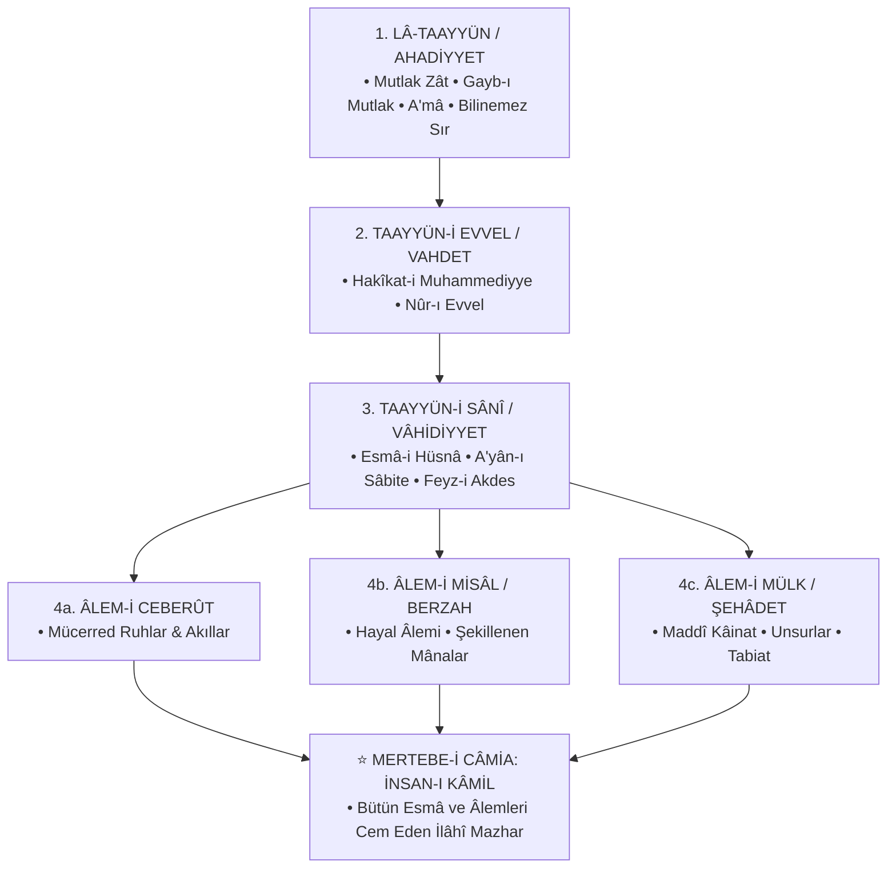

<div align="center">


<br/><br/>

[](https://github.com/arch-yunus/ibn-arabi-studies)
[](LICENSE)
[](texts/)
[](docs/ontology-maps.md)
[](https://github.com/arch-yunus/ibn-arabi-studies)

<br/>

> *«Biz öyle bir topluluğuz ki; sözlerimiz mecaz değil, doğrudan zevk ve keşif mahsulüdür. Dalgaların yüzeyine bakan köpük görür, dibe dalan ise incileri derer.»*  
> — **Muhyiddin İbnü'l-Arabî (eş-Şeyhü'l-Ekber / H. 560–638 / M. 1165–1240)**

</div>

---

## 📑 Kapsamlı İçindekiler
1. [🏛️ Külliyatın Vizyonu ve Mahiyeti](#-külliyatın-vizyonu-ve-mahiyeti)
2. [🗺️ Şeyhü'l-Ekber'in Biyografik ve Coğrafî Kronolojisi (Endülüs'ten Şam'a)](#-şeyhül-ekberin-biyografik-ve-coğrafî-kronolojisi-endülüsten-şama)
3. [💬 Şeyhü'l-Ekber Hakkında Söylenenler: Büyük Tarihsel ve Felsefî Tanıklıklar Hazinesi](#-şeyhül-ekber-hakkında-söylenenler-büyük-tarihsel-ve-felsefî-tanıklıklar-hazinesi)
   - [1. Çağdaşları & Doğrudan Muhatapları (İbn Rüşd, Konevî, İzzeddin b. Abdisselâm, İbnü'l-Fârız, Kirmânî)](#1-çağdaşları-ve-doğrudan-muhatapları-13-yüzyıl)
   - [2. Anadolu ve Tasavvuf Büyükleri (Mevlânâ, Şems, Yûnus, Hüdâyî, Mısrî)](#2-anadolu-ve-tasavvuf-büyükleri-mevlânâ-şems-yûnus-hüdâyî-mısrî)
   - [3. Klasik Şârihler ve İrfân Mektebi (Kayserî, Kâşânî, Câmî, Nablusî, Bursevî, Dihlevî, İbn Âbidîn)](#3-klasik-şârihler-ve-osmanlıiran-irfân-mektebi-1418-yüzyıl)
   - [4. Resmî Savunmalar ve Şeyhülislâm Fetvaları (İbn Kemal, Süyûtî, Şa'rânî, Fîrûzâbâdî)](#4-resmî-savunmalar-şeyhülislâm-fetvaları-ve-büyük-imamlar)
   - [5. Kelâmî, Fıkhî ve Selefî Tenkitler (İbn Teymiyye, İbn Haldun, İbn Hacer, Teftâzânî)](#5-kelâmî-fıkhî-ve-selefî-tenkitler-ve-itirazlar)
   - [6. Modern Doğu-Batı Filozofları (Izutsu, Chittick, Corbin, Chodkiewicz, Addas, Kılıç, Demirli)](#6-modern-doğu-batı-filozofları-ve-akademisyenleri)
4. [📜 Şeyhü'l-Ekber'in Eserlerinden Genişletilmiş Metin ve Alıntılar](#-şeyhül-ekberin-eserlerinden-genişletilmiş-metin-ve-alıntılar)
   - [*Fusûsü'l-Hikem* Seçkileri ve Fass Fass Hikmet Sırları](#1-fusûsül-hikem-seçkileri-ve-hikmet-sırları)
   - [*el-Fütûhâtü'l-Mekkiyye* Tematik Şaheser Alıntıları](#2-el-fütûhâtül-mekkiyye-tematik-şaheser-alıntıları)
   - [*Tercümânü'l-Eşvâk* ve Şerhi *Zehâirü'l-A'lâk*](#3-tercümânül-eşvâk-ve-zehâirül-alâk-aşk-ve-sembolizm)
   - [Küçük Risaleler (*Risâletü'l-Vücûd*, *İsfâr*, *Şecere*, *İnşâ*, *Hilye*, *Mevâkı'*)](#4-küçük-risaleler-er-resâilüs-suğrâ)
5. [🧭 Ekberî Ontoloji Haritası & Merâtibü'l-Vücûd](#-ekberî-ontoloji-haritası--merâtibül-vücûd)
6. [🔤 İlmü'l-Hurûf: 28 Harfin Kozmik Mahreçleri ve Felekler Hiyerarşisi](#-ilmül-hurûf-28-harfin-kozmik-mahreçleri-ve-felekler-hiyerarşisi)
7. [👑 Velâyet Doktrini ve Hatmü'l-Velâye Nazariyesi](#-velâyet-doktrini-ve-hatmül-velâye-nazariyesi)
8. [🏰 Siyaset Düşüncesi ve Anadolu Selçuklu Sultanına Mektuplar](#-siyaset-düşüncesi-ve-anadolu-selçuklu-sultanına-mektuplar)
9. [🧩 Fusûsü'l-Hikem: 27 Peygamber ve Hikmet Matrisi](#-fusûsül-hikem-27-peygamber-ve-hikmet-matrisi)
10. [📖 Kapsamlı Ekberî Kavramlar Sözlüğü (*Istılâhât-ı Sûfiyye*)](#-kapsamlı-ekberî-kavramlar-sözlüğü-ıstılâhât-ı-sûfiyye)
11. [⚖️ Mukayeseli Felsefe Araştırmaları (Spinoza, Heidegger, Jung, Eckhart, Hegel, Shankara)](#-mukayeseli-felsefe-araştırmaları)
12. [🗂️ Depo ve Dizin Mimarisi](#-depo-ve-dizin-mimarisi)
13. [💻 İnteraktif CLI Araştırma Aracı (`tools/ekber_cli.py`)](#-interaktif-cli-araştırma-aracı-toolsekber_clipy)
14. [🎓 Akademik Müfredat ve Bibliyografya (BibTeX)](#-akademik-müfredat-ve-bibliyografya-bibtex)
15. [🤝 Katkı Protokolü & Lisans](#-katkı-protokolü--lisans)

---

## 🏛️ Külliyatın Vizyonu ve Mahiyeti

`ibn-arabi-studies`, Endülüslü büyük metafizikçi, mutasavvıf ve arif **Muhyiddin İbnü'l-Arabî**'nin (*eş-Şeyhü'l-Ekber*) metafizik sistemini, kavram dağarcığını, eserlerini ve Doğu-Batı düşüncesindeki yankılarını dizinlemek amacıyla kurgulanmış kapsamlı bir açık kaynak araştırma külliyatıdır.

İbnü'l-Arabî (H. 560–638 / M. 1165–1240), varlığın birliği (*Vahdet-i Vücûd*), İnsan-ı Kâmil nazariyesi, Âlem-i Misâl (*Mundus Imaginalis*) ontolojisi ve kesintisiz yaratılış (*Tecellî-i Dâim*) doktrinleriyle İslam medeniyetinin ve dünya felsefesinin en özgün anıtlarından birini inşa etmiştir.

---

## 🗺️ Şeyhü'l-Ekber'in Biyografik ve Coğrafî Kronolojisi (Endülüs'ten Şam'a)

```text
[1165 - Mürsiye] ➔ [1172 - İşbîliye] ➔ [1201 - Tunus/Fas] ➔ [1202 - Mekke] ➔ [1205 - Konya/Malatya] ➔ [1223 - Şam]
  (Doğumu)          (İbn Rüşd Görüşmesi)  (Mağrip İrfanı)    (Fütûhât Başlangıcı)  (Konevî & Selçuklular)   (Fusûs & Vefat)
```

| Yıl (Miladî / Hicrî) | Coğrafya / Şehir | Mühim Tarihsel & Manevî Hadise |
| :--- | :--- | :--- |
| **1165 (H. 560)** | **Mürsiye (Murcia, Endülüs)** | 17 Ramazan gecesi soylu bir Tayy kabilesi mensubu olarak dünyaya gelişi. |
| **1172 (H. 568)** | **İşbîliye (Sevilla)** | Ailesiyle Sevilla'ya taşınması; Kur'an, hadis, fıkıh ve zâhir ilimlerini ikmal etmesi. |
| **1180 (H. 576)** | **Kurtuba (Cordoba)** | İlk büyük manevî cezbe halinden sonra Aristoteles şârihi Kadı **İbn Rüşd** ile tarihi mülakatı. |
| **1193–1200** | **Fas, Tunus, Mağrip** | Ebû Medyen Mağribî mektebiyle buluşma, *Mevâkiu'n-Nücûm* ve *İnşâü'd-Devâir*'in telifi. |
| **1202 (H. 598)** | **Mekke-i Mükerreme** | İlk hac; Kâbe'deki manevî fetihler, genç (*el-Fetâ*) ile buluşma ve *el-Fütûhâtü'l-Mekkiyye*'nin yazımına başlanması; Nizâm için *Tercümânü'l-Eşvâk*'ın telifi. |
| **1204 (H. 601)** | **Musul & Bağdat** | Şeyh Ebü'l-Hasan Ali b. Câmî'den hırka giymesi; *et-Tenezzülâtü'l-Mevsıliyye*'nin telifi. |
| **1205–1218** | **Konya, Malatya, Sivas** | Anadolu Selçuklu payitahtına geliş; Mecdüddin İshak ile dostluk; üvey oğlu **Sadreddin Konevî**'yi yetiştirmesi; Sultan I. İzzeddin Keykâvus'a cihad ve adalet mektupları. |
| **1223 (H. 620)** | **Dımaşk (Şam)** | Şam'a kalıcı olarak yerleşmesi; Eyyûbî meliklerinin ve ulemanın hürmeti. |
| **1229 (H. 627)** | **Dımaşk (Şam)** | Rüyasında Hz. Peygamber'i (s.a.v.) görerek *Fusûsü'l-Hikem*'i mübarek ellerinden alıp kaleme dökmesi. |
| **1238 (H. 636)** | **Dımaşk (Şam)** | 37 yıl süren *el-Fütûhâtü'l-Mekkiyye*'nin ikinci ve nihai nüshasını tamamlaması (Osman Yahyâ tahkiki). |
| **1240 (H. 638)** | **Dımaşk (Şam)** | 22 Rebiülâhir'de 76 yaşında vefatı; Kasiyun Dağı eteğindeki Sâlihiyye kabristanına defni (Yavuz Sultan Selim Türbesi). |

---

<div align="center">
  
</div>

## 💬 Şeyhü'l-Ekber Hakkında Söylenenler: Büyük Tarihsel ve Felsefî Tanıklıklar Hazinesi

```text
       ╔═══════════════════════════════════════════════════════════════════════════════╗
       ║   "O öyle bir ummandır ki; kıyısı olmayan bir deryaya benzer.                 ║
       ║    Dalgıçlar onun derinliklerinden marifet incilerini dererken,              ║
       ║    kıyıda durup nazar edenler dalgaların azametinden ürperirler."             ║
       ║                                                    — Sadreddin Konevî         ║
       ╚═══════════════════════════════════════════════════════════════════════════════╝
```

### 1. Çağdaşları ve Doğrudan Muhatapları (13. Yüzyıl)

#### ⚖️ İbn Rüşd (Averroes, ö. 1198) — *Kurtuba Kadısı ve Büyük İslam Filozofu*
> *(Genç İbnü'l-Arabî henüz bıyıkları terlememiş bir delikanlı iken, Kurtuba'da onu bizzat köşküne davet eden İbn Rüşd ile gerçekleşen meşhur tarihi diyalog):*  
>
> *"Kurtuba Kadısı İbn Rüşd beni görmeyi çok arzu etmişti. Yanına girdiğimde sevgisinden ve saygısından dolayı yerinden fırlayıp bana sarıldı. Bana dedi ki:*  
> — **'Evet mi?'**  
> Ben de:  
> — **'Evet!'** dedim.  
> Bu cevabım üzerine kendisini anladığımı görerek sevinci arttı. Fakat hemen ardından onun neden sevindiğini fark ederek:  
> — **'Hayır!'** dedim.  
> Bunun üzerine rengi soldu, yüzü sarardı ve şüpheye düşerek sordu:  
> — **'Keşif ve ilahî feyz yoluyla ulaştığınız bilgi, bizim akıl ve nazar yoluyla elde ettiğimiz bilgiyle uyuşuyor mu?'**  
> Dedim ki:  
> — **'Evet ve Hayır! Evet ile Hayır arasında ise ruhlar cesetlerinden, boyunlar bedenlerinden fırlar uçar!'**  
> İbn Rüşd sarardı, titredi ve 'Lâ havle ve lâ kuvvete illâ billâh' diyerek oturdu. Çünkü ne demek istediğimi tam olarak anlamıştı; zira o sadece aklın peşindeydi, biz ise keşif ehliydik."  
> — **İbnü'l-Arabî, *el-Fütûhâtü'l-Mekkiyye*, Bab 15**

#### 🔑 Sadreddin Konevî (ö. 1274) — *Üvey Oğlu, Baş Halifesi ve Ekberî Ekolün Kurucusu*
> *"Şeyhimiz ve imamımız İbnü'l-Arabî, ilahî marifetlerin nihayetine ermiş, zâhir ve bâtın ilimlerini kendisinde cem etmiş bir tahkik sultanıdır. O, varlığın sırlarını akli kıyasların ve felsefi zihin jimnastiklerinin çok ötesinde, doğrudan Hak Teâlâ'dan alınan keşfî ve zevkî nurlarla açıklamıştır.*  
> *Fusûsü'l-Hikem'in gayesi, akıl yürüterek varılan kuru bir tevhid değil; varlığın Hak ile kaim olduğunu bizzat müşahede ettiren 'Hakkü'l-Yakîn' idrakidir. Onun kitaplarını sadece harflerin zahirine takılanlar anlayamaz."*  
> — **Sadreddin Konevî, *el-Fükûk Mukaddimesi***

#### 👑 İzzeddin b. Abdisselâm (ö. 1262) — *«Sultânü'l-Ulemâ» (Âlimlerin Sultanı)*
> *(Talebesi İbn Dakîku'l-Îd'in "Şeyh Muhyiddin hakkında ne dersiniz?" sorusu üzerine):*  
> *"O, zamanımızın kutbudur! O, şeriatın zâhir sınırlarına kıldan ince riayet eden, bâtın ilminde ise eşi benzeri olmayan kâmil bir mürşiddir. Ondan duyduğun ve aklının almadığı sözleri zahirine göre yargılama; çünkü o yüksek makamların lisanıyla konuşmaktadır."*  
> — **İmam Süyûtî, *Tenbîhü'l-Gabî***

#### 🌹 Şerefeddin İbnü'l-Fârız (ö. 1235) — *«Sultânü'l-Âşıkîn» (Büyük Mısır Şairi)*
> *(İbnü'l-Arabî'nin Kasîde-i Tâiyye'yi şerh etme teklifine cevaben):*  
> *"Ey Şeyh! Senin el-Fütûhâtü'l-Mekkiyye adlı eserin, benim kasidemin zaten en kâmil şerhidir! Benim manzum olarak remzettiğim hakikatleri sen mensur olarak en derin biçimde izah etmişsin."*

---

### 2. Anadolu ve Tasavvuf Büyükleri (Mevlânâ, Şems, Yûnus, Hüdâyî, Mısrî)

#### ☀️ Şems-i Tebrîzî (ö. 1247) — *Mevlânâ'nın Mürşidi*
> *"Şam'da Şeyh Muhyiddin'in meclisinde bulundum. O, ilim ve marifette bir deryadır; lakin onun deryası öyle bir deryadır ki, içine dalan dalgıcın nefesi kesilir. Şeriat edebine riayeti ve ilahî hakikatleri beyandaki kudreti akıllara durgunluk verir."*  
> — **Şems-i Tebrîzî, *Makâlât***

#### 💫 Mevlânâ Celâleddîn-i Rûmî (ö. 1273) — *Mesnevî Müellifi*
> Mevlânâ, Şeyh-i Ekber'in baş talebesi Sadreddin Konevî'ye olan derin muhabbeti ve hürmetiyle bilinirdi. Vefatında cenaze namazını Konevî'nin kıldırmasını vasiyet etmiştir. Mesnevî'deki vahdet ve tecelli beyitleri, İbnü'l-Arabî metafiziğinin şiir lisanıyla terennümüdür:  
> *"Biz yoktuk; bizim bu varlık iddiamız da yoktu. Sen bizim yokluğumuza vücud verdin, var kıldın ve bize Senin cemâlinin aynası olmayı bahşettin."*

#### 🌿 Yûnus Emre (ö. 1321) — *Türkçe İrfânın Zirvesi*
> Yûnus Emre'nin divanında Vahdet-i Vücûd neşvesi doğrudan yankılanır:  
> *«Cümle yerde Hak hazır, göz gerektir göresi / Hak'tan gayrı ne vardır, kime gerek sorası...»*  
> *«Beni bende demen ben de değilem / Bir ben vardır bende benden içerü...»*

#### 🕯️ Niyâzî-i Mısrî (ö. 1694) — *Büyük Halvetî-Uşşâkî Kutbu*
> *"Şeyh Muhyiddin İbnü'l-Arabî, velayet semasının güneşidir. Onun sözlerini inkâr eden kimse, güneşin doğuşunu inkâr eden kör gibidir. Bizim yolumuzun esası, Şeyh-i Ekber'in beyan ettiği Tahkik Tevhidi'dir."*  
> — **Niyâzî-i Mısrî, *Mevâidü'l-İrfân***

---

### 3. Klasik Şârihler ve Osmanlı/İran İrfân Mektebi (14–18. Yüzyıl)

#### 🏛️ Dâvûd-i Kayserî (ö. 1350) — *Osmanlı'nın İlk Müderrisi*
> *"Bilinmelidir ki Şeyhü'l-Ekber'in kelâmı, nebevi kandilden sızan nurlardır. O, varlığın mertebelerini ve ilahî isimlerin tecellilerini öyle bir vuzuhla açıklamıştır ki, onun terminolojisini tahsil etmeyen bir kimsenin hakiki manada tasavvuf ve metafizik tahsil etmesi imkânsızdır."*  
> — **Dâvûd-i Kayserî, *Matla‘u Husûsi'l-Kelim Mukaddimesi***

#### 📖 Abdürrezzâk el-Kâşânî (ö. 1329) — *Büyük Ekberî Şârih*
> *"Şeyh Muhyiddin, varlığın birliğini ve tevhidi öyle bir tahkik makamında anlatmıştır ki; nâehle bu sırlar perde kalsın diye onları sembollerin libasına bürümüştür. Basiret sahipleri o örtünün altındaki saf nuru görürken, mukallitler sadece kumaşa takılıp kalırlar."*  
> — **Abdürrezzâk el-Kâşânî, *Şerhu Fusûsi'l-Hikem***

#### ✍️ Molla Câmî (ö. 1492) — *Büyük Fars Şairi ve Ârifi*
> *"Fusûsü'l-Hikem'in her bir fassı, ledün deryasından fışkıran bir hikmet pınarıdır. O pınardan ancak nefsaniyet kirlerinden arınmış saf canlar içebilir. Şeyh Muhyiddin'e dil uzatanlar, göğe doğru tüküren adama benzerler; tükürükleri göğe ulaşmaz, kendi yüzlerine geri döner."*  
> — **Molla Câmî, *Nefehâtü'l-Üns***

#### 💎 Abdülganî en-Nablusî (ö. 1731) — *18. Yüzyıl Şam Allâmesi*
> *"Vahdet-i Vücûd ile mülhitlerin ittihadını bir tutanlar cehalet içindedirler. Şeyh Muhyiddin der ki: 'Lâ hulûle ve lâ ittihâd' (Ne hulûl vardır ne de birleşme). Zira mutlak anlamda var olan yalnızca Hak'tır, masivâ ise O'nun esmâ gölgesidir."*  
> — **Abdülganî en-Nablusî, *el-Vücûdü'l-Hakk***

#### 📜 İsmail Hakkı Bursevî (ö. 1725) — *Osmanlı Müfessir ve Mutasavvıfı*
> *"Şeyh-i Ekber'in kelâmı vahiy menbaından feyz almıştır; onun remizleri zâhir ulemasının havsalasını aşar. Rûhu'l-Beyân tefsirimizi tezyin eden en latif mânalar, Şeyh'in Fütûhât ve Fusûs'taki işârî nurlarından derlenmiştir."*  
> — **İsmail Hakkı Bursevî, *Kitâbü'l-Hitâb***

#### ⚖️ İbn Âbidîn (ö. 1836) — *Büyük Hanefî Fıkıh İmamı*
> *"Şeyh Muhyiddin İbnü'l-Arabî, şüphesiz velilerin önde gelenlerinden ve tahkik ehli kâmil bir ariftir. Kapalı ifadelerinin zahirine bakıp hüküm vermek avam için caiz değildir; lâkin onu tekfir etmek de büyük bir hüsrandır."*  
> — **İbn Âbidîn, *el-Ukûdü'd-Dürriyye***

---

### 4. Resmî Savunmalar, Şeyhülislâm Fetvaları ve Büyük İmamlar

#### 📜 Şeyhülislâm İbn Kemal (Kemalpaşazâde, ö. 1534) — *Tarihî Osmanlı Fetvası*
> *(Yavuz Sultan Selim'in Şam fethinde İbnü'l-Arabî'nin kabrini buldurup türbe ve cami yaptırması üzerine verilen meşhur fetva):*  
>
> *"Muhyiddin İbnü'l-Arabî; kâmil bir mürşid, fâzıl bir imam ve ledünnî ilimler sahibi bir tahkik kutbudur. Onun faziletini inkâr edenler büyük bir gaflet içindedirler. Hükmümüz şudur: **Şeyh kâmil bir velidir; lâkin onun kitaplarını derin ilmi ve basireti olmayanların okuması men edilmelidir.**"*  
> — **Şeyhülislâm Kemalpaşazâde Fetvası**

#### 📿 İmam Celâleddin es-Süyûtî (ö. 1505) — *Büyük Hadis ve Tefsir İmamı*
> *"Şeyh Muhyiddin bir müçtehid ve velilerin kutbudur. Kitaplarında ulemaya kapalı gelen ibareler varsa, bunların tasavvuf ıstılahında sahih bir tevili vardır. Bir veliyi anlamadığın bir sözünden ötürü tekfir etmektense hüsnüzan edip tevil etmek Ehl-i Sünnet edebinin gereğidir."*  
> — **İmam Süyûtî, *Tenbîhü'l-Gabî fî Tebrieti İbni'l-Arabî***

---

### 5. Kelâmî, Fıkhî ve Selefî Tenkitler ve İtirazlar

#### ⚡ Takıyyüddin İbn Teymiyye (ö. 1328) — *Selefî / Harrânî Âlim*
> *"İbnü'l-Arabî'nin 'Vahdet-i Vücûd' nazariyesi, İslam'ın zahir nasslarına ve Selef-i Sâlihîn'in icmaına kökten muhaliftir. O, Hristiyanların Hz. Îsâ hakkındaki tecessüd iddiasını bütün mevcudata yaymıştır. Firavun'un imanla öldüğünü söylemesi, Nûh kavminin putlara tapmasını hakikate ermek sayması kabul edilemez bir dalalettir. Zekâsı ne kadar parlak olursa olsun, bu akide İslam tevhidini tahrip eder."*  
> — **İbn Teymiyye, *Mecmûu'l-Fetâvâ***

#### 📜 İbn Haldun (ö. 1406) — *Sosyolojinin ve Tarih Felsefesinin Öncüsü*
> *"Muhyiddin İbnü'l-Arabî yüksek bir keşif sahibidir; lâkin eserlerinde 'Vahdet-i Mutlaka' fikrini müteşabih kavramlarla anlatmıştır. Bu kitaplar şeriat ahkâmına yabancılaşmaya yol açabileceğinden, ehil olmayanların bu eserleri mütalaa etmesi fıkhî maslahat gereği men edilmelidir."*  
> — **İbn Haldun, *Şifâü's-Sâil li-Tehzîbi'l-Mesâil***

---

### 6. Modern Doğu-Batı Filozofları ve Akademisyenleri

#### 🇯🇵 Toshihiko Izutsu (1914–1993) — *Japon Filozof ve Karşılaştırmalı Dinler Uzmanı*
> *"İbnü'l-Arabî, yalnızca İslam dünyasının değil, insanlık düşünce tarihinin gördüğü en devasa sistem kuruculardan biridir. Onun 'Vahdet-i Vücûd' ontolojisi Spinoza'dan, 'Âlem-i Misâl' ve 'Tecellî-i Dâim' teorisi ise Hegel'den çok daha zengin bir irfani zeminle inşa edilmiştir."*  
> — **Toshihiko Izutsu, *Sufism and Taoism***

#### 🇺🇸 William Chittick (1943–) — *İslam Felsefesi ve Tasavvuf Profesörü*
> *"Şeyhü'l-Ekber'den sonra İslam coğrafyasında felsefe veya tasavvuf yapan hiç kimse, onun kurduğu kavramsal sözlüğü kullanmadan tek bir bağımsız cümle dahi kuramamıştır. İbn Arabî'nin eserleri, Kur'an ve Sünnet'in metafizik projeksiyonudur."*  
> — **William Chittick, *The Sufi Path of Knowledge***

#### 🇫🇷 Henry Corbin (1903–1978) — *Fransız Filozof ve Şarkiyatçı*
> *"İbnü'l-Arabî'nin 'Hayal Âlemi' (Mundus Imaginalis) kavramı olmaksızın, Doğu'nun tinsel coğrafyasını ve rüya fenomenolojisini anlamak imkânsızdır. O, ruh ile madde arasındaki ontolojik köprüyü kurmuştur."*  
> — **Henry Corbin, *Creative Imagination in the Sufism of Ibn Arabi***

---

<div align="center">
  
</div>

## 📜 Şeyhü'l-Ekber'in Eserlerinden Genişletilmiş Metin ve Alıntılar

### 1. *Fusûsü'l-Hikem* Seçkileri ve Hikmet Sırları

- 🪞 **Fass I (Hz. Âdem / Hikmet-i İlâhiyye):** [Âlemin Cilalanmamış Aynası ve Hilafet](texts/fusus-al-hikam/01-fass-adem-hikmet-i-ilahiyye.md)
- 🌿 **Fass II (Hz. Şît / Hikmet-i Nefsiyye):** [Atâ-yı Zâtî, Atâ-yı Esmâî ve Ruh-Nefis Dengesi](texts/fusus-al-hikam/02-fass-sit-hikmet-i-nefsiyye.md)
- 🌊 **Fass III (Hz. Nûh / Hikmet-i Sübbûhiyye):** [Tenzih ve Teşbihin Tevhitte Cemi](texts/fusus-al-hikam/03-fass-nuh-hikmet-i-subbuhiyye.md)
- ☀️ **Fass IV (Hz. İdrîs / Hikmet-i Kuddûsiyye):** [Mekân ve Mertebe Yüceliği, Güneş Feleği](texts/fusus-al-hikam/04-fass-idris-hikmet-i-kuddusiyye.md)
- 🔥 **Fass V (Hz. İbrâhîm / Hikmet-i Müheymiyye):** [Aşkın Varlığa Sirayeti ve Kozmik Misafirperverlik](texts/fusus-al-hikam/05-fass-ibrahim-hikmet-i-muheymiyye.md)
- 🏔️ **Fass VII (Hz. İsmâil / Hikmet-i Aliyye):** [Rubûbiyyet ve Ubûdiyyet Karşılıklılığı](texts/fusus-al-hikam/07-fass-ismail-hikmet-i-aliyye.md)
- 🌙 **Fass IX (Hz. Yûsuf / Hikmet-i Nûriyye):** [Âlem-i Misâl, Rüya Ontolojisi ve Tevil Sırrı](texts/fusus-al-hikam/09-fass-yusuf-hikmet-i-nuriyye.md)
- 🏹 **Fass X (Hz. Hûd / Hikmet-i Ahadiyye):** [Kozmik Sırât-ı Müstakîm ve Perçem Sırrı](texts/fusus-al-hikam/10-fass-hud-hikmet-i-ahadiyye.md)
- ❤️ **Fass XII (Hz. Şuayb / Hikmet-i Kalbiyye):** [Kalbin Değişkenliği ve Tecellide Tekrar Olmaması (*Lâ Tekrâr*)](texts/fusus-al-hikam/12-fass-suayb-hikmet-i-kalbiyye.md)
- 🕊️ **Fass XV (Hz. Îsâ / Hikmet-i Nebeviyye):** [Nefes-i Rahmânî ve Diriltme (İhyâ) Kelimesi](texts/fusus-al-hikam/15-fass-isa-hikmet-i-nebeviyye.md)
- 💍 **Fass XVI (Hz. Süleymân / Hikmet-i Rahmâniyye):** [Rahmaniyet/Rahimiyet ve Anlık Yaratılış (*Halk-ı Cedîd*)](texts/fusus-al-hikam/16-fass-suleyman-hikmet-i-rahmaniyye.md)
- ⚡ **Fass XXV (Hz. Mûsâ / Hikmet-i Ulviyye):** [Firavun'un İmanı, Tûr-ı Sînâ ve Tecellî-i Zât](texts/fusus-al-hikam/25-fass-musa-hikmet-i-ulviyye.md)
- 👑 **Fass XXVII (Hz. Muhammed s.a.v. / Hikmet-i Ferdiyye):** [Varlığın İlk Taayyünü, Kadın/Koku/Namaz Sırrı](texts/fusus-al-hikam/27-fass-muhammed-hikmet-i-ferdiyye.md)

---

### 2. *el-Fütûhâtü'l-Mekkiyye* Tematik Şaheser Alıntıları

- 🕊️ **Bab 1:** [Marifet-i Rûh ve Kâbe'deki Ruhanî Genç (*el-Fetâ*)](texts/futuhat-al-makkiyya/bab-001-marifet-i-ruh.md)
- 🌌 **Bab 63:** [Âlem-i Hayâl ve Kesretin Gölge Tabiatı](texts/futuhat-al-makkiyya/bab-063-alem-i-hayal-ve-kesret.md)
- 🌹 **Bab 178:** [Bâbü'l-Muhabbe: İlahî, Ruhânî ve Tabiî Aşkın Hakikati](texts/futuhat-al-makkiyya/bab-178-babu-l-muhabbe.md)
- 🌬️ **Bab 198:** [Nefes-i Rahmânî ve Harflerin Kozmik Mahreçleri](texts/futuhat-al-makkiyya/bab-198-nefes-i-rahmani-ve-huruf.md)
- ⏳ **Bab 390:** [Zamanın Hakikati ve Ân-ı Dâim](texts/futuhat-al-makkiyya/bab-390-zaman-ve-an-i-daim.md)
- 📜 **Bab 558:** [Sâliklere Ahlâkî Vasiyetler ve Şeriatın Korunması](texts/futuhat-al-makkiyya/bab-558-vasiyetler-ve-nasihatler.md)
- 🌌 **Bab 559:** [Marifetullah ve Esmâü'l-Hüsnâ'nın Aynalık Görevi](texts/futuhat-al-makkiyya/bab-559-marifetullah-ve-esma.md)

---

### 3. *Tercümânü'l-Eşvâk* ve *Zehâirü'l-A'lâk* (Aşk ve Sembolizm)

> *«Kalbim her sûreti kabul eder bir hâle geldi;  
> Ceylanların otlağı, keşişlerin manastırı,  
> Putların tapınağı, hacıların Kâbe'si,  
> Tevrat'ın levhaları ve Kur'ân'ın mushafı...  
> Ben aşk dinine tâbiyim; aşkın kervanı hangi yöne yönelirse yönelsin,  
> İşte benim dinim ve imanım odur.»*  
> — [Ayrıntılı Şiir & Zehâirü'l-A'lâk Tahlili](texts/tarjuman-al-ashwaq/kaside-11-kalbin-evrenselligi-ve-sehri.md)

---

### 4. Küçük Risaleler (*er-Resâilü's-Suğrâ*)

- 🌿 [Risâletü'l-Vücûd (Kitâbü'l-Elif)](texts/minor-treatises/risaletu-l-vucud.md): *«Kendini bilen Rabbini bilir; sen ne O'sun ne de O'ndan gayrısın.»*
- 🚶‍♂️ [Kitâbü'l-İsfâr an Netâici'l-Esfâr](texts/minor-treatises/kitabu-l-isfor-an-netaic-il-esfar.md): *Üç Büyük Sefer (Hakk'a, Hakk'ta, Hakk'tan Halka).*
- 🌳 [Şeceretü'l-Kevn](texts/minor-treatises/seceretu-l-kevn.md): *Kozmik Varlık Ağacı, Kün tohumu ve İnsan-ı Kâmil meyvesi.*
- ⭕ [İnşâü'd-Devâir](texts/minor-treatises/insau-d-devair.md): *Dairelerin İnşası; Mutlak Vücûd, Mutlak Adem, Mümkin Vücûd.*
- ✨ [Hilyetü'l-Abdâl](texts/minor-treatises/huliyyetu-l-abdal.md): *Sülûkün Dört Direği: Sükût, Uzlet, Cû‘ (Açlık), Seher (Geceleri İhya).*
- 🌟 [Mevâkiu'n-Nücûm](texts/minor-treatises/mevakiu-n-nucum.md): *Yıldızların Doğuş Yerleri ve İnsan Organlarının İrfanî İbadeti.*

---

<div align="center">
  
</div>

## 🧭 Ekberî Ontoloji Haritası & Merâtibü'l-Vücûd



---

## 🔤 İlmü'l-Hurûf: 28 Harfin Kozmik Mahreçleri ve Felekler Hiyerarşisi

İbnü'l-Arabî'ye göre Arap alfabesindeki 28 harf, yalnızca lisan vasıtası değil; *Nefes-i Rahmânî*'nin kozmik mahreçlerinde beliren 28 ontolojik mertebedir (*Fütûhât, Bab 2 & Bab 198*):

| Mahreç Grubu | Harfler | Kozmik Karşılığı / Âlem Mertebesi | İlahî İsim Mazharı |
| :--- | :--- | :--- | :--- |
| **Boğazın Dibi (Halk)** | **Hemze (ء), He (ه)** | İlk Akıl (el-Aklü'l-Evvel) & Küllî Nefis | el-Bedî‘, el-Bâis |
| **Boğazın Ortası** | **Ayn (ع), Hâ (ح)** | Heyûlâ (İlk Madde) & Küllî Cisim | ez-Zâhir, el-Bâtın |
| **Boğazın Üstü** | **Gayn (غ), Hı (خ)** | Küllî Şekil & Arş-ı Âlâ | el-Hakîm, el-Muhît |
| **Dil Kökü & Damak** | **Kaf (ق), Kef (ك)** | Kürsî & Atlas Feleği (Yıldızsız Gökyüzü) | eş-Şekûr, el-Ganî |
| **Dil Ortası** | **Cim (ج), Şın (ش), Yâ (ي)** | Zodyak Feleği (Burçlar) & Sabit Yıldızlar | el-Mukaddim, el-Muahhir |
| **Dil Ucu & Dişler** | **Zâd (ض), Lâm (ل), Nûn (ن), Râ (ر)** | Yedi Gezegen Feleği (*Satürn, Jüpiter, Mars, Güneş*) | el-Hayy, el-Kayyûm, el-Kâbız |
| **Dudaklar (Şefeviyye)** | **Fâ (ف), Bâ (ب), Mîm (م), Vâv (و)** | Dört Unsur (*Ateş, Hava, Su, Toprak*) ve Madenler | el-Câmi‘, el-Latîf, er-Rahmân |
| **İnsan-ı Kâmil** | **Lâm-Elif (لا)** | Bütün Harfleri Kendinde Cem Eden Berzah Mertebesi | el-Mütecellî bi-Külli'l-Esmâ |

---

## 👑 Velâyet Doktrini ve Hatmü'l-Velâye Nazariyesi

İbnü'l-Arabî tasavvuf düşüncesine velayetin sistematik mimarisini kazandırmıştır (*el-Fütûhât, Bab 73*):

1. **Nübüvvet ve Velâyet:**
   - Şeriat getiren nübüvvet (*Nübüvvet-i Teşrî‘*) Hz. Muhammed (s.a.v.) ile mühürlenmiştir.
   - Hakikati keşf ve müşahede eden velayet (*Nübüvvet-i Âmme / Velâyet*) ise kıyamete kadar kesintisiz devam eder.
2. **İki Velâyet Mührü (*Hâtemü'l-Velâye*):**
   - **Hâtemü'l-Velâyeti'l-Mutlaka:** Bütün insanlığın mutlak velayet mührü olup ahir zamanda nüzul edecek olan **Hz. Îsâ**'dır.
   - **Hâtemü'l-Velâyeti'l-Muhammediyye:** Hz. Muhammed'in (s.a.v.) özel manevî mirasının ve tahkik ilminin mührüdür; Şeyh-i Ekber kendisinin bu makamın mazharı olduğunu işaret etmiştir.

---

## 🏰 Siyaset Düşüncesi ve Anadolu Selçuklu Sultanına Mektuplar

Şeyh-i Ekber, fildişi kulede yaşayan soyut bir filozof değil; yaşadığı çağın siyasî buhranlarına bizzat müdahil olan bir mürşiddir:

> *(Anadolu Selçuklu Sultanı **I. İzzeddin Keykâvus**'a yazdığı mektuptan):*  
> *"Ey adaletli Melik! Bil ki mülk Allah'ındır ve sen o mülkte emanetçisin. Kılıcını mazlumların kalkanı, adaletini ise tebaanın sığınağı kıl. Gayrimüslim tebaaya şeriatın zimmî hukukuna göre muamele et; kibirden ve nefsin sarhoşluğundan sakın. Sultanların en hayırlısı âlimlerin ayağına giden, âlimlerin en şerlisi ise sultanların kapısında bekleyendir."*

---

<div align="center">
  
</div>

## 🧩 Fusûsü'l-Hikem: 27 Peygamber ve Hikmet Matrisi

| # | Peygamber / Fass | Temsil Ettiği Hikmet | Temel Teolojik / Ontolojik Mesele | İlgili Metin & Şerh |
| :---: | :--- | :--- | :--- | :---: |
| 1 | **Hz. Âdem** | Hikmet-i İlâhiyye | Âlemin yaratılışı, ayna metaforu ve hilafet | [01-fass-adem](texts/fusus-al-hikam/01-fass-adem-hikmet-i-ilahiyye.md) |
| 2 | **Hz. Şît** | Hikmet-i Nefsiyye | Hibe, bağış, zâtî/esmâî bağışlar ve nefis-ruh dengesi | [02-fass-sit](texts/fusus-al-hikam/02-fass-sit-hikmet-i-nefsiyye.md) |
| 3 | **Hz. Nûh** | Hikmet-i Sübbûhiyye | Tenzih ve teşbih dengesi; tevhîdin kuşatıcılığı | [03-fass-nuh](texts/fusus-al-hikam/03-fass-nuh-hikmet-i-subbuhiyye.md) |
| 4 | **Hz. İdrîs** | Hikmet-i Kuddûsiyye | Yücelik (*Ulüvv*) mertebesi, Güneş Feleği ve Hermes irfânı | [04-fass-idris](texts/fusus-al-hikam/04-fass-idris-hikmet-i-kuddusiyye.md) |
| 5 | **Hz. İbrâhîm** | Hikmet-i Müheymiyye | Aşkta fena hali, tehallül ve ilahi dostluk (*Hullet*) | [05-fass-ibrahim](texts/fusus-al-hikam/05-fass-ibrahim-hikmet-i-muheymiyye.md) |
| 6 | **Hz. İshâk** | Hikmet-i Hakkiyye | Rüyaların tabiri, kurban sırrı ve koçun tevili | [Fusûs Dizini](texts/fusus-al-hikam/README.md) |
| 7 | **Hz. İsmâil** | Hikmet-i Aliyye | Rıza makamı ve rubûbiyyet-ubûdiyyet karşılıklılığı | [07-fass-ismail](texts/fusus-al-hikam/07-fass-ismail-hikmet-i-aliyye.md) |
| 8 | **Hz. Yâkûb** | Hikmet-i Rûhiyyet | Dinî teslimiyet, sabr-ı cemîl ve kalbî istikamet | [Fusûs Dizini](texts/fusus-al-hikam/README.md) |
| 9 | **Hz. Yûsuf** | Hikmet-i Nûriyye | Âlem-i Misâl, rüya ontolojisi ve aktif imajinasyon | [09-fass-yusuf](texts/fusus-al-hikam/09-fass-yusuf-hikmet-i-nuriyye.md) |
| 10 | **Hz. Hûd** | Hikmet-i Ahadiyye | Sırat-ı müstakîm ve her varlığın perçeminden tutulması | [10-fass-hud](texts/fusus-al-hikam/10-fass-hud-hikmet-i-ahadiyye.md) |
| 11 | **Hz. Sâlih** | Hikmet-i Fethiyye | İlahi fethin açılışı ve devedeki mucize sırrı | [Fusûs Dizini](texts/fusus-al-hikam/README.md) |
| 12 | **Hz. Şuayb** | Hikmet-i Kalbiyye | Kalbin değişkenliği ve tecellide tekrar olmaması (*Lâ Tekrâr*) | [12-fass-suayb](texts/fusus-al-hikam/12-fass-suayb-hikmet-i-kalbiyye.md) |
| 13 | **Hz. Lût** | Hikmet-i Melekiyye | Kudret, tasarruf, himmet ve kulun acziyet dengesi | [Fusûs Dizini](texts/fusus-al-hikam/README.md) |
| 14 | **Hz. Üzeyr** | Hikmet-i Kadriyye | Kader sırrı, diriliş ve a‘yân-ı sâbite istidatları | [Fusûs Dizini](texts/fusus-al-hikam/README.md) |
| 15 | **Hz. Îsâ** | Hikmet-i Nebeviyye | Nefes-i Rahmânî ile dirilme ve kelime-ruh sırrı | [15-fass-isa](texts/fusus-al-hikam/15-fass-isa-hikmet-i-nebeviyye.md) |
| 16 | **Hz. Süleymân** | Hikmet-i Rahmâniyye | Rahmaniyet ve Rahimiyet; Belkıs'ın tahtı ve *Halk-ı Cedîd* | [16-fass-suleyman](texts/fusus-al-hikam/16-fass-suleyman-hikmet-i-rahmaniyye.md) |
| 17 | **Hz. Dâvûd** | Hikmet-i Vücûdiyye | Hilafet, demirin yumuşatılması ve adaletle hüküm | [Fusûs Dizini](texts/fusus-al-hikam/README.md) |
| 18 | **Hz. Yûnus** | Hikmet-i Nefesiyye | Tabiatın karanlığı ve balığın karnındaki tesbih | [Fusûs Dizini](texts/fusus-al-hikam/README.md) |
| 19 | **Hz. Eyyûb** | Hikmet-i Gaybiyye | Bela, sabır, teslimiyet ve su ile arınmanın şifası | [Fusûs Dizini](texts/fusus-al-hikam/README.md) |
| 20 | **Hz. Yahyâ** | Hikmet-i Celâliyye | İlahi isimlerin celali, tenzih ve bekâ hali | [Fusûs Dizini](texts/fusus-al-hikam/README.md) |
| 21 | **Hz. Zekeriyyâ** | Hikmet-i Mâlikiyye | İhtiyarlıkta gelen rahmet ve yokluktan varlık bağışı | [Fusûs Dizini](texts/fusus-al-hikam/README.md) |
| 22 | **Hz. İlyâs** | Hikmet-i İnsiyye | Tabiat ile akıl, semavîlik ile arzîlik dengesi | [Fusûs Dizini](texts/fusus-al-hikam/README.md) |
| 23 | **Hz. Lokmân** | Hikmet-i İhsâniyye | Şirkten arınma, hikmetin derinliği ve basiret | [Fusûs Dizini](texts/fusus-al-hikam/README.md) |
| 24 | **Hz. Hârûn** | Hikmet-i İmâmiyye | Surete tapınma uyarısı, şefkat ve rahmetin önceliği | [Fusûs Dizini](texts/fusus-al-hikam/README.md) |
| 25 | **Hz. Mûsâ** | Hikmet-i Ulviyye | Firavun ile münazara, asâ mucizesi ve Tecellî-i Zât | [25-fass-musa](texts/fusus-al-hikam/25-fass-musa-hikmet-i-ulviyye.md) |
| 26 | **Hz. Hâlid b. Sinân** | Hikmet-i Samediyye | Berzah âleminin haberleri ve fetret devri irfânı | [Fusûs Dizini](texts/fusus-al-hikam/README.md) |
| 27 | **Hz. Muhammed (s.a.v.)** | Hikmet-i Ferdiyye | Varlığın gayesi, üç şeyin sevdirilmesi ve Hatm-i Nübüvvet | [27-fass-muhammed](texts/fusus-al-hikam/27-fass-muhammed-hikmet-i-ferdiyye.md) |

---

<div align="center">
  
</div>

## 📖 Kapsamlı Ekberî Kavramlar Sözlüğü (*Istılâhât-ı Sûfiyye*)

| Kavram | Arapça İbare | Anlamı ve Ontolojik Karşılığı |
| :--- | :--- | :--- |
| **Vahdet-i Vücûd** | وحدة الوجود | Varlığın ontolojik birliği; mutlak anlamda var olan yalnızca Hakk'tır, kesret O'nun tecellisidir. |
| **A‘yân-ı Sâbite** | الأعيan الثابتة | Eşyanın henüz dış dünyada zuhur etmeden önce ilahi ilimdeki ezeli suretleri ve kabiliyetleri. |
| **İnsan-ı Kâmil** | الإنسان الكامل | Bütün ilahi isim ve sıfatların mazharı olan, âlemin manevi direği ve kâinatın gözbebeği insan. |
| **Nefes-i Rahmânî** | النفس الرحماني | İlahi rahmetin mümkinata varlık kazandırması; harflerin ve suretlerin zuhur vasıtası. |
| **Âlem-i Misâl (Berzah)** | عالم المثال / البرزخ | Ruhaniyet ile cismaniyet arasında köprü kuran, mânanın şekil aldığı ontolojik ara boyut. |
| **Hazarât-ı Hams** | الحضرات الخمس | Varlığın iniş ve çıkış sürecini tarif eden 'Beş İlahi Mertebe' (Zât, Sıfat, Melekût, Mülk, İnsan). |
| **Tecellî-i Dâim** | التجلي الدائم | Tecellinin kesintisizliği; yaratılışın her an yeniden gerçekleşmesi (*Külli yevmin hüve fî şe'n*). |
| **Lâ Tekrâra fi't-Tecellî** | لا تكرار في التجلي | Tecellide asla tekrar yoktur; Hakk hiçbir kula aynı surette iki kez görünmez. |
| **Hakîkat-i Muhammediyye** | الحقيقة المحمدية | Varlığın ilk taayyünü, Nûr-ı Muhammedî; kâinatın yaratılış çekirdeği ve ilk aklı. |
| **Feyz-i Akdes** | الفيض الأقدس | Zât'ın kendi zâtına tecellisiyle a‘yân-ı sâbitenin ve ezelî istidatların ilâhî ilimde belirlenmesi. |
| **Feyz-i Mukaddes** | الفيض المقدس | A‘yân-ı sâbitenin istidatlarına göre haricî vücûd kazanarak dış dünyada zuhûra gelmesi. |
| **Hakkü'l-Yakîn** | حق اليقين | Varlık ikiliğinin tamamen ortadan kalktığı, tevhîdin bizzat zevk ve tecrübe ile bilindiği son makam. |

> 📌 *150+ kavramlık detaylı sözlük için [docs/terminology-glossary.md](docs/terminology-glossary.md) dosyasına bakabilirsiniz.*

---

<div align="center">
  
</div>

## ⚖️ Mukayeseli Felsefe Araştırmaları

- ⚖️ [İbnü'l-Arabî & Spinoza](scholarship/comparative-philosophy/ibn-arabi-spinoza-monism.md): *Vahdet-i Vücûd* ile *Deus sive Natura* (Töz Monizmi / Panteizm) farkı.
- 🌲 [İbnü'l-Arabî & Heidegger](scholarship/comparative-philosophy/ibn-arabi-heidegger-being.md): Varlık Sorusu (*Seinsfrage*) ve *Vücûd-Mevcûd* ayrımı.
- 🎭 [İbnü'l-Arabî & C. G. Jung](scholarship/comparative-philosophy/ibn-arabi-jung-mundus-imaginalis.md): Âlem-i Misâl (*Mundus Imaginalis*) ve Arketipler.
- 🕯️ [İbnü'l-Arabî & Meister Eckhart](scholarship/comparative-philosophy/ibn-arabi-eckhart-mysticism.md): Mutlak Zât (*Gottheit*) ve Benliğin İfnası.
- 🏛️ [İbnü'l-Arabî & G. W. F. Hegel](scholarship/comparative-philosophy/ibn-arabi-hegel-dialectic.md): İrfanî Tenezzül & Geist Diyalektiği.
- 🕉️ [İbnü'l-Arabî & Adi Shankara](scholarship/comparative-philosophy/ibn-arabi-shankara-advaita-vedanta.md): Vahdet-i Vücûd & Advaita Vedanta.

---

## 🗂️ Depo ve Dizin Mimarisi

```text
ibn-arabi-studies/
├── README.md                          # Ana vitrin rehberi, ontoloji ve dizin
├── LICENSE                            # MIT Lisansı
├── .gitignore                         # Git filtreleri
├── assets/                            # 8 Adet Yüksek Çözünürlüklü Sanat Eseri
├── docs/
│   ├── ontology-maps.md               # Hazarât-ı Hams ve daire şemaları
│   ├── terminology-glossary.md        # Ekberî kavramlar sözlüğü
│   └── reading-curriculum.md          # 4 aşamalı araştırma ve okuma müfredatı
├── texts/
│   ├── fusus-al-hikam/                # 27 faslın analizi ve detaylı metinleri
│   ├── futuhat-al-makkiyya/           # Fütûhât babları (Bab 1, 63, 178, 198, 390, 558, 559)
│   ├── tarjuman-al-ashwaq/            # Şiirler ve Zehâirü'l-A'lâk şerhi
│   └── minor-treatises/               # Risâletü'l-Vücûd, İsfâr, Şecere, İnşâ, Hilye, Mevâkı'
├── commentaries/                      # Konevî, Kayserî, Kâşânî, Nablusî, Bursevî
├── scholarship/
│   ├── comparative-philosophy/        # Spinoza, Heidegger, Jung, Eckhart, Hegel, Shankara
│   ├── critique-and-defense/          # İbn Teymiyye, İbn Haldun, Süyûtî, İbn Kemal
│   └── academic-bibliography.bib      # BibTeX formatında kaynakça
└── tools/
    └── ekber_cli.py                   # İnteraktif terminal sorgulama motoru
```

---

## 💻 İnteraktif CLI Araştırma Aracı (`tools/ekber_cli.py`)

Külliyatı terminal üzerinden hızlıca sorgulamak ve incelemek için Python CLI aracı geliştirilmiştir:

```bash
# 1. Kavram Sözlüğünde Arama Yap:
python tools/ekber_cli.py search nefes

# 2. Fusûs 27 Peygamber Listesini Filtrele:
python tools/ekber_cli.py fusus musa

# 3. Ontoloji Şemasını Terminalde Gör:
python tools/ekber_cli.py ontology
```

---

<div align="center">
  
</div>

## 🎓 Akademik Müfredat ve Bibliyografya (BibTeX)

Külliyatın anlaşılması için 4 aşamalı okuma programı tavsiye edilir:
1. **Giriş:** *Hilyetü'l-Abdal*, *Risâletü'l-Kuds*, Chittick (*Hayal Âlemi*), Izutsu (*Sufism and Taoism*).
2. **Kozmoloji:** *İnşâü'd-Devâir*, *Şeceretü'l-Kevn*, *Kitâbü'l-İsfâr*, *Tercümânü'l-Eşvâk*.
3. **Fusûs Şerhleri:** Kayserî Mukaddimesi, Konevî (*el-Fükûk*), Kâşânî Şerhi.
4. **Fütûhât:** 560 babın 6 büyük fasıl halinde mütalaası.  
👉 [Detaylı Müfredat](docs/reading-curriculum.md) • [BibTeX Kaynakçası](scholarship/academic-bibliography.bib)

---

## 🤝 Katkı Protokolü & Lisans

1. **Metin ve Tahkik:** Eklenen eser metinlerinde standart ve güvenilir tahkikli neşirlere sadık kalınmalıdır.
2. **Kavram Analizleri:** Yapılan tahlillerde Şeyh'in kendi şerh usulü ve ilk dönem şârihlerinin (*Konevî, Kayserî, Kâşânî*) metotları referans alınmalıdır.
3. **Lisans:** Bu depodaki tüm akademik derlemeler ve şerh notları açık irfanî araştırmaları desteklemek amacıyla [MIT Lisansı](LICENSE) kapsamında sunulmuştur.

<br/>

<div align="center">

*"Hakikat bir deryadır; akıl kıyıda duran yolcu, keşif ise deryaya dalan dalgıçtır."*

</div>
