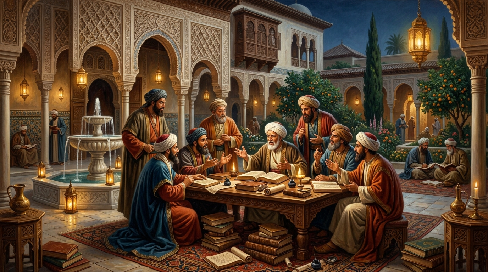
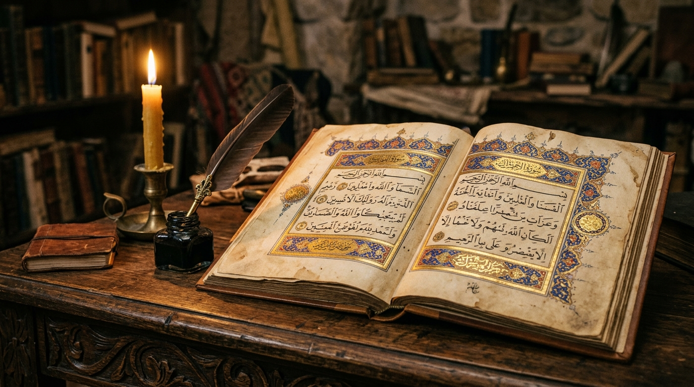
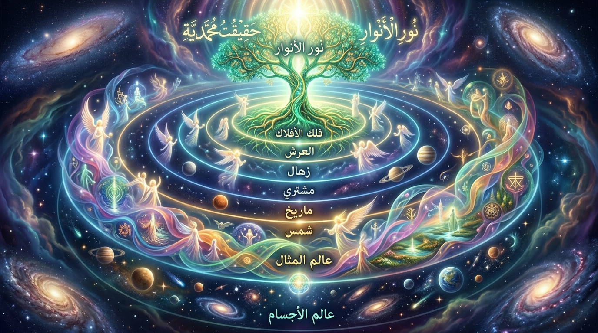
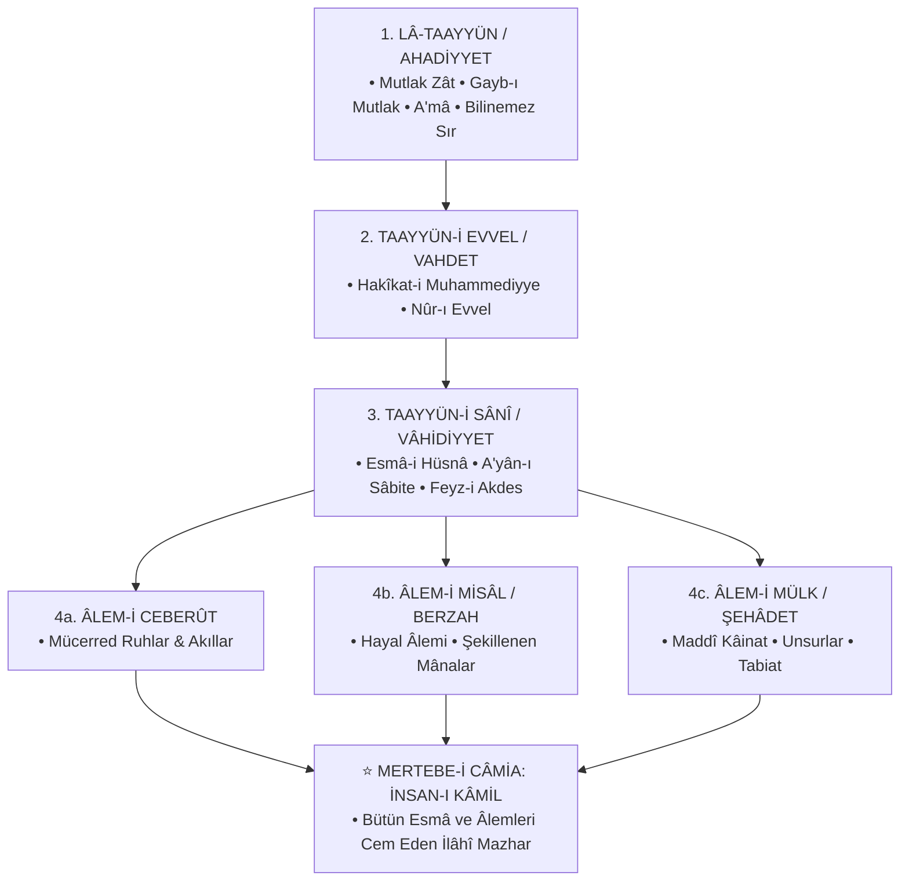
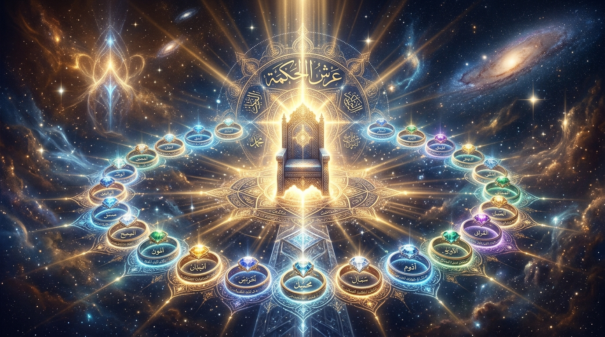
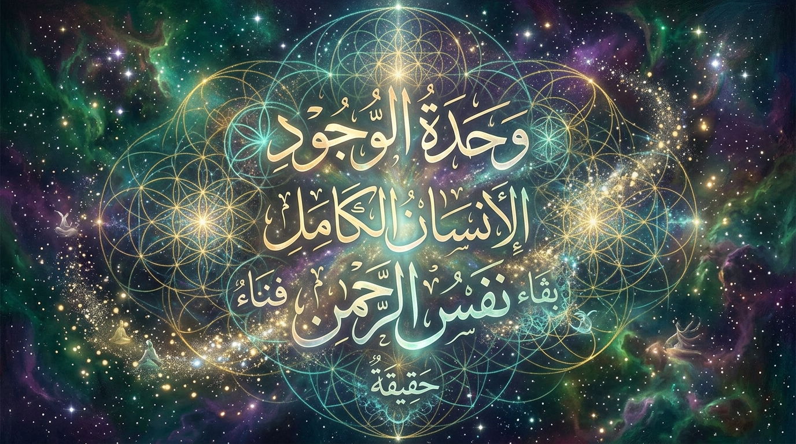
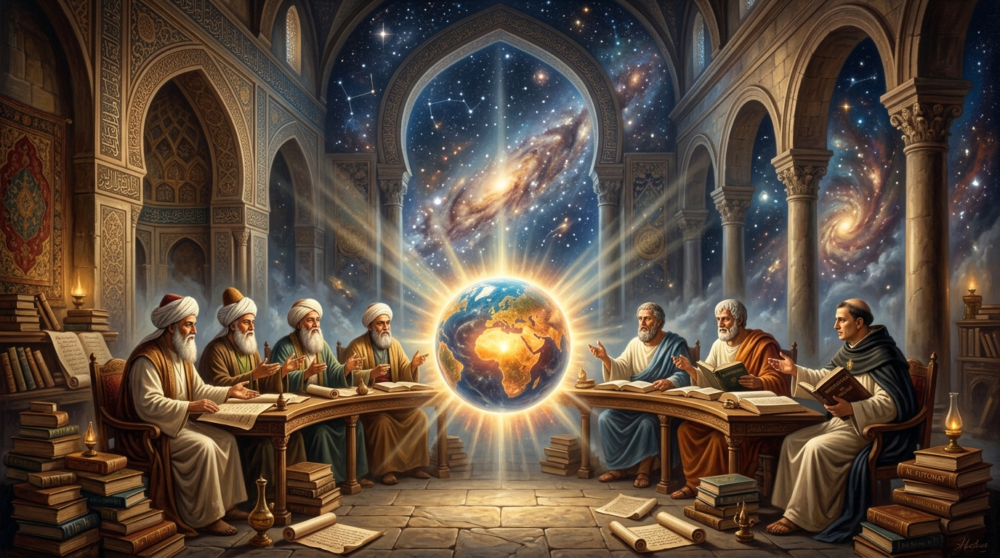
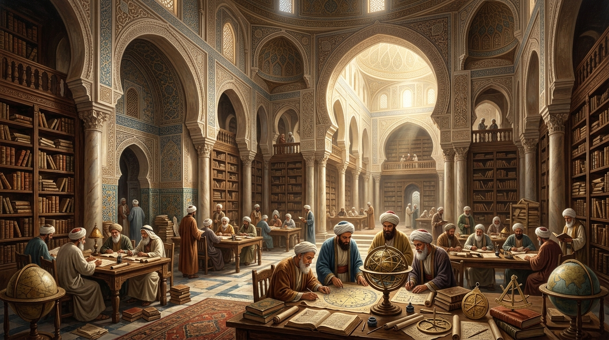

<div align="center">


<br/><br/>

[](https://github.com/arch-yunus/ibn-arabi-studies)
[](LICENSE)
[](texts/)
[](docs/ontology-maps.md)
[](https://github.com/arch-yunus/ibn-arabi-studies)

<br/>

> *«Biz öyle bir topluluğuz ki; sözlerimiz mecaz değil, doğrudan zevk ve keşif mahsulüdür. Dalgaların yüzeyine bakan köpük görür, dibe dalan ise incileri derer.»*  
> — **Muhyiddin İbnü'l-Arabî (eş-Şeyhü'l-Ekber / H. 560–638 / M. 1165–1240)**

</div>

---

## 📑 Kapsamlı İçindekiler
1. [🏛️ Külliyatın Vizyonu ve Mahiyeti](#-külliyatın-vizyonu-ve-mahiyeti)
2. [💬 Şeyhü'l-Ekber Hakkında Söylenenler: Büyük Tarihsel ve Felsefî Tanıklıklar Hazinesi](#-şeyhül-ekber-hakkında-söylenenler-büyük-tarihsel-ve-felsefî-tanıklıklar-hazinesi)
   - [1. Çağdaşları & Doğrudan Muhatapları (İbn Rüşd, Konevî, İzzeddin b. Abdisselâm, İbnü'l-Fârız, Kirmânî)](#1-çağdaşları-ve-doğrudan-muhatapları-13-yüzyıl)
   - [2. Anadolu ve Tasavvuf Büyükleri (Mevlânâ, Şems, Yûnus, Hüdâyî, Mısrî)](#2-anadolu-ve-tasavvuf-büyükleri-mevlânâ-şems-yûnus-hüdâyî-mısrî)
   - [3. Klasik Şârihler ve İrfân Mektebi (Kayserî, Kâşânî, Câmî, Nablusî, Bursevî, Dihlevî, İbn Âbidîn)](#3-klasik-şârihler-ve-osmanlıiran-irfân-mektebi-1418-yüzyıl)
   - [4. Resmî Savunmalar ve Şeyhülislâm Fetvaları (İbn Kemal, Süyûtî, Şa'rânî, Fîrûzâbâdî)](#4-resmî-savunmalar-şeyhülislâm-fetvaları-ve-büyük-imamlar)
   - [5. Kelâmî, Fıkhî ve Selefî Tenkitler (İbn Teymiyye, İbn Haldun, İbn Hacer, Teftâzânî)](#5-kelâmî-fıkhî-ve-selefî-tenkitler-ve-itirazlar)
   - [6. Modern Doğu-Batı Filozofları (Izutsu, Chittick, Corbin, Chodkiewicz, Addas, Kılıç, Demirli)](#6-modern-doğu-batı-filozofları-ve-akademisyenleri)
3. [📜 Şeyhü'l-Ekber'in Eserlerinden Genişletilmiş Metin ve Alıntılar](#-şeyhül-ekberin-eserlerinden-genişletilmiş-metin-ve-alıntılar)
   - [*Fusûsü'l-Hikem* Seçkileri ve Fass Fass Hikmet Sırları](#1-fusûsül-hikem-seçkileri-ve-hikmet-sırları)
   - [*el-Fütûhâtü'l-Mekkiyye* Tematik Şaheser Alıntıları](#2-el-fütûhâtül-mekkiyye-tematik-şaheser-alıntıları)
   - [*Tercümânü'l-Eşvâk* ve Şerhi *Zehâirü'l-A'lâk*](#3-tercümânül-eşvâk-ve-zehâirül-alâk-aşk-ve-sembolizm)
   - [Küçük Risaleler (*Risâletü'l-Vücûd*, *İsfâr*, *Şecere*, *İnşâ*, *Hilye*)](#4-küçük-risaleler-er-resâilüs-suğrâ)
4. [🧭 Ekberî Ontoloji Haritası & Merâtibü'l-Vücûd](#-ekberî-ontoloji-haritası--merâtibül-vücûd)
5. [🧩 Fusûsü'l-Hikem: 27 Peygamber ve Hikmet Matrisi](#-fusûsül-hikem-27-peygamber-ve-hikmet-matrisi)
6. [📖 Kapsamlı Ekberî Kavramlar Sözlüğü (*Istılâhât-ı Sûfiyye*)](#-kapsamlı-ekberî-kavramlar-sözlüğü-ıstılâhât-ı-sûfiyye)
7. [⚖️ Mukayeseli Felsefe Araştırmaları (Spinoza, Heidegger, Jung, Eckhart)](#-mukayeseli-felsefe-araştırmaları)
8. [🗂️ Depo ve Dizin Mimarisi](#-depo-ve-dizin-mimarisi)
9. [💻 İnteraktif CLI Araştırma Aracı (`tools/ekber_cli.py`)](#-interaktif-cli-araştırma-aracı-toolsekber_clipy)
10. [🎓 Akademik Müfredat ve Bibliyografya (BibTeX)](#-akademik-müfredat-ve-bibliyografya-bibtex)
11. [🤝 Katkı Protokolü & Lisans](#-katkı-protokolü--lisans)

---

## 🏛️ Külliyatın Vizyonu ve Mahiyeti

`ibn-arabi-studies`, Endülüslü büyük metafizikçi, mutasavvıf ve arif **Muhyiddin İbnü'l-Arabî**'nin (*eş-Şeyhü'l-Ekber*) metafizik sistemini, kavram dağarcığını, eserlerini ve Doğu-Batı düşüncesindeki yankılarını dizinlemek amacıyla kurgulanmış kapsamlı bir açık kaynak araştırma külliyatıdır.

İbnü'l-Arabî (H. 560–638 / M. 1165–1240), varlığın birliği (*Vahdet-i Vücûd*), İnsan-ı Kâmil nazariyesi, Âlem-i Misâl (*Mundus Imaginalis*) ontolojisi ve kesintisiz yaratılış (*Tecellî-i Dâim*) doktrinleriyle İslam medeniyetinin ve dünya felsefesinin en özgün anıtlarından birini inşa etmiştir.

---

<div align="center">
  
</div>

## 💬 Şeyhü'l-Ekber Hakkında Söylenenler: Büyük Tarihsel ve Felsefî Tanıklıklar Hazinesi

```text
       ╔═══════════════════════════════════════════════════════════════════════════════╗
       ║   "O öyle bir ummandır ki; kıyısı olmayan bir deryaya benzer.                 ║
       ║    Dalgıçlar onun derinliklerinden marifet incilerini dererken,              ║
       ║    kıyıda durup nazar edenler dalgaların azametinden ürperirler."             ║
       ║                                                    — Sadreddin Konevî         ║
       ╚═══════════════════════════════════════════════════════════════════════════════╝
```

### 1. Çağdaşları ve Doğrudan Muhatapları (13. Yüzyıl)

#### ⚖️ İbn Rüşd (Averroes, ö. 1198) — *Kurtuba Kadısı ve Büyük İslam Filozofu*
> *(Genç İbnü'l-Arabî henüz bıyıkları terlememiş bir delikanlı iken, Kurtuba'da onu bizzat köşküne davet eden İbn Rüşd ile gerçekleşen meşhur tarihi diyalog):*  
>
> *"Kurtuba Kadısı İbn Rüşd beni görmeyi çok arzu etmişti. Yanına girdiğimde sevgisinden ve saygısından dolayı yerinden fırlayıp bana sarıldı. Bana dedi ki:*  
> — **'Evet mi?'**  
> Ben de:  
> — **'Evet!'** dedim.  
> Bu cevabım üzerine kendisini anladığımı görerek sevinci arttı. Fakat hemen ardından onun neden sevindiğini fark ederek:  
> — **'Hayır!'** dedim.  
> Bunun üzerine rengi soldu, yüzü sarardı ve şüpheye düşerek sordu:  
> — **'Keşif ve ilahî feyz yoluyla ulaştığınız bilgi, bizim akıl ve nazar yoluyla elde ettiğimiz bilgiyle uyuşuyor mu?'**  
> Dedim ki:  
> — **'Evet ve Hayır! Evet ile Hayır arasında ise ruhlar cesetlerinden, boyunlar bedenlerinden fırlar uçar!'**  
> İbn Rüşd sarardı, titredi ve 'Lâ havle ve lâ kuvvete illâ billâh' diyerek oturdu. Çünkü ne demek istediğimi tam olarak anlamıştı; zira o sadece aklın peşindeydi, biz ise keşif ehliydik."  
> — **İbnü'l-Arabî, *el-Fütûhâtü'l-Mekkiyye*, Bab 15**

#### 🔑 Sadreddin Konevî (ö. 1274) — *Üvey Oğlu, Baş Halifesi ve Ekberî Ekolün Kurucusu*
> *"Şeyhimiz ve imamımız İbnü'l-Arabî, ilahî marifetlerin nihayetine ermiş, zâhir ve bâtın ilimlerini kendisinde cem etmiş bir tahkik sultanıdır. O, varlığın sırlarını akli kıyasların ve felsefi zihin jimnastiklerinin çok ötesinde, doğrudan Hak Teâlâ'dan alınan keşfî ve zevkî nurlarla açıklamıştır.*  
> *Fusûsü'l-Hikem'in gayesi, akıl yürüterek varılan kuru bir tevhid değil; varlığın Hak ile kaim olduğunu bizzat müşahede ettiren 'Hakkü'l-Yakîn' idrakidir. Onun kitaplarını sadece harflerin zahirine takılanlar anlayamaz."*  
> — **Sadreddin Konevî, *el-Fükûk Mukaddimesi***

#### 👑 İzzeddin b. Abdisselâm (ö. 1262) — *«Sultânü'l-Ulemâ» (Âlimlerin Sultanı)*
> *(Talebesi İbn Dakîku'l-Îd'in "Şeyh Muhyiddin hakkında ne dersiniz?" sorusu üzerine):*  
> *"O, zamanımızın kutbudur! O, şeriatın zâhir sınırlarına kıldan ince riayet eden, bâtın ilminde ise eşi benzeri olmayan kâmil bir mürşiddir. Ondan duyduğun ve aklının almadığı sözleri zahirine göre yargılama; çünkü o yüksek makamların lisanıyla konuşmaktadır."*  
> — **İmam Süyûtî, *Tenbîhü'l-Gabî***

#### 🌹 Şerefeddin İbnü'l-Fârız (ö. 1235) — *«Sultânü'l-Âşıkîn» (Büyük Mısır Şairi)*
> *(İbnü'l-Arabî'nin Kasîde-i Tâiyye'yi şerh etme teklifine cevaben):*  
> *"Ey Şeyh! Senin el-Fütûhâtü'l-Mekkiyye adlı eserin, benim kasidemin zaten en kâmil şerhidir! Benim manzum olarak remzettiğim hakikatleri sen mensur olarak en derin biçimde izah etmişsin."*

#### 🕊️ Evhadüddîn-i Kirmânî (ö. 1238) — *Büyük Sûfi ve Yakın Dostu*
> *"Şeyh Muhyiddin ile beraberliğimiz, ruhların beden kalıplarından evvelki ezelî ahdini hatırlatan ilahî bir sohbetti. O, Hakk'ın cemâlini ve celâlini her aynada kusursuz temâşâ eden eşsiz bir basiret gözüdür."*

---

### 2. Anadolu ve Tasavvuf Büyükleri (Mevlânâ, Şems, Yûnus, Hüdâyî, Mısrî)

#### ☀️ Şems-i Tebrîzî (ö. 1247) — *Mevlânâ'nın Mürşidi*
> *"Şam'da Şeyh Muhyiddin'in meclisinde bulundum. O, ilim ve marifette bir deryadır; lakin onun deryası öyle bir deryadır ki, içine dalan dalgıcın nefesi kesilir. Şeriat edebine riayeti ve ilahî hakikatleri beyandaki kudreti akıllara durgunluk verir."*  
> — **Şems-i Tebrîzî, *Makâlât***

#### 💫 Mevlânâ Celâleddîn-i Rûmî (ö. 1273) — *Mesnevî Müellifi*
> Mevlânâ, Şeyh-i Ekber'in baş talebesi Sadreddin Konevî'ye olan derin muhabbeti ve hürmetiyle bilinirdi. Vefatında cenaze namazını Konevî'nin kıldırmasını vasiyet etmiştir. Mesnevî'deki vahdet ve tecelli beyitleri, İbnü'l-Arabî metafiziğinin şiir lisanıyla terennümüdür:  
> *"Biz yoktuk; bizim bu varlık iddiamız da yoktu. Sen bizim yokluğumuza vücud verdin, var kıldın ve bize Senin cemâlinin aynası olmayı bahşettin."*

#### 🌿 Yûnus Emre (ö. 1321) — *Türkçe İrfânın Zirvesi*
> Yûnus Emre'nin divanında Vahdet-i Vücûd neşvesi doğrudan yankılanır:  
> *«Cümle yerde Hak hazır, göz gerektir göresi / Hak'tan gayrı ne vardır, kime gerek sorası...»*  
> *«Beni bende demen ben de değilem / Bir ben vardır bende benden içerü...»*

#### 🕯️ Niyâzî-i Mısrî (ö. 1694) — *Büyük Halvetî-Uşşâkî Kutbu*
> *"Şeyh Muhyiddin İbnü'l-Arabî, velayet semasının güneşidir. Onun sözlerini inkâr eden kimse, güneşin doğuşunu inkâr eden kör gibidir. Bizim yolumuzun esası, Şeyh-i Ekber'in beyan ettiği Tahkik Tevhidi'dir."*  
> — **Niyâzî-i Mısrî, *Mevâidü'l-İrfân***

#### 🕌 Azîz Mahmûd Hüdâyî (ö. 1628) — *Osmanlı Celvetî Pîri*
> *"Şeyh Muhyiddin, irfân vadisinde ayak basılmadık tepe bırakmamış bir kutbü'l-aktâbdır. Sultanların ve ulemanın ona hürmeti, Hak Teâlâ'nın ona bahşettiği zâtî heybet ve fazilettendir."*

---

### 3. Klasik Şârihler ve Osmanlı/İran İrfân Mektebi (14–18. Yüzyıl)

#### 🏛️ Dâvûd-i Kayserî (ö. 1350) — *Osmanlı'nın İlk Müderrisi*
> *"Bilinmelidir ki Şeyhü'l-Ekber'in kelâmı, nebevi kandilden sızan nurlardır. O, varlığın mertebelerini ve ilahî isimlerin tecellilerini öyle bir vuzuhla açıklamıştır ki, onun terminolojisini tahsil etmeyen bir kimsenin hakiki manada tasavvuf ve metafizik tahsil etmesi imkânsızdır."*  
> — **Dâvûd-i Kayserî, *Matla‘u Husûsi'l-Kelim Mukaddimesi***

#### 📖 Abdürrezzâk el-Kâşânî (ö. 1329) — *Büyük Ekberî Şârih*
> *"Şeyh Muhyiddin, varlığın birliğini ve tevhidi öyle bir tahkik makamında anlatmıştır ki; nâehle bu sırlar perde kalsın diye onları sembollerin libasına bürümüştür. Basiret sahipleri o örtünün altındaki saf nuru görürken, mukallitler sadece kumaşa takılıp kalırlar."*  
> — **Abdürrezzâk el-Kâşânî, *Şerhu Fusûsi'l-Hikem***

#### ✍️ Molla Câmî (ö. 1492) — *Büyük Fars Şairi ve Ârifi*
> *"Fusûsü'l-Hikem'in her bir fassı, ledün deryasından fışkıran bir hikmet pınarıdır. O pınardan ancak nefsaniyet kirlerinden arınmış saf canlar içebilir. Şeyh Muhyiddin'e dil uzatanlar, göğe doğru tüküren adama benzerler; tükürükleri göğe ulaşmaz, kendi yüzlerine geri döner."*  
> — **Molla Câmî, *Nefehâtü'l-Üns***

#### 💎 Abdülganî en-Nablusî (ö. 1731) — *18. Yüzyıl Şam Allâmesi*
> *"Vahdet-i Vücûd ile mülhitlerin ittihadını bir tutanlar cehalet içindedirler. Şeyh Muhyiddin der ki: 'Lâ hulûle ve lâ ittihâd' (Ne hulûl vardır ne de birleşme). Zira mutlak anlamda var olan yalnızca Hak'tır, masivâ ise O'nun esmâ gölgesidir."*  
> — **Abdülganî en-Nablusî, *el-Vücûdü'l-Hakk***

#### 📜 İsmail Hakkı Bursevî (ö. 1725) — *Osmanlı Müfessir ve Mutasavvıfı*
> *"Şeyh-i Ekber'in kelâmı vahiy menbaından feyz almıştır; onun remizleri zâhir ulemasının havsalasını aşar. Rûhu'l-Beyân tefsirimizi tezyin eden en latif mânalar, Şeyh'in Fütûhât ve Fusûs'taki işârî nurlarından derlenmiştir."*  
> — **İsmail Hakkı Bursevî, *Kitâbü'l-Hitâb***

#### ⚖️ İbn Âbidîn (ö. 1836) — *Büyük Hanefî Fıkıh İmamı*
> *"Şeyh Muhyiddin İbnü'l-Arabî, şüphesiz velilerin önde gelenlerinden ve tahkik ehli kâmil bir ariftir. Kapalı ifadelerinin zahirine bakıp hüküm vermek avam için caiz değildir; lâkin onu tekfir etmek de büyük bir hüsrandır."*  
> — **İbn Âbidîn, *el-Ukûdü'd-Dürriyye***

#### 👳‍♂️ Şah Veliyyullah ed-Dihlevî (ö. 1762) — *Hindistan'ın Büyük Müceddidi*
> *"İbnü'l-Arabî'nin 'Vahdet-i Vücûd'u ile İmam Rabbânî'nin 'Vahdet-i Şühûd'u arasında hakikatte hiçbir zıtlık yoktur. İbnü'l-Arabî meselenin ontolojik (varlıksal) hakikatini anlatmış, İmam Rabbânî ise sâlikin psikolojik ve müşahede halini dile getirmiştir. İkisi de aynı hakikatin farklı cepheleridir."*  
> — **Şah Veliyyullah Dihlevî, *et-Tefhîmâtü'l-İlâhiyye***

---

### 4. Resmî Savunmalar, Şeyhülislâm Fetvaları ve Büyük İmamlar

#### 📜 Şeyhülislâm İbn Kemal (Kemalpaşazâde, ö. 1534) — *Tarihî Osmanlı Fetvası*
> *(Yavuz Sultan Selim'in Şam fethinde İbnü'l-Arabî'nin kabrini buldurup türbe ve cami yaptırması üzerine verilen meşhur fetva):*  
>
> *"Muhyiddin İbnü'l-Arabî; kâmil bir mürşid, fâzıl bir imam ve ledünnî ilimler sahibi bir tahkik kutbudur. Onun faziletini inkâr edenler büyük bir gaflet içindedirler. Hükmümüz şudur: **Şeyh kâmil bir velidir; lâkin onun kitaplarını derin ilmi ve basireti olmayanların okuması men edilmelidir.**"*  
> — **Şeyhülislâm Kemalpaşazâde Fetvası**

#### 📿 İmam Celâleddin es-Süyûtî (ö. 1505) — *Büyük Hadis ve Tefsir İmamı*
> *"Şeyh Muhyiddin bir müçtehid ve velilerin kutbudur. Kitaplarında ulemaya kapalı gelen ibareler varsa, bunların tasavvuf ıstılahında sahih bir tevili vardır. Bir veliyi anlamadığın bir sözünden ötürü tekfir etmektense hüsnüzan edip tevil etmek Ehl-i Sünnet edebinin gereğidir."*  
> — **İmam Süyûtî, *Tenbîhü'l-Gabî fî Tebrieti İbni'l-Arabî***

#### 📖 İmam Şa'rânî (ö. 1565) — *Mısırlı Büyük Hadis ve Tasavvuf Âlimi*
> *"Şeyhü'l-Ekber'in kitaplarını okuduğumda gördüm ki; onun vazedip de Kur'an ve Sünnet'e dayanmayan tek bir meselesi dahi yoktur. Şayet onun kitaplarında şeriata açıkça aykırı bir lafız görürseniz biliniz ki o lafız, hasetçileri tarafından sonradan onun kitaplarına sokulmuş tahrifattır."*  
> — **İmam Şa'rânî, *el-Kibrîtü'l-Ahmer fî Beyâni Ulûmi'ş-Şeyhi'l-Ekber***

#### 📚 Mecdüddin el-Fîrûzâbâdî (ö. 1414) — *«Kâmûsu'l-Muhît» Müellifi Büyük Lügat Âlimi*
> *"Şeyh Muhyiddin, ilim deryalarının sultanıdır. Onun aleyhinde konuşanlar ya onun yüksek mertebesini kıskanan hasetçilerdir ya da tasavvuf ehlinin lisanını anlamaktan aciz zahirperestlerdir."*

---

### 5. Kelâmî, Fıkhî ve Selefî Tenkitler ve İtirazlar

#### ⚡ Takıyyüddin İbn Teymiyye (ö. 1328) — *Selefî / Harrânî Âlim*
> *"İbnü'l-Arabî'nin 'Vahdet-i Vücûd' nazariyesi, İslam'ın zahir nasslarına ve Selef-i Sâlihîn'in icmaına kökten muhaliftir. O, Hristiyanların Hz. Îsâ hakkındaki tecessüd iddiasını bütün mevcudata yaymıştır. Firavun'un imanla öldüğünü söylemesi, Nûh kavminin putlara tapmasını hakikate ermek sayması kabul edilemez bir dalalettir. Zekâsı ne kadar parlak olursa olsun, bu akide İslam tevhidini tahrip eder."*  
> — **İbn Teymiyye, *Mecmûu'l-Fetâvâ***

#### 📜 İbn Haldun (ö. 1406) — *Sosyolojinin ve Tarih Felsefesinin Öncüsü*
> *"Muhyiddin İbnü'l-Arabî yüksek bir keşif sahibidir; lâkin eserlerinde 'Vahdet-i Mutlaka' fikrini müteşabih kavramlarla anlatmıştır. Bu kitaplar şeriat ahkâmına yabancılaşmaya yol açabileceğinden, ehil olmayanların bu eserleri mütalaa etmesi fıkhî maslahat gereği men edilmelidir."*  
> — **İbn Haldun, *Şifâü's-Sâil li-Tehzîbi'l-Mesâil***

#### ⚖️ İbn Hacer el-Askalânî (ö. 1449) — *Büyük Hadis Hâfızı*
> *"Şeyh Muhyiddin'in kelimelerinin zahirinde çok ağır ifadeler görülür; lâkin sûfiyyenin kendilerine has ıstılahları vardır. En selametli yol, şahsen kendisini tekfir etmekten sakınmak, fakat kitaplarındaki muğlak sözleri taklit etmekten de uzak durmaktır."*  
> — **İbn Hacer, *Lisânü'l-Mîzân***

#### 🏛️ Sa'deddin et-Teftâzânî (ö. 1390) — *Büyük Kelâm Âlimi*
> *"Vahdet-i Vücûd ehline göre varlık birdir ve o da Hak Teâlâ'dır; mahlukat ise O'nun tecellileridir. Şayet bu sözden mevcudatın bizatihi Allah olduğu kastediliyorsa bu açık bir ilhaddır. Şayet kastedilen masivânın Hak ile kaim olduğu ise, bu zaten Ehl-i Sünnet kelâmının kabul ettiği bir gerçektir."*  
> — **Teftâzânî, *Şerhu'l-Makâsıd***

---

### 6. Modern Doğu-Batı Filozofları ve Akademisyenleri

#### 🇯🇵 Toshihiko Izutsu (1914–1993) — *Japon Filozof ve Karşılaştırmalı Dinler Uzmanı*
> *"İbnü'l-Arabî, yalnızca İslam dünyasının değil, insanlık düşünce tarihinin gördüğü en devasa sistem kuruculardan biridir.*  
> *Onun 'Vahdet-i Vücûd' ontolojisi, Spinoza'nın töz kuramından çok daha zengin; 'Âlem-i Misâl' ve 'Tecellî-i Dâim' teorisi ise Hegel'in diyalektiğini ve Whitehead'in süreç felsefesini yüzyıllar öncesinden çok daha canlı bir irfani zeminle inşa etmiştir. O, varlığın nefes alıp verişini metafizik bir senfoni gibi kurgulamıştır."*  
> — **Toshihiko Izutsu, *Sufism and Taoism***

#### 🇺🇸 William Chittick (1943–) — *İslam Felsefesi ve Tasavvuf Profesörü*
> *"Şeyhü'l-Ekber'den sonra İslam coğrafyasında kelâm, felsefe veya tasavvuf yapan hiç kimse, onun kurduğu kavramsal sözlüğü kullanmadan tek bir bağımsız cümle dahi kuramamıştır.*  
> *Onu kabul eden de reddeden de, onun açtığı terminolojik sahada düşünmek mecburiyetinde kalmıştır. İbn Arabî'nin eserleri, Kur'an ve Sünnet'in metafizik bir projeksiyonudur."*  
> — **William Chittick, *The Sufi Path of Knowledge***

#### 🇫🇷 Henry Corbin (1903–1978) — *Fransız Filozof ve Şarkiyatçı*
> *"İbnü'l-Arabî'nin 'Hayal Âlemi' (Mundus Imaginalis) kavramı olmaksızın, Doğu'nun tinsel coğrafyasını, rüya fenomenolojisini ve sanat felsefesini anlamak imkânsızdır.*  
> *Batı felsefesi madde ile akıl arasına sıkışıp ontolojik bir boşluğa düşmüşken, İbn Arabî ruh ile madde arasında 'Âlem-i Misâl' köprüsünü kurarak insanın kozmik yalnızlığına son vermiştir."*  
> — **Henry Corbin, *Creative Imagination in the Sufism of Ibn Arabi***

#### 🇫🇷 Michel Chodkiewicz (1929–2020) — *Ekberî Araştırmaları Otoritesi*
> *"İbnü'l-Arabî bir kıyısı olmayan deryadır. Onun velayet teorisi (Hatmü'l-Velâye), İslam teolojisinin peygamberlik ve veraset anlayışına getirilmiş en kusursuz ve kapsamlı mimaridir."*  
> — **Michel Chodkiewicz, *Seal of the Saints***

#### 🇫🇷 Claude Addas — *İbn Arabî Biyografi Yazarı*
> *"İbnü'l-Arabî'nin hayatı, manevî bir coğrafyada kesintisiz bir hicrettir. Endülüs'ten Şam'a, Mekke'den Konya'ya uzanan bu yolculuk, aslında insanın kendi içindeki Zât-ı İlâhî'ye olan seyrü's-sülûkünün haritasıdır."*  
> — **Claude Addas, *Quest for the Red Sulphur***

#### 🇹🇷 Prof. Dr. Mahmut Erol Kılıç — *İslam Felsefesi Profesörü*
> *"İbn Arabî bir masal anlatıcısı veya soyut bir teorisyen değildir. O, varoluş hiyerarşisinin haritasını çıkaran kozmik bir mimardır. Onu anlamak için zihni sadece rasyonel aklın sınırlarında tutmak yetmez; kalbin idrak gözünü (basiret) devreye sokmak gerekir. Şeyh-i Ekber, Doğu bilgeliğinin zirve noktasıdır."*  
> — **Mahmut Erol Kılıç, *Şeyh-i Ekber: İbn Arabî Düşüncesine Giriş***

#### 🇹🇷 Prof. Dr. Ekrem Demirli — *Tasavvuf ve Ekberî Düşünce Profesörü*
> *"İbnü'l-Arabî ile birlikte İslam metafiziği kurucu ve nihai diline kavuşmuştur. Ondan sonra gelen bütün kelâmcılar, filozoflar ve mutasavvıflar onun kavramsal haritası üzerinden konuşmak zorunda kalmışlardır. Vahdet-i Vücûd, sadece bir tasavvuf neşvesi değil, varlığın nihai ontolojik izahıdır."*  
> — **Ekrem Demirli, *İslam Metafiziğinde Tanrı ve İnsan***

---

<div align="center">
  
</div>

## 📜 Şeyhü'l-Ekber'in Eserlerinden Genişletilmiş Metin ve Alıntılar

### 1. *Fusûsü'l-Hikem* Seçkileri ve Hikmet Sırları

#### 🪞 Fass I: Âdem Kelimesindeki İlahi Hikmet (*Fass-ı Hikmet-i İlâhiyye*)
> *"Hakk Teâlâ, güzel isimlerinin (el-Esmâü'l-Hüsnâ) hükümlerini bütünüyle göreceği kuşatıcı bir varlık içinde Zât'ını müşahede etmeyi diledi. Zira bir şeyin kendisini bizzat kendi nefsiyle görmesi ile, o şeyi kendisine ayna olan başka bir surette görmesi aynı şey değildir... Âlem, içinde ruh bulunmayan cilalanmamış bir ayna gibi yaratılmıştı. Âdem'in yaratılmasıyla o ayna cilalandı. Âdem, o aynanın cilası ve o suretin ruhu oldu."*  
> — *Fusûsü'l-Hikem, Fasl I* • [Metin Analizi](texts/fusus-al-hikam/01-fass-adem-hikmet-i-ilahiyye.md)

#### 🌊 Fass III: Nûh Kelimesindeki Tenzihî Hikmet (*Fass-ı Hikmet-i Sübbûhiyye*)
> *"Bil ki tenzih ehli, Hakk'ı sınırlandırmış ve mukayyet kılmıştır. Çünkü sırf tenzih yapan kimse Hakk'ı mahlukattan tecrit ederken O'nu bir yöne hapseder. Teşbih ehli de O'nu sınırlandırmıştır. Hakiki arif ise hem tenzih hem teşbihi cem eder: 'O'nun benzeri hiçbir şey yoktur (Tenzih) ve O her şeyi işiten ve görendir (Teşbih).' (Şûrâ, 42/11)"*  
> — *Fusûsü'l-Hikem, Fasl III* • [Metin Analizi](texts/fusus-al-hikam/03-fass-nuh-hikmet-i-subbuhiyye.md)

#### 🏔️ Fass VI: İsmâil Kelimesindeki Yücelik Hikmeti (*Fass-ı Hikmet-i Aliyye*)
> *"Bil ki 'Rabb' isminin senden talep ettiği şey ile senin O'ndan talep ettiğin şey birbirine bağlıdır. Rab, kulun kulluğu (ubûdiyyeti) ile zâhir olur; kul ise Rabbin rubûbiyyeti ile kâimdir. Eğer O olmasaydı biz var olamazdık; eğer biz olmasaydık O'nun isimlerinin tecellisi zâhir olmazdı."*  
> — *Fusûsü'l-Hikem, Fasl VI* • [Metin Analizi](texts/fusus-al-hikam/07-fass-ismail-hikmet-i-aliyye.md)

#### 🌙 Fass IX: Yûsuf Kelimesindeki Nûrânî Hikmet (*Fass-ı Hikmet-i Nûriyye*)
> *"Hz. Peygamber (s.a.v.) buyurdu: 'İnsanlar uykudadırlar, öldükleri zaman uyanırlar.' İşte bu dünya hayatı baştan başa bir uykudur; içinde görülen şeyler rüyadır. Hz. Yûsuf rüyada on bir yıldız, güneş ve ayın kendisine secde ettiğini gördüğünde, bu suretler Âlem-i Misâl'deki mânanın sembolleriydi. Yıllar sonra tahta oturduğunda 'İşte bu, evvelki rüyamın tevilidir' dedi. Oysa tahta oturması da rüya içinde rüyadır; mutlak uyanış ancak berzahtan sonra gerçekleşir."*  
> — *Fusûsü'l-Hikem, Fasl IX* • [Metin Analizi](texts/fusus-al-hikam/09-fass-yusuf-hikmet-i-nuriyye.md)

#### ❤️ Fass XII: Şuayb Kelimesindeki Kalbî Hikmet (*Fass-ı Hikmet-i Kalbiyye*)
> *"Kalp, Hakk'ın tecellilerinin genişliğine göre genişler ve daralır; çünkü tecellide tekrar yoktur (**Lâ tekrâra fi't-tecellî**). Arif kişinin kalbi belli bir inancın ve itikadın düğümüne hapsolmaz. Hakk hangi surette tecelli ederse O'nu o surette tanır. Mukayyed inanç sahipleri ise Hakk'ı yalnızca kendi zihinlerindeki putta/kalıpta kabul eder, gayrısında inkâr ederler."*  
> — *Fusûsü'l-Hikem, Fasl XII* • [Metin Analizi](texts/fusus-al-hikam/12-fass-suayb-hikmet-i-kalbiyye.md)

#### 🕊️ Fass XV: Îsâ Kelimesindeki Nebevî Hikmet (*Fass-ı Hikmet-i Nebeviyye*)
> *"Hz. Îsâ'nın zuhuru, Cebrail'in Hz. Meryem'e üflediği nefes ile gerçekleşti. Bu yüzden onda diriltme (*ihyâ*) sıfatı baskındır. Cebrail'in nefesi, Rahmân'ın kâinata varlık veren nefesinin (*Nefes-i Rahmânî*) cüz'î bir mazharı idi. Îsâ (a.s.), Hakk'ın kelimesi ve ruhudur."*  
> — *Fusûsü'l-Hikem, Fasl XV* • [Metin Analizi](texts/fusus-al-hikam/15-fass-isa-hikmet-i-nebeviyye.md)

#### 👑 Fass XXVII: Muhammed Kelimesindeki Ferdiyyet Hikmeti (*Fass-ı Hikmet-i Ferdiyye*)
> *"Hz. Muhammed'in (s.a.v.) hikmeti 'Ferdiyyet'tir (Teklik ve Benzersizliktir); çünkü o, bu insan türünün en kâmil mazharı ve varlığın ilk taayyünüdür. Hadis-i şerifte buyuruldu: 'Bana dünyanızdan üç şey sevdirildi: Kadın, güzel koku ve gözümün nuru kılınan namaz.' Kadın mazharında Hakk'ı müşahede etmek, en kâmil müşahededir; çünkü Hakk'ı hem fâil hem kâbil olarak temaşa etmeyi sağlar."*  
> — *Fusûsü'l-Hikem, Fasl XXVII* • [Metin Analizi](texts/fusus-al-hikam/27-fass-muhammed-hikmet-i-ferdiyye.md)

---

### 2. *el-Fütûhâtü'l-Mekkiyye* Tematik Şaheser Alıntıları

#### 🕊️ Bab 1: Marifet-i Rûh ve Kâbe'deki Ruhanî Genç (*el-Fetâ*)
> *"Mekke'de Harem-i Şerif'te Kâbe'yi tavaf ederken Hacerü'l-Esved'in karşısında nûrânî bir genç (*el-Fetâ*) ile karşılaştım. O hem konuşan hem susan, hem cisim hem ruhtu. Ona sordum: 'Sen kimsin?' Dedi ki: 'Ben konuşan Kâbe'yim; varlığın sırrıyım.' İşte Fütûhât'ta yazılanlar, o gencin bana remzettiği hakikatlerin açılımıdır."*  
> — *el-Fütûhâtü'l-Mekkiyye, Bab 1* • [İncele](texts/futuhat-al-makkiyya/bab-001-marifet-i-ruh.md)

#### 🌌 Bab 63: Varlığın Aslı ve Hayal Mertebesi
> *"Ey talip! Bil ki sen bir hayalsin; algıladığın ve 'benim dışımda var' dediğin her şey de hayal içinde hayaldir. Hakiki ve mutlak varlık yalnızca Hakk Teâlâ'dır. Kesret (çokluk), vahdet denizinin yüzeyindeki kabarcıklar ve dalgalar gibidir. Suretlere takılıp kalan dalgayı müstakil sanır; tahkik ehli ise denizin tekliğini müşahede eder."*  
> — *el-Fütûhâtü'l-Mekkiyye, Bab 63* • [İncele](texts/futuhat-al-makkiyya/bab-063-alem-i-hayal-ve-kesret.md)

#### 🌬️ Bab 198: İlahî Nefes ve Kozmik Harfler (*Nefes-i Rahmânî*)
> *"Eşya, Rahmân'ın nefesinde açığa çıkan harfler gibidir. İnsan nefes verirken harflerin ağız mahreçlerinde belirmesi gibi; Hakîm olan Yaratıcı da 'Kün' (Ol) emrinin nefesiyle mümkinatın harflerini Âlem levhasına nakşetmiştir. Bütün kâinat, Hakk'ın telaffuz ettiği bitimsiz bir kelimeler manzumesidir."*  
> — *el-Fütûhâtü'l-Mekkiyye, Bab 198* • [İncele](texts/futuhat-al-makkiyya/bab-198-nefes-i-rahmani-ve-huruf.md)

#### ❤️ Bab 178: İlahî, Ruhânî ve Tabiî Aşkın Hakikati (*Bâbü'l-Muhabbe*)
> *"Aşk, varlığın mayası ve yaratılışın yegâne sebebidir. Bil ki Allah Teâlâ mahlukatı ancak muhabbetle yarattı; nitekim kudsî hadiste buyuruldu: 'Gizli bir hazine idim, bilinmeyi sevdim (ahbebtü) ve mahlukatı yarattım.' Seven kişi maşukunda fâni olmadıkça aşkın hakikatine eremez. Aşk öyle bir ateştir ki, sevgiliden gayrı ne varsa hepsini yakıp kül eder; geriye yalnızca Maşuk kalır."*  
> — *el-Fütûhâtü'l-Mekkiyye, Bab 178*

#### ⏳ Bab 390: Zaman ve Anın Hakikati (*Ân-ı Dâim*)
> *"Zaman, seninle tecelli arasındaki nisbetten ibarettir. Ne geçmiş vardır ne gelecek; gerçekte olan yalnızca 'Ân-ı Dâim'dir (Sürekli Şimdiki Zaman). Her nefeste bir yaratılış, her anda yeni bir tecelli zuhur eder; lakin gaflet ehli bunu kesintisiz bir süreklilik zanneder."*  
> — *el-Fütûhâtü'l-Mekkiyye, Bab 390* • [İncele](texts/futuhat-al-makkiyya/bab-390-zaman-ve-an-i-daim.md)

#### 📜 Bab 558: Sâliklere Vasiyetler ve Ahlâkî Nasihatler
> *"Sana vasiyetim şudur: Hiçbir varlığı hakir görme; çünkü Hakk Teâlâ hiçbir şeyi bâtıl ve abes yaratmamıştır. Sana kötülük edene ihsan ile muamele et. Şeriatın zâhir sınırlarına kıldan ince riayet et; zira zâhir şeriatı korumayanın bâtın hakikati zındıklıktır."*  
> — *el-Fütûhâtü'l-Mekkiyye, Bab 558* • [İncele](texts/futuhat-al-makkiyya/bab-558-vasiyetler-ve-nasihatler.md)

---

### 3. *Tercümânü'l-Eşvâk* ve *Zehâirü'l-A'lâk* (Aşk ve Sembolizm)

#### 🌹 11. Kaside: Kalbin Evrenselliği ve Din-i Aşk
```text
لقد صارَ قلبي قابلاً كلَّ صورةٍ
فَمَرْعىً لِغِزْلانٍ ودَيْرٌ لرُهْبانِ
وبَيْتٌ لأوْثانٍ وكَعْبَةُ طائفٍ
وألْواحُ تَوْراةٍ ومُصْحَفُ قُرْآنِ
أدِينُ بدِينِ الحُبِّ أنّى تَوَجَّهَتْ
رَكائِبُهُ فالحُبُّ دِيني وإيماني
```

> *"Kalbim her sûreti kabul eder bir hâle geldi;  
> Ceylanların otlağı, keşişlerin manastırı,  
> Putların tapınağı, hacıların Kâbe'si,  
> Tevrat'ın levhaları ve Kur'ân'ın mushafı...  
> Ben aşk dinine tâbiyim; aşkın kervanı hangi yöne yönelirse yönelsin,  
> İşte benim dinim ve imanım odur."*  
>  
> *(Şeyh'in Kendi Şerhi - Zehâirü'l-A'lâk'tan):*  
> *"Bu beyitlerde geçen 'ceylan', ilahi sırların peşinde koşan letaiftir; 'manastır', ruhani makamların tecrit halidir; 'putlar', esmâ tecellilerinin mazharlarıdır. Kalb-i arif, hiçbir tecelli suretinden mahrum kalmayacak kadar genişlemiştir."*  
> — [Ayrıntılı Şiir & Zehâirü'l-A'lâk Tahlili](texts/tarjuman-al-ashwaq/kaside-11-kalbin-evrenselligi-ve-sehri.md)

---

### 4. Küçük Risaleler (*er-Resâilü's-Suğrâ*)

#### 🌿 *Risâletü'l-Vücûd* (Kitâbü'l-Elif): Varlık Risalesi
> *"Bil ki Allah Teâlâ ile birlikte hiçbir şey yoktur. Ne O'nun içinde bir şey vardır ne de O'nun dışında. O şimdi de ezelde olduğu gibidir. Sen ne O'sun ne de O'ndan başkasısın. Eğer kendini bilirsen, nefsinin bağımsız bir varlığı olmadığını, varlığın yalnızca Hakk'ın Vücûdu olduğunu anlarsın."*  
> — *Risâletü'l-Vücûd* • [İncele](texts/minor-treatises/risaletu-l-vucud.md)

#### 🚶‍♂️ *Kitâbü'l-İsfâr an Netâici'l-Esfâr*: Yolculukların Neticeleri
> *"Varlıkta üç büyük sefer vardır:  
> 1. **Hakk'a Sefer:** Kesret karanlığından, günahlardan ve cehaletten sıyrılarak Tevhid ve Vahdet nuruna hicret.  
> 2. **Hakk'ta Sefer:** İsimler, sıfatlar ve ilâhî kemâlât deryasında sonsuz müşahede hali.  
> 3. **Hakk'tan Halka Sefer:** Cem makamından sonra fark makamına inerek halkı Hakk ile irşad etme, peygamberlerin ve vârislerin yolculuğu."*  
> — *Kitâbü'l-İsfâr* • [İncele](texts/minor-treatises/kitabu-l-isfor-an-netaic-il-esfar.md)

#### 🌳 *Şeceretü'l-Kevn*: Kozmik Varlık Ağacı
> *"Kâinat devasa bir ağaç gibidir: Kökü 'Kün' emri ve Hakîkat-i Muhammediyye tohumu; gövdesi ve dalları felekler ve melekût âlemleri; meyvesi ise İnsan-ı Kâmil'dir. Ağacın dikilme gayesi meyvedir; kâinatın yaratılış gayesi İnsandır."*  
> — *Şeceretü'l-Kevn* • [İncele](texts/minor-treatises/seceretu-l-kevn.md)

#### ⭕ *İnşâü'd-Devâir*: Dairelerin İnşası
> *"Varlık üç ana daireye ayrılır: 1. Mutlak Vücûd (Hakk Teâlâ), 2. Mutlak Adem (Yokluk), 3. Mümkin Vücûd (Âlem). İnsan ise bütün bu dairelerin kesiştiği merkez noktasıdır."*  
> — *İnşâü'd-Devâir* • [İncele](texts/minor-treatises/insau-d-devair.md)

#### ✨ *Hilyetü'l-Abdâl*: Manevî Sülûkün Dört Direği
> *"Sülûkün dört esası vardır: 1. **Sükût:** Dili lüzumsuz sözden, kalbi masivâdan korumak; 2. **Uzlet:** Kalben halktan tecrit olup Hakk'a yönelmek; 3. **Cû‘:** Az yemekle nefsin kesafetini kırmak; 4. **Seher:** Geceleri teheccüd ve murakabe ile ihya etmek."*  
> — *Hilyetü'l-Abdâl* • [İncele](texts/minor-treatises/huliyyetu-l-abdal.md)

---

<div align="center">
  
</div>

## 🧭 Ekberî Ontoloji Haritası & Merâtibü'l-Vücûd

Ekberî düşünce, varlığın birliği (*Vahdet-i Vücûd*) ve bu tek hakikatin farklı tecelli mertebelerinde (*Merâtibü'l-Vücûd*) zuhur etmesi temeline dayanır:



> 📌 *Dairelerin İnşası (*İnşâü'd-Devâir*) ve Nefes-i Rahmânî şemaları için [docs/ontology-maps.md](docs/ontology-maps.md) dosyasına bakabilirsiniz.*

---

<div align="center">
  
</div>

## 🧩 Fusûsü'l-Hikem: 27 Peygamber ve Hikmet Matrisi

| # | Peygamber / Fass | Temsil Ettiği Hikmet | Temel Teolojik / Ontolojik Mesele | Doküman |
| :---: | :--- | :--- | :--- | :---: |
| 1 | **Hz. Âdem** | Hikmet-i İlâhiyye | Âlemin yaratılışı, ayna metaforu ve hilafet | [Metin & Şerh](texts/fusus-al-hikam/01-fass-adem-hikmet-i-ilahiyye.md) |
| 2 | **Hz. Şît** | Hikmet-i Nefsiyye | Hibe, bağış ve ilahi isimlerin sırları | [Fusûs Dizini](texts/fusus-al-hikam/README.md) |
| 3 | **Hz. Nûh** | Hikmet-i Sübbûhiyye | Tenzih ve teşbih dengesi; tevhîdin kuşatıcılığı | [Metin & Şerh](texts/fusus-al-hikam/03-fass-nuh-hikmet-i-subbuhiyye.md) |
| 4 | **Hz. İdrîs** | Hikmet-i Kuddûsiyye | Yücelik (*Ulüvv*) mertebesi ve mekânsal tenzih | [Fusûs Dizini](texts/fusus-al-hikam/README.md) |
| 5 | **Hz. İbrâhîm** | Hikmet-i Müheymiyye | Aşkta fena hali ve ilahi dostluk (*Hullet*) | [Fusûs Dizini](texts/fusus-al-hikam/README.md) |
| 6 | **Hz. İshâk** | Hikmet-i Hakkiyye | Rüyaların tabiri ve kurban sırrı | [Fusûs Dizini](texts/fusus-al-hikam/README.md) |
| 7 | **Hz. İsmâil** | Hikmet-i Aliyye | Rıza makamı ve rubûbiyyet-ubûdiyyet ilişkisi | [Metin & Şerh](texts/fusus-al-hikam/07-fass-ismail-hikmet-i-aliyye.md) |
| 8 | **Hz. Yâkûb** | Hikmet-i Rûhiyyet | Dinî teslimiyet ve kalbî istikamet | [Fusûs Dizini](texts/fusus-al-hikam/README.md) |
| 9 | **Hz. Yûsuf** | Hikmet-i Nûriyye | Âlem-i Misâl, rüya ontolojisi ve suretler | [Metin & Şerh](texts/fusus-al-hikam/09-fass-yusuf-hikmet-i-nuriyye.md) |
| 10 | **Hz. Hûd** | Hikmet-i Ahadiyye | Sırat-ı müstakîm ve her varlığın perçeminden tutulması | [Fusûs Dizini](texts/fusus-al-hikam/README.md) |
| 11 | **Hz. Sâlih** | Hikmet-i Fethiyye | İlahi fethin açılışı ve mucizenin hakikati | [Fusûs Dizini](texts/fusus-al-hikam/README.md) |
| 12 | **Hz. Şuayb** | Hikmet-i Kalbiyye | Kalbin değişkenliği ve tecellide tekrar olmaması | [Metin & Şerh](texts/fusus-al-hikam/12-fass-suayb-hikmet-i-kalbiyye.md) |
| 13 | **Hz. Lût** | Hikmet-i Melekiyye | Kudret, tasarruf ve acziyet dengesi | [Fusûs Dizini](texts/fusus-al-hikam/README.md) |
| 14 | **Hz. Üzeyr** | Hikmet-i Kadriyye | Kader sırrı ve a‘yân-ı sâbite istidatları | [Fusûs Dizini](texts/fusus-al-hikam/README.md) |
| 15 | **Hz. Îsâ** | Hikmet-i Nebeviyye | Nefes-i Rahmânî ile dirilme ve kelime sırrı | [Metin & Şerh](texts/fusus-al-hikam/15-fass-isa-hikmet-i-nebeviyye.md) |
| 16 | **Hz. Süleymân** | Hikmet-i Rahmâniyye | Rahmaniyet ve Rahimiyet; mülk ve tasarruf | [Fusûs Dizini](texts/fusus-al-hikam/README.md) |
| 17 | **Hz. Dâvûd** | Hikmet-i Vücûdiyye | Hilafet, demirin yumuşatılması ve hüküm | [Fusûs Dizini](texts/fusus-al-hikam/README.md) |
| 18 | **Hz. Yûnus** | Hikmet-i Nefesiyye | Tabiatın karanlığı ve balığın karnındaki tesbih | [Fusûs Dizini](texts/fusus-al-hikam/README.md) |
| 19 | **Hz. Eyyûb** | Hikmet-i Gaybiyye | Bela, sabır ve su ile arınmanın şifası | [Fusûs Dizini](texts/fusus-al-hikam/README.md) |
| 20 | **Hz. Yahyâ** | Hikmet-i Celâliyye | İlahi isimlerin celali ve bekâ hali | [Fusûs Dizini](texts/fusus-al-hikam/README.md) |
| 21 | **Hz. Zekeriyyâ** | Hikmet-i Mâlikiyye | İhtiyarlıkta gelen rahmet ve varlık bağışı | [Fusûs Dizini](texts/fusus-al-hikam/README.md) |
| 22 | **Hz. İlyâs** | Hikmet-i İnsiyye | Tabiat ile akıl arasındaki denge | [Fusûs Dizini](texts/fusus-al-hikam/README.md) |
| 23 | **Hz. Lokmân** | Hikmet-i İhsâniyye | Şirkten arınma ve hikmetin derinliği | [Fusûs Dizini](texts/fusus-al-hikam/README.md) |
| 24 | **Hz. Hârûn** | Hikmet-i İmâmiyye | Surete tapınma uyarısı ve rahmetin önceliği | [Fusûs Dizini](texts/fusus-al-hikam/README.md) |
| 25 | **Hz. Mûsâ** | Hikmet-i Ulviyye | Firavun ile münazara, asâ mucizesi ve tecellî | [Fusûs Dizini](texts/fusus-al-hikam/README.md) |
| 26 | **Hz. Hâlid b. Sinân** | Hikmet-i Samediyye | Berzah âleminin haberleri | [Fusûs Dizini](texts/fusus-al-hikam/README.md) |
| 27 | **Hz. Muhammed (s.a.v.)** | Hikmet-i Ferdiyye | Varlığın gayesi, üç şeyin sevdirilmesi ve Hatm-i Nübüvvet | [Metin & Şerh](texts/fusus-al-hikam/27-fass-muhammed-hikmet-i-ferdiyye.md) |

---

<div align="center">
  
</div>

## 📖 Kapsamlı Ekberî Kavramlar Sözlüğü (*Istılâhât-ı Sûfiyye*)

| Kavram | Anlamı ve Ontolojik Karşılığı |
| :--- | :--- |
| **Vahdet-i Vücûd** | Varlığın ontolojik birliği; mutlak anlamda var olan yalnızca Hakk'tır, kesret O'nun tecellisidir. |
| **A‘yân-ı Sâbite** | Eşyanın henüz dış dünyada zuhur etmeden önce ilahi ilimdeki ezeli suretleri ve kabiliyetleri. |
| **İnsan-ı Kâmil** | Bütün ilahi isim ve sıfatların mazharı olan, âlemin manevi direği ve kâinatın gözbebeği insan. |
| **Nefes-i Rahmânî** | İlahi rahmetin mümkinata varlık kazandırması; harflerin ve suretlerin zuhur vasıtası. |
| **Âlem-i Misâl (Berzah)** | Ruhaniyet ile cismaniyet arasında köprü kuran, mânanın şekil aldığı ontolojik ara boyut. |
| **Hazarât-ı Hams** | Varlığın iniş ve çıkış sürecini tarif eden 'Beş İlahi Mertebe' (Zât, Sıfat, Melekût, Mülk, İnsan). |
| **Tecellî-i Dâim** | Tecellinin kesintisizliği; yaratılışın her an yeniden gerçekleşmesi (*Külli yevmin hüve fî şe'n*). |
| **Lâ Tekrâra fi't-Tecellî** | Tecellide asla tekrar yoktur; Hakk hiçbir kula aynı surette iki kez görünmez. |
| **Hakîkat-i Muhammediyye** | Varlığın ilk taayyünü, Nûr-ı Muhammedî; kâinatın yaratılış çekirdeği ve ilk aklı. |
| **Feyz-i Akdes** | Zât'ın kendi zâtına tecellisiyle a‘yân-ı sâbitenin ve ezelî istidatların ilâhî ilimde belirlenmesi. |
| **Feyz-i Mukaddes** | A‘yân-ı sâbitenin istidatlarına göre haricî vücûd kazanarak dış dünyada zuhûra gelmesi. |
| **Hakkü'l-Yakîn** | Varlık ikiliğinin tamamen ortadan kalktığı, tevhîdin bizzat zevk ve tecrübe ile bilindiği son makam. |

> 📌 *150+ kavramlık detaylı sözlük için [docs/terminology-glossary.md](docs/terminology-glossary.md) dosyasına bakabilirsiniz.*

---

<div align="center">
  
</div>

## ⚖️ Mukayeseli Felsefe Araştırmaları

- ⚖️ [İbnü'l-Arabî & Spinoza](scholarship/comparative-philosophy/ibn-arabi-spinoza-monism.md): *Vahdet-i Vücûd* ile *Deus sive Natura* (Töz Monizmi / Panteizm) farkı.
- 🌲 [İbnü'l-Arabî & Heidegger](scholarship/comparative-philosophy/ibn-arabi-heidegger-being.md): Varlık Sorusu (*Seinsfrage*) ve *Vücûd-Mevcûd* ayrımı.
- 🎭 [İbnü'l-Arabî & C. G. Jung](scholarship/comparative-philosophy/ibn-arabi-jung-mundus-imaginalis.md): Âlem-i Misâl (*Mundus Imaginalis*) ve Arketipler.
- 🕯️ [İbnü'l-Arabî & Meister Eckhart](scholarship/comparative-philosophy/ibn-arabi-eckhart-mysticism.md): Mutlak Zât (*Gottheit*) ve Benliğin İfnası.

---

## 🗂️ Depo ve Dizin Mimarisi

```text
ibn-arabi-studies/
├── README.md                          # Ana vitrin rehberi, ontoloji ve dizin
├── LICENSE                            # MIT Lisansı
├── .gitignore                         # Git filtreleri
├── assets/
│   ├── hero-banner.svg                # 1. Ana Hero Bannerı
│   ├── quotes-banner.svg              # 2. Tarihsel Tanıklıklar Bannerı
│   ├── works-banner.svg               # 3. Eserler ve Şaheserler Bannerı
│   ├── ontology-banner.svg            # 4. Ontoloji ve Merâtibü'l-Vücûd Bannerı
│   └── comparative-banner.svg         # 5. Mukayeseli Felsefe Bannerı
├── docs/
│   ├── ontology-maps.md               # Hazarât-ı Hams ve daire şemaları
│   ├── terminology-glossary.md        # Ekberî kavramlar sözlüğü
│   └── reading-curriculum.md          # 4 aşamalı araştırma ve okuma müfredatı
├── texts/
│   ├── fusus-al-hikam/                # 27 faslın analizi ve detaylı metinleri
│   ├── futuhat-al-makkiyya/           # Fütûhât babları (Bab 1, 63, 198, 390, 558)
│   ├── tarjuman-al-ashwaq/            # Şiirler ve Zehâirü'l-A'lâk şerhi
│   └── minor-treatises/               # Risâletü'l-Vücûd, İsfâr, Şecere, İnşâ
├── commentaries/                      # Konevî, Kayserî, Kâşânî, Nablusî, Bursevî
├── scholarship/
│   ├── comparative-philosophy/        # Spinoza, Heidegger, Jung, Eckhart
│   ├── critique-and-defense/          # İbn Teymiyye, İbn Haldun, Süyûtî, İbn Kemal
│   └── academic-bibliography.bib      # BibTeX formatında kaynakça
└── tools/
    └── ekber_cli.py                   # İnteraktif terminal sorgulama motoru
```

---

## 💻 İnteraktif CLI Araştırma Aracı (`tools/ekber_cli.py`)

Külliyatı terminal üzerinden hızlıca sorgulamak ve incelemek için Python CLI aracı geliştirilmiştir:

```bash
# 1. Kavram Sözlüğünde Arama Yap:
python tools/ekber_cli.py search nefes

# 2. Fusûs 27 Peygamber Listesini Filtrele:
python tools/ekber_cli.py fusus musa

# 3. Ontoloji Şemasını Terminalde Gör:
python tools/ekber_cli.py ontology
```

---

<div align="center">
  
</div>

## 🎓 Akademik Müfredat ve Bibliyografya (BibTeX)

Külliyatın anlaşılması için 4 aşamalı okuma programı tavsiye edilir:
1. **Giriş:** *Hilyetü'l-Abdal*, *Risâletü'l-Kuds*, Chittick (*Hayal Âlemi*), Izutsu (*Sufism and Taoism*).
2. **Kozmoloji:** *İnşâü'd-Devâir*, *Şeceretü'l-Kevn*, *Kitâbü'l-İsfâr*, *Tercümânü'l-Eşvâk*.
3. **Fusûs Şerhleri:** Kayserî Mukaddimesi, Konevî (*el-Fükûk*), Kâşânî Şerhi.
4. **Fütûhât:** 560 babın 6 büyük fasıl halinde mütalaası.  
👉 [Detaylı Müfredat](docs/reading-curriculum.md) • [BibTeX Kaynakçası](scholarship/academic-bibliography.bib)

---

## 🤝 Katkı Protokolü & Lisans

1. **Metin ve Tahkik:** Eklenen eser metinlerinde standart ve güvenilir tahkikli neşirlere sadık kalınmalıdır.
2. **Kavram Analizleri:** Yapılan tahlillerde Şeyh'in kendi şerh usulü ve ilk dönem şârihlerinin (*Konevî, Kayserî, Kâşânî*) metotları referans alınmalıdır.
3. **Lisans:** Bu depodaki tüm akademik derlemeler ve şerh notları açık irfanî araştırmaları desteklemek amacıyla [MIT Lisansı](LICENSE) kapsamında sunulmuştur.

<br/>

<div align="center">

*"Hakikat bir deryadır; akıl kıyıda duran yolcu, keşif ise deryaya dalan dalgıçtır."*

</div>
