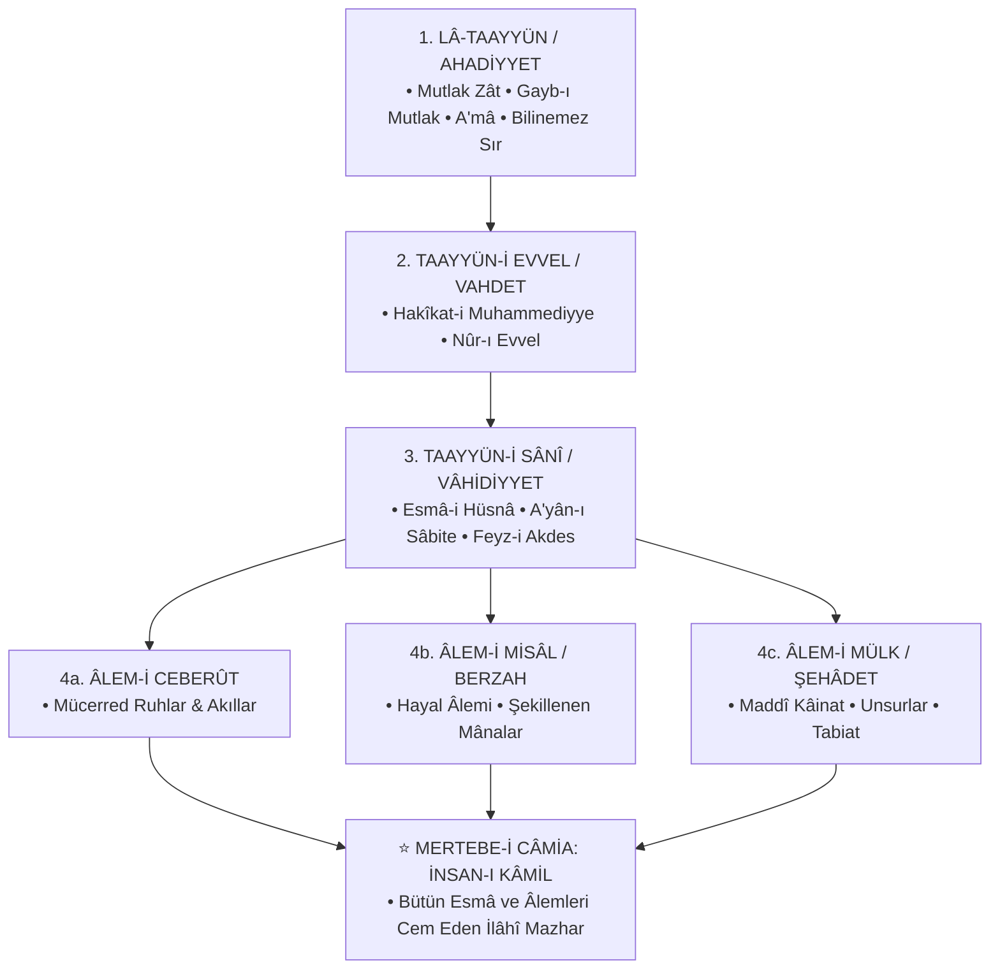

<div align="center">


<br/><br/>

[](https://github.com/arch-yunus/ibn-arabi-studies)
[](LICENSE)
[](texts/)
[](docs/ontology-maps.md)
[](https://github.com/arch-yunus/ibn-arabi-studies)

<br/>

> *«Biz öyle bir topluluğuz ki; sözlerimiz mecaz değil, doğrudan zevk ve keşif mahsulüdür. Dalgaların yüzeyine bakan köpük görür, dibe dalan ise incileri derer.»*  
> — **Muhyiddin İbnü'l-Arabî (eş-Şeyhü'l-Ekber / H. 560–638 / M. 1165–1240)**

</div>

---

## 📑 İçindekiler
1. [Külliyatın Vizyonu ve Mahiyeti](#-külliyatın-vizyonu-ve-mahiyeti)
2. [Ekberî Ontoloji Haritası & Merâtibü'l-Vücûd](#-ekberî-ontoloji-haritası--merâtibül-vücûd)
3. [Eserlerinden Doğrudan Alıntılar ve Metin Tahlilleri](#-eserlerinden-doğrudan-alıntılar-ve-metin-tahlilleri)
   - [*Fusûsü'l-Hikem* Seçkileri](#1-fusûsül-hikem-seçkileri)
   - [*el-Fütûhâtü'l-Mekkiyye* Seçkileri](#2-el-fütûhâtül-mekkiyye-seçkileri)
   - [*Tercümânü'l-Eşvâk* ve Şerhi](#3-tercümânül-eşvâk-ve-şerhi)
   - [*Risâletü'l-Vücûd & Kitâbü'l-İsfâr*](#4-risâletül-vücûd--kitâbül-isfâr)
4. [Fusûsü'l-Hikem: 27 Peygamber ve Hikmet Matrisi](#-fusûsül-hikem-27-peygamber-ve-hikmet-matrisi)
5. [Tarihsel ve Felsefî Tanıklıklar](#-tarihsel-ve-felsefî-tanıklıklar)
   - [Şârihler & İrfânî Gelenek (Ekberîlik)](#1-şârihler-ve-irfân-geleneği)
   - [Kelâmî, Fıkhî ve Selefî Eleştiriler](#2-kelâmî-fıkhî-ve-selefî-eleştiriler)
   - [Modern Akademik & Karşılaştırmalı Okumalar](#3-modern-ve-çağdaş-felsefî-okumalar)
6. [Temel Kavramlar Sözlüğü (*Istılâhât-ı Sûfiyye*)](#-temel-kavramlar-sözlüğü-ıstılâhât-ı-sûfiyye)
7. [Karşılaştırmalı Felsefe (Doğu-Batı)](#-karşılaştırmalı-felsefe-doğu-batı)
8. [Depo Dizin Mimarisi](#-depo-dizin-mimarisi)
9. [İnteraktif CLI Araştırma Aracı (`tools/ekber_cli.py`)](#-interaktif-cli-araştırma-aracı-toolsekber_clipy)
10. [Akademik Müfredat ve Bibliyografya](#-akademik-müfredat-ve-bibliyografya)
11. [Katkı Protokolü & Lisans](#-katkı-protokolü--lisans)

---

## 🏛️ Külliyatın Vizyonu ve Mahiyeti

`ibn-arabi-studies`, Endülüslü büyük metafizikçi, mutasavvıf ve arif **Muhyiddin İbnü'l-Arabî**'nin (*eş-Şeyhü'l-Ekber*) metafizik sistemini, kavram dağarcığını, eserlerini ve Doğu-Batı düşüncesindeki yankılarını dizinlemek amacıyla kurgulanmış kapsamlı bir açık kaynak araştırma projesidir.

Proje; klasik şerh geleneğini (*Sadreddin Konevî, Dâvûd-i Kayserî, Abdürrezzâk el-Kâşânî*), felsefî/kelâmî tenkitleri (*İbn Teymiyye, İbn Haldun*) ve modern akademik literatürü (*Chittick, Corbin, Izutsu, Addas*) tek bir çatı altında toplamayı amaçlar.

---

## 🧭 Ekberî Ontoloji Haritası & Merâtibü'l-Vücûd

Ekberî düşünce, varlığın birliği (*Vahdet-i Vücûd*) ve bu tek hakikatin farklı tecelli mertebelerinde (*Merâtibü'l-Vücûd*) zuhur etmesi temeline dayanır:



> 📌 *Dairelerin İnşası (*İnşâü'd-Devâir*) ve Nefes-i Rahmânî şemaları için [docs/ontology-maps.md](docs/ontology-maps.md) dosyasına bakabilirsiniz.*

---

## 📜 Eserlerinden Doğrudan Alıntılar ve Metin Tahlilleri

### 1. *Fusûsü'l-Hikem* Seçkileri

#### 🪞 Âdem Kelimesindeki İlahi Hikmet (*Fass-ı Hikmet-i İlâhiyye*)
> *"Hakk, isimlerinin ve sıfatlarının tecellilerini bütünüyle göreceği kuşatıcı bir varlık dilediğinde âlemi yarattı. Fakat âlem, içinde ruh bulunmayan cilalanmamış bir ayna gibiydi. Âdem'in var edilmesiyle o ayna cilalandı; Âdem, o aynanın cilası ve o suretin ruhu oldu."*  
> — *Fusûsü'l-Hikem, Fasl I* • [Metin Analizi](texts/fusus-al-hikam/01-fass-adem-hikmet-i-ilahiyye.md)

#### 🌊 Nûh Kelimesindeki Tenzihî Hikmet (*Fass-ı Hikmet-i Sübbûhiyye*)
> *"Bil ki tenzih ehli, Hakk'ı sınırlandırmış ve mukayyet kılmıştır. Teşbih ehli de O'nu sınırlandırmıştır. Hakiki arif ise hem tenzih hem teşbihi cem eder: 'O'nun benzeri hiçbir şey yoktur (Tenzih) ve O her şeyi işiten ve görendir (Teşbih).' (Şûrâ, 42/11)"*  
> — *Fusûsü'l-Hikem, Fasl III* • [Metin Analizi](texts/fusus-al-hikam/03-fass-nuh-hikmet-i-subbuhiyye.md)

#### 🏔️ İsmâil Kelimesindeki Yücelik Hikmeti (*Fass-ı Hikmet-i Aliyye*)
> *"Rab, kulun kulluğu (ubûdiyyeti) ile zâhir olur; kul ise Rabbin rubûbiyyeti ile kâimdir. Eğer O olmasaydı biz var olamazdık; eğer biz olmasaydık O'nun isimlerinin tecellisi zâhir olmazdı."*  
> — *Fusûsü'l-Hikem, Fasl VI* • [Metin Analizi](texts/fusus-al-hikam/07-fass-ismail-hikmet-i-aliyye.md)

#### 🌙 Yûsuf Kelimesindeki Nûrânî Hikmet (*Fass-ı Hikmet-i Nûriyye*)
> *"Hz. Peygamber buyurdu: 'İnsanlar uykudadırlar, öldükleri zaman uyanırlar.' İşte bu dünya hayatı baştan başa bir uykudur; içinde görülen şeyler rüyadır. Suretlerin asıl mânaya bağlanması tevil ilmidir."*  
> — *Fusûsü'l-Hikem, Fasl IX* • [Metin Analizi](texts/fusus-al-hikam/09-fass-yusuf-hikmet-i-nuriyye.md)

#### ❤️ Şuayb Kelimesindeki Kalbî Hikmet (*Fass-ı Hikmet-i Kalbiyye*)
> *"Kalp, Hakk'ın tecellilerinin genişliğine göre genişler ve daralır; çünkü tecellide tekrar yoktur (**Lâ tekrâra fi't-tecellî**). Arif kişinin kalbi tek bir inancın kalıbına hapsolmaz. Hakk hangi surette tecelli ederse O'nu o surette tanır."*  
> — *Fusûsü'l-Hikem, Fasl XII* • [Metin Analizi](texts/fusus-al-hikam/12-fass-suayb-hikmet-i-kalbiyye.md)

#### 🕊️ Îsâ Kelimesindeki Nebevî Hikmet (*Fass-ı Hikmet-i Nebeviyye*)
> *"Hz. Îsâ'nın zuhuru, Cebrail'in Hz. Meryem'e üflediği nefes ile gerçekleşti. Bu nefes, Rahmân'ın kâinata varlık veren nefesinin (Nefes-i Rahmânî) cüz'î bir mazharıdır. Onda diriltme (ihyâ) sırrı baskındır."*  
> — *Fusûsü'l-Hikem, Fasl XV* • [Metin Analizi](texts/fusus-al-hikam/15-fass-isa-hikmet-i-nebeviyye.md)

#### 👑 Muhammed Kelimesindeki Ferdiyyet Hikmeti (*Fass-ı Hikmet-i Ferdiyye*)
> *"Hz. Muhammed'in hikmeti Ferdiyyet'tir; çünkü o varlığın ilk taayyünü ve insan türünün en kâmil mazharıdır. 'Bana dünyanızdan üç şey sevdirildi: Kadın, güzel koku ve namaz.' Kadın mazharında Hakk'ı müşahede etmek, O'nu hem fâil hem kâbil olarak temaşadır."*  
> — *Fusûsü'l-Hikem, Fasl XXVII* • [Metin Analizi](texts/fusus-al-hikam/27-fass-muhammed-hikmet-i-ferdiyye.md)

---

### 2. *el-Fütûhâtü'l-Mekkiyye* Seçkileri

- 🕊️ **Bab 1:** [Marifet-i Rûh ve Kâbe'deki Ruhanî Karşılaşma](texts/futuhat-al-makkiyya/bab-001-marifet-i-ruh.md) — *«Ben konuşan Kâbe'yim; varlığın sırrıyım.»*
- 🌌 **Bab 63:** [Âlem-i Hayâl ve Kesretin Gölge Tabiatı](texts/futuhat-al-makkiyya/bab-063-alem-i-hayal-ve-kesret.md) — *«Sen bir hayalsin; senin dışında var sandığın her şey de hayal içinde hayaldir.»*
- 🌬️ **Bab 198:** [Nefes-i Rahmânî ve Harflerin Kozmik Mahreçleri](texts/futuhat-al-makkiyya/bab-198-nefes-i-rahmani-ve-huruf.md) — *«Kâinat, Hakk'ın telaffuz ettiği bitimsiz bir kelimeler manzumesidir.»*
- ⏳ **Bab 390:** [Zamanın Hakikati ve Ân-ı Dâim](texts/futuhat-al-makkiyya/bab-390-zaman-ve-an-i-daim.md) — *«Zaman, tecelli ile arandaki nisbettir. Gerçekte olan yalnızca Ân-ı Dâim'dir.»*
- 📜 **Bab 558:** [Sâliklere Vasiyetler ve Şeriatın Korunması](texts/futuhat-al-makkiyya/bab-558-vasiyetler-ve-nasihatler.md) — *«Zâhir şeriatı korumayanın bâtın hakikati zındıklıktır.»*

---

### 3. *Tercümânü'l-Eşvâk* ve Şerhi

> *«Kalbim her sûreti kabul eder bir hâle geldi;  
> Ceylanların otlağı, keşişlerin manastırı,  
> Putların tapınağı, hacıların Kâbe'si,  
> Tevrat'ın levhaları ve Kur'ân'ın mushafı...  
> Ben aşk dinine tâbiyim; aşkın kervanı nereye yönelirse,  
> İşte benim dinim ve imanım odur.»*  
> — [11. Kaside Metni ve Zehâirü'l-A'lâk Şerhi](texts/tarjuman-al-ashwaq/kaside-11-kalbin-evrenselligi-ve-sehri.md)

---

### 4. *Risâletü'l-Vücûd & Kitâbü'l-İsfâr*

- 🌿 [Risâletü'l-Vücûd](texts/minor-treatises/risaletu-l-vucud.md): *«Sen ne O'sun ne de O'ndan gayrısın. Varlık ancak Hakk'ın Vücûdudur.»*
- 🚶‍♂️ [Kitâbü'l-İsfâr](texts/minor-treatises/kitabu-l-isfor-an-netaic-il-esfar.md): Üç Büyük Sefer (*Hakk'a Sefer, Hakk'ta Sefer, Hakk'tan Halka Sefer*).
- 🌳 [Şeceretü'l-Kevn](texts/minor-treatises/seceretu-l-kevn.md) • ⭕ [İnşâü'd-Devâir](texts/minor-treatises/insau-d-devair.md) • ✨ [Hilyetü'l-Abdâl](texts/minor-treatises/huliyyetu-l-abdal.md).

---

## 🧩 Fusûsü'l-Hikem: 27 Peygamber ve Hikmet Matrisi

| # | Peygamber / Fass | Temsil Ettiği Hikmet | Temel Teolojik / Ontolojik Mesele | Doküman |
| :---: | :--- | :--- | :--- | :---: |
| 1 | **Hz. Âdem** | Hikmet-i İlâhiyye | Âlemin yaratılışı, ayna metaforu ve hilafet | [Metin & Şerh](texts/fusus-al-hikam/01-fass-adem-hikmet-i-ilahiyye.md) |
| 2 | **Hz. Şît** | Hikmet-i Nefsiyye | Hibe, bağış ve ilahi isimlerin sırları | [Fusûs Dizini](texts/fusus-al-hikam/README.md) |
| 3 | **Hz. Nûh** | Hikmet-i Sübbûhiyye | Tenzih ve teşbih dengesi; tevhîdin kuşatıcılığı | [Metin & Şerh](texts/fusus-al-hikam/03-fass-nuh-hikmet-i-subbuhiyye.md) |
| 4 | **Hz. İdrîs** | Hikmet-i Kuddûsiyye | Yücelik (*Ulüvv*) mertebesi ve mekânsal tenzih | [Fusûs Dizini](texts/fusus-al-hikam/README.md) |
| 5 | **Hz. İbrâhîm** | Hikmet-i Müheymiyye | Aşkta fena hali ve ilahi dostluk (*Hullet*) | [Fusûs Dizini](texts/fusus-al-hikam/README.md) |
| 6 | **Hz. İshâk** | Hikmet-i Hakkiyye | Rüyaların tabiri ve kurban sırrı | [Fusûs Dizini](texts/fusus-al-hikam/README.md) |
| 7 | **Hz. İsmâil** | Hikmet-i Aliyye | Rıza makamı ve rubûbiyyet-ubûdiyyet ilişkisi | [Metin & Şerh](texts/fusus-al-hikam/07-fass-ismail-hikmet-i-aliyye.md) |
| 8 | **Hz. Yâkûb** | Hikmet-i Rûhiyyet | Dinî teslimiyet ve kalbî istikamet | [Fusûs Dizini](texts/fusus-al-hikam/README.md) |
| 9 | **Hz. Yûsuf** | Hikmet-i Nûriyye | Âlem-i Misâl, rüya ontolojisi ve suretler | [Metin & Şerh](texts/fusus-al-hikam/09-fass-yusuf-hikmet-i-nuriyye.md) |
| 10 | **Hz. Hûd** | Hikmet-i Ahadiyye | Sırat-ı müstakîm ve her varlığın perçeminden tutulması | [Fusûs Dizini](texts/fusus-al-hikam/README.md) |
| 11 | **Hz. Sâlih** | Hikmet-i Fethiyye | İlahi fethin açılışı ve mucizenin hakikati | [Fusûs Dizini](texts/fusus-al-hikam/README.md) |
| 12 | **Hz. Şuayb** | Hikmet-i Kalbiyye | Kalbin değişkenliği ve tecellide tekrar olmaması | [Metin & Şerh](texts/fusus-al-hikam/12-fass-suayb-hikmet-i-kalbiyye.md) |
| 13 | **Hz. Lût** | Hikmet-i Melekiyye | Kudret, tasarruf ve acziyet dengesi | [Fusûs Dizini](texts/fusus-al-hikam/README.md) |
| 14 | **Hz. Üzeyr** | Hikmet-i Kadriyye | Kader sırrı ve a‘yân-ı sâbite istidatları | [Fusûs Dizini](texts/fusus-al-hikam/README.md) |
| 15 | **Hz. Îsâ** | Hikmet-i Nebeviyye | Nefes-i Rahmânî ile dirilme ve kelime sırrı | [Metin & Şerh](texts/fusus-al-hikam/15-fass-isa-hikmet-i-nebeviyye.md) |
| 16 | **Hz. Süleymân** | Hikmet-i Rahmâniyye | Rahmaniyet ve Rahimiyet; mülk ve tasarruf | [Fusûs Dizini](texts/fusus-al-hikam/README.md) |
| 17 | **Hz. Dâvûd** | Hikmet-i Vücûdiyye | Hilafet, demirin yumuşatılması ve hüküm | [Fusûs Dizini](texts/fusus-al-hikam/README.md) |
| 18 | **Hz. Yûnus** | Hikmet-i Nefesiyye | Tabiatın karanlığı ve balığın karnındaki tesbih | [Fusûs Dizini](texts/fusus-al-hikam/README.md) |
| 19 | **Hz. Eyyûb** | Hikmet-i Gaybiyye | Bela, sabır ve su ile arınmanın şifası | [Fusûs Dizini](texts/fusus-al-hikam/README.md) |
| 20 | **Hz. Yahyâ** | Hikmet-i Celâliyye | İlahi isimlerin celali ve bekâ hali | [Fusûs Dizini](texts/fusus-al-hikam/README.md) |
| 21 | **Hz. Zekeriyyâ** | Hikmet-i Mâlikiyye | İhtiyarlıkta gelen rahmet ve varlık bağışı | [Fusûs Dizini](texts/fusus-al-hikam/README.md) |
| 22 | **Hz. İlyâs** | Hikmet-i İnsiyye | Tabiat ile akıl arasındaki denge | [Fusûs Dizini](texts/fusus-al-hikam/README.md) |
| 23 | **Hz. Lokmân** | Hikmet-i İhsâniyye | Şirkten arınma ve hikmetin derinliği | [Fusûs Dizini](texts/fusus-al-hikam/README.md) |
| 24 | **Hz. Hârûn** | Hikmet-i İmâmiyye | Surete tapınma uyarısı ve rahmetin önceliği | [Fusûs Dizini](texts/fusus-al-hikam/README.md) |
| 25 | **Hz. Mûsâ** | Hikmet-i Ulviyye | Firavun ile münazara, asâ mucizesi ve tecellî | [Fusûs Dizini](texts/fusus-al-hikam/README.md) |
| 26 | **Hz. Hâlid b. Sinân** | Hikmet-i Samediyye | Berzah âleminin haberleri | [Fusûs Dizini](texts/fusus-al-hikam/README.md) |
| 27 | **Hz. Muhammed (s.a.v.)** | Hikmet-i Ferdiyye | Varlığın gayesi, üç şeyin sevdirilmesi ve Hatm-i Nübüvvet | [Metin & Şerh](texts/fusus-al-hikam/27-fass-muhammed-hikmet-i-ferdiyye.md) |

---

## 💬 Tarihsel ve Felsefî Tanıklıklar

### 1. Şârihler ve İrfân Geleneği

| Müellif | Dönem / Ekol | Beyan / Değerlendirme |
| :--- | :--- | :--- |
| **Sadreddin Konevî** | 13. yy / Doğrudan Talebesi | *"Şeyhimiz İbnü'l-Arabî, ilahî marifetlerin nihayetine ermiş, zâhir ve bâtın ilimlerini cem etmiş bir tahkik sultanıdır."* |
| **Dâvûd-i Kayserî** | 14. yy / Osmanlı İlk Müderrisi | *"Şeyhü'l-Ekber'in eserleri, varlığın mertebelerini ve hakikatini açıklayan ilahi nurlardır. Onun ıstılahlarını anlamadan metafizik tahsil edilemez."* |
| **Abdürrezzâk el-Kâşânî** | 14. yy / Ekberî Şârih | *"O, hakikatin sırlarını harflerin libasına bürüyerek nâehle perdelemiş; basiret sahiplerine ise marifet kapılarını ardına kadar açmıştır."* |
| **Molla Câmî** | 15. yy / Şair & Filozof | *"Fusûs'un her bir kelimesi, ledünnî bir deryadan fışkıran hikmet pınarıdır."* |
| **İbn Âbidîn** | 19. yy / Hanefî Fakihi | *"Şeyh Muhyiddin kâmil bir velidir. Zahirine bakıp hüküm vermek avam için caiz değildir; lakin ona taan etmek de hüsrandır."* |

---

### 2. Kelâmî, Fıkhî ve Selefî Eleştiriler

> *"Fusûsü'l-Hikem ve el-Fütûhât'ta yer alan pek çok ibare dinin zahir naslarına muhaliftir. 'Varlık birdir' iddiası Yaratan ile yaratılanı bir kılan tehlikeli bir ilhaddır."*  
> — **Takıyyüddin İbn Teymiyye** (*Mecmûu'l-Fetâvâ*) • [Eleştiri Analizi](scholarship/critique-and-defense/ibn-teymiyye-ve-selefi-elestiriler.md)

> *"Şeyh Muhyiddin büyük bir zekâ ve bilgi sahibidir; lâkin eserlerindeki sembolik ve muğlak ifadeler avamın itikadını zedeleyebilir. Ehil olmayanların mütalaası men edilmelidir."*  
> — **İbn Haldun** (*Şifâü's-Sâil*) • [İbn Haldun Analizi](scholarship/critique-and-defense/ibn-haldun-sifau-s-sail.md)

> *"Onun sözlerinin zahiri küfrü andırır; fakat tasavvuf ehlinin kendilerine has ıstılahları vardır. Kendisini tekfir etmekten sakınmak en selametli yoldur."*  
> — **İbn Hacer el-Askalânî** • [Müdafaanâmeler](scholarship/critique-and-defense/ekberi-mudafaanameler.md)

---

### 3. Modern ve Çağdaş Felsefî Okumalar

> *"İbnü'l-Arabî, insanlık tarihinin gördüğü en devasa sistem kuruculardan biridir. 'Vahdet-i Vücûd' ve 'Âlem-i Misâl' teorileri, Spinoza'nın töz kuramını ve Hegel'in diyalektiğini yüzyıllar öncesinden kuşatmıştır."*  
> — **Toshihiko Izutsu** (*Sufism and Taoism*)

> *"Şeyhü'l-Ekber'den sonra İslam dünyasında felsefe veya tasavvuf yapan hiç kimse, onun kurduğu kavramsal sözlüğü kullanmadan tek bir cümle dahi kuramamıştır."*  
> — **William Chittick** (*The Sufi Path of Knowledge*)

> *"İbnü'l-Arabî'nin 'Hayal Âlemi' (Mundus Imaginalis) kavramı olmaksızın, Doğu'nun tinsel coğrafyasını anlamak imkânsızdır."*  
> — **Henry Corbin** (*Creative Imagination in the Sufism of Ibn Arabi*)

---

## 📖 Temel Kavramlar Sözlüğü (*Istılâhât-ı Sûfiyye*)

| Kavram | Anlamı ve Ontolojik Karşılığı |
| :--- | :--- |
| **Vahdet-i Vücûd** | Varlığın ontolojik birliği; mutlak anlamda var olan yalnızca Hakk'tır, kesret O'nun tecellisidir. |
| **A‘yân-ı Sâbite** | Eşyanın henüz dış dünyada zuhur etmeden önce ilahi ilimdeki ezeli suretleri ve kabiliyetleri. |
| **İnsan-ı Kâmil** | Bütün ilahi isim ve sıfatların mazharı olan, âlemin manevi direği ve kâinatın gözbebeği insan. |
| **Nefes-i Rahmânî** | İlahi rahmetin mümkinata varlık kazandırması; harflerin ve suretlerin zuhur vasıtası. |
| **Âlem-i Misâl (Berzah)** | Ruhaniyet ile cismaniyet arasında köprü kuran, mânanın şekil aldığı ontolojik ara boyut. |
| **Hazarât-ı Hams** | Varlığın iniş ve çıkış sürecini tarif eden 'Beş İlahi Mertebe' (Zât, Sıfat, Melekût, Mülk, İnsan). |
| **Tecellî-i Dâim** | Tecellinin kesintisizliği; yaratılışın her an yeniden gerçekleşmesi (*Külli yevmin hüve fî şe'n*). |
| **Hakkü'l-Yakîn** | Varlık ikiliğinin tamamen ortadan kalktığı, tevhîdin bizzat zevk ve tecrübe ile bilindiği son makam. |

> 📌 *150+ kavramlık detaylı sözlük için [docs/terminology-glossary.md](docs/terminology-glossary.md) dosyasına bakabilirsiniz.*

---

## ⚖️ Karşılaştırmalı Felsefe (Doğu-Batı)

- ⚖️ [İbnü'l-Arabî & Spinoza](scholarship/comparative-philosophy/ibn-arabi-spinoza-monism.md): *Vahdet-i Vücûd* ile *Deus sive Natura* (Töz Monizmi / Panteizm) farkı.
- 🌲 [İbnü'l-Arabî & Heidegger](scholarship/comparative-philosophy/ibn-arabi-heidegger-being.md): Varlık Sorusu (*Seinsfrage*) ve *Vücûd-Mevcûd* ayrımı.
- 🎭 [İbnü'l-Arabî & C. G. Jung](scholarship/comparative-philosophy/ibn-arabi-jung-mundus-imaginalis.md): Âlem-i Misâl (*Mundus Imaginalis*) ve Arketipler.
- 🕯️ [İbnü'l-Arabî & Meister Eckhart](scholarship/comparative-philosophy/ibn-arabi-eckhart-mysticism.md): Mutlak Zât (*Gottheit*) ve Benliğin İfnası.

---

## 🗂️ Depo Dizin Mimarisi

```text
ibn-arabi-studies/
├── README.md                          # Ana vitrin rehberi, ontoloji ve dizin
├── LICENSE                            # MIT Lisansı
├── .gitignore                         # Git filtreleri
├── assets/
│   └── hero-banner.svg                # Vektörel vitrin bannerı
├── docs/
│   ├── ontology-maps.md               # Hazarât-ı Hams ve daire şemaları
│   ├── terminology-glossary.md        # Ekberî kavramlar sözlüğü
│   └── reading-curriculum.md          # 4 aşamalı araştırma ve okuma müfredatı
├── texts/
│   ├── fusus-al-hikam/                # 27 faslın analizi ve detaylı metinleri
│   ├── futuhat-al-makkiyya/           # Fütûhât babları (Bab 1, 63, 198, 390, 558)
│   ├── tarjuman-al-ashwaq/            # Şiirler ve Zehâirü'l-A'lâk şerhi
│   └── minor-treatises/               # Risâletü'l-Vücûd, İsfâr, Şecere, İnşâ
├── commentaries/                      # Konevî, Kayserî, Kâşânî, Nablusî, Bursevî
├── scholarship/
│   ├── comparative-philosophy/        # Spinoza, Heidegger, Jung, Eckhart
│   ├── critique-and-defense/          # İbn Teymiyye, İbn Haldun, Süyûtî, İbn Kemal
│   └── academic-bibliography.bib      # BibTeX formatında kaynakça
└── tools/
    └── ekber_cli.py                   # İnteraktif terminal sorgulama motoru
```

---

## 💻 İnteraktif CLI Araştırma Aracı (`tools/ekber_cli.py`)

Külliyatı terminal üzerinden hızlıca sorgulamak ve incelemek için Python CLI aracı geliştirilmiştir:

```bash
# 1. Kavram Sözlüğünde Arama Yap:
python tools/ekber_cli.py search nefes

# 2. Fusûs 27 Peygamber Listesini Filtrele:
python tools/ekber_cli.py fusus musa

# 3. Ontoloji Şemasını Terminalde Gör:
python tools/ekber_cli.py ontology
```

---

## 🎓 Akademik Müfredat ve Bibliyografya

Külliyatın anlaşılması için 4 aşamalı okuma programı tavsiye edilir:
1. **Giriş:** *Hilyetü'l-Abdal*, *Risâletü'l-Kuds*, Chittick (*Hayal Âlemi*), Izutsu (*Sufism and Taoism*).
2. **Kozmoloji:** *İnşâü'd-Devâir*, *Şeceretü'l-Kevn*, *Kitâbü'l-İsfâr*, *Tercümânü'l-Eşvâk*.
3. **Fusûs Şerhleri:** Kayserî Mukaddimesi, Konevî (*el-Fükûk*), Kâşânî Şerhi.
4. **Fütûhât:** 560 babın 6 büyük fasıl halinde mütalaası.  
👉 [Detaylı Müfredat](docs/reading-curriculum.md) • [BibTeX Kaynakçası](scholarship/academic-bibliography.bib)

---

## 🤝 Katkı Protokolü & Lisans

1. **Metin ve Tahkik:** Eklenen eser metinlerinde standart ve güvenilir tahkikli neşirlere sadık kalınmalıdır.
2. **Kavram Analizleri:** Yapılan tahlillerde Şeyh'in kendi şerh usulü ve ilk dönem şârihlerinin (*Konevî, Kayserî, Kâşânî*) metotları referans alınmalıdır.
3. **Lisans:** Bu depodaki tüm akademik derlemeler ve şerh notları açık irfanî araştırmaları desteklemek amacıyla [MIT Lisansı](LICENSE) kapsamında sunulmuştur.

<div align="center">

*"Hakikat bir deryadır; akıl kıyıda duran yolcu, keşif ise deryaya dalan dalgıçtır."*

</div>
