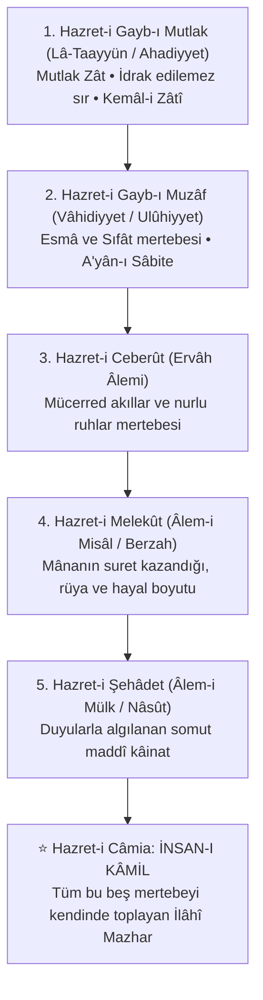

# 🌌 Ekberî Ontoloji Haritası ve Merâtibü'l-Vücûd

> *"Varlık birdir; mertebeler ise çoktur. Mertebelerin çokluğu varlığın birliğini bozmaz; nitekim bir ışık farklı renklerdeki camlardan geçerken renklenir ama ışığın kendisi ışıktır."*  
> — **Sadreddin Konevî, *Miftâhu'l-Gayb***

---

## 1. Hazarât-ı Hams (Beş İlâhî Hazret/Mertebe)

İbnü'l-Arabî metafiziğinde varlığın mutlak gaybdan şehâdet (maddî) âlemine doğru tenezzülü ve insanın bu mertebeleri idraki beş temel hazret (varlık düzlemi) üzerinden açıklanır:

---

## 2. Merâtibü'l-Vücûd Ayrıntılı Tablosu

| # | Mertebe | Arapça Karşılığı | Ontolojik Nitelik | Mazhar / Karşılık |
|---|---|---|---|---|
| **0** | **Lâ-Taayyün / Ahadiyyet** | مرتبة اللاتعين / الأحدية | Hiçbir sıfat ve nisbetle mukayyet olmayan Mutlak Zât. | Bilinemezlik (*Gayb-ı Mutlak*, *A'mâ*) |
| **1** | **Taayyün-i Evvel (Vahdet)** | التعين الأول / الحقيقة المحمدية | Zât'ın kendi zâtını ve kemâlâtını icmâlen müşahedesi. | *Hakîkat-i Muhammediyye*, *Nûr-ı Evvel* |
| **2** | **Taayyün-i Sânî (Vâhidiyyet)** | التعين الثاني / الواحدية | İlâhî isimlerin ve hakikatlerin mufassalan ayrışması. | *A'yân-ı Sâbite*, *Ulûhiyyet* |
| **3** | **Âlem-i Ervâh (Ceberût)** | عالم الأرواح / الجبروت | Maddeden ve zamandan münezzeh latîf ruhlar alanı. | Melekler, Akıllar, İnsanî Ruhlar |
| **4** | **Âlem-i Misâl (Melekût)** | عالم المثال / الملكوت | Maddesiz fakat suretli berzah boyutu; rüya hakikatleri. | Hayal-i Muttasıl / Münfasıl |
| **5** | **Âlem-i Şehâdet (Mülk)** | عالم الشهادة / الملك | Kesafet kazanmış, duyulur ve mekânsal cisimler âlemi. | Felekler, Elementler, Maden, Bitki, Hayvan |
| **6** | **Mertebe-i Câmia** | المرتبة الجامعة | Tüm ilâhî ve kevnî hakikatlerin aynası olan zirve mertebe. | **İnsan-ı Kâmil** |

---

## 3. Dairelerin İnşası ve Kozmik Devir

*İnşâü'd-Devâir* risalesinde tasvir edildiği üzere:
- **Kavs-i Nüzûl (İniş Yayı):** Mutlak Gayb'tan Ruhlar, Misâl ve Cisimler âlemine iniş.
- **Kavs-i Urûc (Çıkış Yayı):** Maddeden sülûk, tefekkür, fenâ ve bekâ makamlarıyla İnsan-ı Kâmil zirvesine dönüş. Daire böylece kemale erer.
