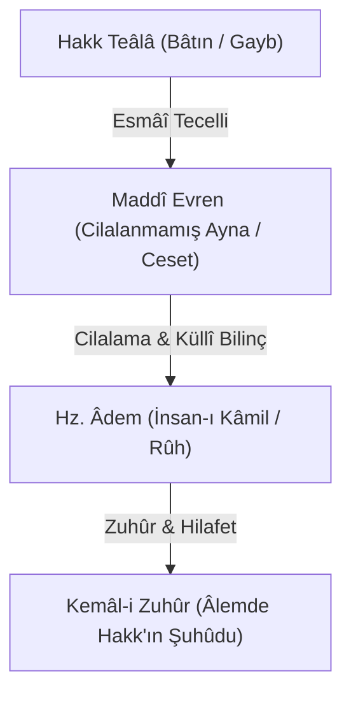

# 🪞 Fass-ı Hikmet-i İlâhiyye fî Kelimeti Âdem
### (Hz. Âdem Kelimesindeki İlâhî Hikmet)

> *«Âlem, içinde ruh bulunmayan cilalanmamış bir ayna gibiydi. Âdem'in yaratılmasıyla o ayna cilalandı; Âdem o aynanın cilası ve suretin ruhu oldu.»*  
> — **Muhyiddin İbnü'l-Arabî, *Fusûsü'l-Hikem***

---

## 📜 Orijinal Arapça Metin ve Seçkiler

### 1. Aynanın Cilalanması ve Âlemin Kemâli
```arabic
لَمَّا شَاءَ الحَقُّ سُبْحَانَهُ مِنْ حَيْثُ أَسْمَاؤُهُ الحُسْنَى الَّتِي لَا تُحْصَى أَنْ يَرَى أَعْيَانَهَا 
وَإِنْ شِئْتَ قُلْتَ: أَنْ يَرَى عَيْنَهُ فِي كَوْنٍ جَامِعٍ يَحْصُرُ الأَمْرَ كُلَّهُ لِكَوْنِهِ مُتَّصِفاً بِالوُجُودِ 
فَيُظْهِرُ بِهِ سِرَّهُ إِلَيْهِ... فَكَانَ كَمِرْآةٍ غَيْرِ مَجْلُوَّةٍ، فَكَانَ طَلَبُ الجِلاَءِ لِهَذِهِ المِرْآةِ 
وَكَانَ آدَمُ عَيْنَ جِلاَءِ تِلْكَ المِرْآةِ وَرُوحَ تِلْكَ الصُّورَةِ
```

> **Tercüme:**  
> *"Hakk Sübhânehu ve Teâlâ, sayıya gelmeyen güzel isimlerinin (el-Esmâü'l-Hüsnâ) a'yânını görmek dilediğinde —istersen şöyle de: Varlıkla vasıflanmış olması hasebiyle bütün işi kuşatan cami‘ (kapsayıcı) bir varlıkta Kendi Zâtını görmek ve böylece kendi sırrını Kendi Zâtına izhar etmek dilediğinde— kâinat henüz cilalanmamış bir ayna mesabesindeydi.  
> Bu aynanın cilalanması iktiza etti ve Âdem, o aynanın bizzat cilası ve o sûretin rûhu oldu."*

---

### 2. İnsan-ı Kâmil'in Yüzük Kaşı ve Mühür Olması
```arabic
فَكَانَ الْإِنْسَانُ عَيْنَ فَصِّ هَذَا الخَاتَمِ، وَالنَّقْشَ الَّذِي هُوَ الْعَلاَمَةُ الَّتِي بِهَا خَتَمَ المَلِكُ عَلَى خَزَائِنِهِ
فَمَا دَامَ هَذَا الخَاتَمُ فِيهَا، لَا يَجْسُرُ أَحَدٌ عَلَى فَتْحِهَا إِلَّا بِإِذْنِهِ
```

> **Tercüme:**  
> *"İnsan, bu varlık yüzüğünün kaşı ve melikin hazinelerini kendisiyle mühürlediği mühür nakşı oldu.  
> Bu mühür hazinede bulunduğu müddetçe, melikin izni olmaksızın hiç kimse o hazineyi açmaya cüret edemez."*

---

## 🔍 Tematik ve Ontolojik Şerh

### 1. Neden Kendi Zâtıyla Görmek Yetmedi?
İbnü'l-Arabî, *"Bir şeyin kendisini bizzat kendi nefsiyle görmesi ile, o şeyi kendisine ayna olan başka bir surette görmesi aynı şey değildir"* der.  
- **Gayb-ı Mutlak:** Hakk Zât'ında her türlü kesretten münezzehtir; ancak isimlerin zuhur etmesi, tecelli aynalarının varlığını gerektirir.
- **Cilalanmamış Ayna:** Maddî kâinat İnsan-ı Kâmil olmaksızın sadece kabataslak şekillenmiş, bilinci ve ilâhî idraki olmayan bir ceset gibidir.
- **Cila (Cilâ):** Âdem'in zuhuruyla ayna parlamış, Allah'ın her bir ismi bilinçli bir varlıkta tecelli imkânına kavuşmuştur.



---

## 💡 Şârih Notları ve Tahkik

### Sadreddin Konevî (*el-Fükûk fî Esrâri Müstenedâti Hikemi'l-Fusûs*):
> *"Bil ki Âdem fassı, kitabın fihristi ve kapısıdır. Şeyh burada bütün varlığın gayesinin İnsan-ı Kâmil'in zuhuru olduğunu ispat eder. Âdem, zâhirî cihetiyle âlemin bir cüz'ü iken, bâtınî ve hakiki cihetiyle bütün âlemin aslı ve manevi direğidir."*

### Dâvûd-i Kayserî (*Matla‘u Husûsi'l-Kelim*):
> *"Âlemin yaratılışı cesedin yaratılışı gibidir; İnsan-ı Kâmil'in yaratılışı ise o cesede ruh üflenmesi gibidir. Ruhsuz ceset çürümeye mahkûm olduğu gibi, İnsan-ı Kâmil'den mahrum bir âlem de bekâ bulamaz."*

### Abdürrezzâk el-Kâşânî (*Şerhu Fusûsi'l-Hikem*):
> *"Cilalanmamış ayna istidattır, cila ise fiilî zuhûrdur. Âdem ile kastedilen kuru beden değil; Esmâ-i İlâhiyye'nin tamamını idrak ve izhar eden İlahî Halife'dir."*
