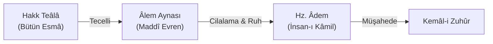

# 🪞 Fass-ı Hikmet-i İlâhiyye fî Kelimeti Âdem
### (Hz. Âdem Kelimesindeki İlâhî Hikmet)

---

## 📜 Orijinal Metin ve Seçki

> *"Hakk Teâlâ, güzel isimlerinin (el-Esmâü'l-Hüsnâ) hükümlerini bütünüyle göreceği kuşatıcı bir varlık içinde Zât'ını müşahede etmeyi diledi. Zira bir şeyin kendisini bizzat kendi nefsiyle görmesi ile, o şeyi kendisine ayna olan başka bir surette görmesi aynı şey değildir...  
> Âlem, içinde ruh bulunmayan cilalanmamış bir ayna gibi yaratılmıştı. Âdem'in yaratılmasıyla o ayna cilalandı. Âdem, o aynanın cilası ve o suretin ruhu oldu."*

---

## 🔍 Tematik Analiz ve Şerh

### 1. Cilalanmamış Ayna ve Âlemin Yaratılışı
İbnü'l-Arabî'ye göre kâinat yaratıldığında henüz eksik bir suret idi; çünkü ilâhî isimlerin tamamını kendinde toplayan ve bilinçle yansıtan bir odak yoktu. Âdem (İnsan-ı Kâmil), bütün isimlerin (*esmâ-i hüsnâ*) mazharı olarak yaratıldığında âlem aynası cilalanmış ve ilâhî tecellileri göstermeye ehil hale gelmiştir.

### 2. Hilâfetin Sırrı
İnsanın yeryüzünde Allah'ın halifesi olması, bedenî gücünden değil; ilâhî sıfatları kendisinde en yüksek düzeyde taşıyabilme kabiliyetinden kaynaklanır.

---

## 💡 Şârih Notları (Sadreddin Konevî - *el-Fükûk*)
> *"Âdem fassı, kitabın fihristi ve anahtarıdır. Şeyh burada bütün varlığın gayesinin İnsan-ı Kâmil'in zuhuru olduğunu ispat eder. İnsan olmasaydı kâinat, başsız bir ceset ve ışıksız bir gece gibi kalırdı."*
