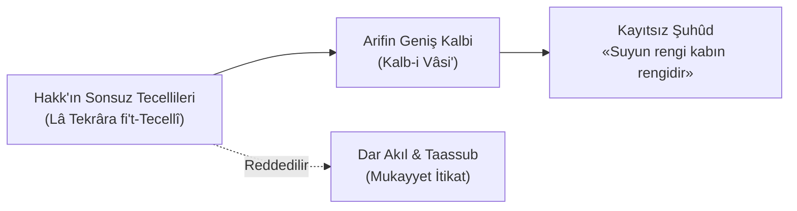

# ❤️ Fass-ı Hikmet-i Kalbiyye fî Kelimeti Şuayb
### (Hz. Şuayb Kelimesindeki Kalbî Hikmet)

> *«Kalp, Hakk'ın tecellilerinin genişliğine göre genişler ve şekil alır; zira tecellide tekrar yoktur (**Lâ tekrâra fi't-tecellî**). Ârifin kalbi tek bir itikadın düğümüne hapsolmaz.»*  
> — **Muhyiddin İbnü'l-Arabî, *Fusûsü'l-Hikem***

---

## 📜 Orijinal Arapça Metin ve Seçkiler

### 1. Kalbin Kuşatıcılığı ve Kudsî Hadis
```arabic
وَاعْلَمْ أَنَّ الْقَلْبَ — أَعْنِي قَلْبَ العَارِفِ بِاللهِ — هُوَ مِنْ رَحْمَةِ اللهِ، وَهُوَ أَوْسَعُ مِنْهَا، 
فَإِنَّهُ يَسَعُ الحَقَّ جَلَّ جَلاَلُهُ، وَرَحْمَتُهُ لَا تَسَعُهُ... 
وَقَدْ وَرَدَ فِي الخَبَرِ الصَّحِيحِ: «مَا وَسِعَنِي أَرْضِي وَلاَ سَمَائِي وَلَكِنْ وَسِعَنِي قَلْبُ عَبْدِيَ المُؤْمِنِ»
```

> **Tercüme:**  
> *"Bil ki kalp —yani Allah'ı hakkıyla bilen arifin kalbi— Allah'ın rahmetindendir; hattâ rahmetten de daha geniştir. Zira arifin kalbi Hakk Teâlâ'yı sığdırır; halbuki Allah'ın rahmeti O'nun Zâtını içine alamaz...  
> Sahih haberde şöyle buyrulmuştur: **«Beni ne yerim ne de göğüm kuşatabildi; fakat mümin kulumun kalbi Beni kuşattı (içine aldı).»**"*

---

### 2. Kalbin Değişkenliği (*Takallüb*) ve Suyun Rengi
```arabic
فَالقَلْبُ يَتَقَلَّبُ بِتَقَلُّبِ التَّجَلِّي، وَالتَّجَلِّي يَتَنَوَّعُ بِتَنَوُّعِ الصُّوَرِ، 
فَالعَارِفُ يَعْرِفُ الحَقَّ فِي كُلِّ صُورَةٍ، كَمَا قَالَ سَيِّدُنَا الجُنَيْدُ رَضِيَ اللهُ عَنْهُ: 
«لَوْنُ المَاءِ لَوْنُ إِنَائِهِ»
```

> **Tercüme:**  
> *"Kalp, tecellinin dönüşmesiyle halden hale dönüşür (*takallüb*); tecelli ise suretlerin çeşitlenmesiyle çeşitlenir.  
> Bu sebeple hakiki arif, Hakk'ı her surette tanır; nitekim Seyyidimiz Cüneyd-i Bağdâdî (r.a.) şöyle buyurmuştur:  
> **«Suyun rengi, içinde bulunduğu kabın rengidir!»**"*

---

## 🔍 Tematik ve Ontolojik Şerh

### 1. Kalbin Etimolojisi ve İrfânî Anlamı
Arapça'da **el-Kalb (القلب)**, kök itibariyle "evrilmek, dönmek, başkalaşmak (*inkılâb/takallüb*)" demektir.  
Akıl (*el-Akl*), kök anlamı olan "bağlamak (*ikâl*)" fiilinden geldiği için Tanrı'yı kayıt altına almaya ve bir tanıma hapsetmeye çalışır. Kalp ise hiçbir tanım ve sınırla mukayyet olmaksızın, Hakk'ın her lahzada beliren yeni bir tecellisini (*Halk-ı Cedîd*) olduğu gibi kabul eder.

### 2. İtikadî Düğümler (*Ukad*) ve Tevhidin Zirvesi
- **Mukayyet İtikat (Kayıtlı İnanç):** İnsanların çoğu Hakk'ı kendi zihinlerinde kurguladıkları bir ilah suretinde (*el-İlâhü'l-Mu'tekad*) tasavvur eder ve bu kalıbın dışındaki her tecelliyi inkâr eder.
- **Mutlak Marifet:** Kâmil arif ise, suyun berraklığı gibi renksizdir; hangi kaba konursa o kabın suretini alır, fakat hiçbir kaba hapsolmaz.



---

## 💡 Şârih Notları ve Tahkik

### Sadreddin Konevî (*el-Fükûk*):
> *"Şuayb fassının esası kalptir. Zira kalp, nefs-i nâtıkanın Hakk'a bakan yüzüdür. Kalbin istidadı sonsuzdur; çünkü tecellide sınır yoktur. Tecelli sonsuz olunca, kabın da sonsuz bir genişleme kabiliyetine sahip olması gerekir."*

### Dâvûd-i Kayserî (*Matla‘u Husûsi'l-Kelim*):
> *"Cüneyd'in 'suyun rengi kabın rengidir' sözü, vahdet-i vücûdun en veciz formülüdür. Su zâtında renksizdir; cam kırmızı ise kırmızı, mavi ise mavi görünür. Hakk Teâlâ da zâtında kayıtsızdır; kulun istidadı ve inancı ne ise o veçheden tecelli eder."*
