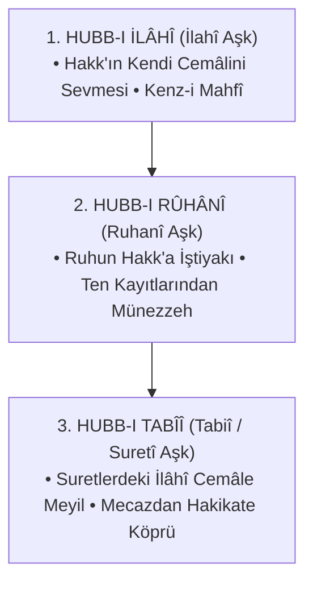

# 🌹 el-Fütûhâtü'l-Mekkiyye: Bab 178 — Bâbü'l-Muhabbe (Aşk Makamı)

> *«Bil ki sevgi öyle bir makamdır ki, onun hakikatine ancak sevgilide yok olanlar erer. Varlık muhabbet ile zâhir oldu; eğer muhabbet olmasaydı hiçbir şey varlık kokusunu koklayamazdı.»*  
> — **Muhyiddin İbnü'l-Arabî, *el-Fütûhâtü'l-Mekkiyye*, Cilt II, Bab 178**

---

## 📜 Orijinal Arapça Metinler ve Şiirler

### 1. Aşkın Varlık İlleti Olması
```arabic
لَوْلاَ الحُبُّ مَا عُبِدَ اللهُ، وَلَوْلاَ الحُبُّ مَا ظَهَرَ العَالَمُ... 
فَالحُبُّ هُوَ أَصْلُ الوُجُودِ، وَبِهِ قَامَ كُلُّ شَيْءٍ. 
قَالَ الحَقُّ فِي الحَدِيثِ الإِلَهِيِّ: «كُنْتُ كَنْزاً مَخْفِيّاً فَأَحْبَبْتُ أَنْ أُعْرَفَ، فَخَلَقْتُ الخَلْقَ فَبِي عَرَفُونِي»
```

> **Tercüme:**  
> *"Eğer sevgi olmasaydı Allah'a ibadet edilmezdi; eğer sevgi olmasaydı âlem asla zuhur etmezdi...  
> Sevgi varlığın aslıdır ve her şey onunla kâimdir.  
> Cenâb-ı Hakk kudsî hadiste şöyle buyurur: **«Ben gizli bir hazine idim; bilinmeyi sevdim (istedim), böylece mahlukatı yarattım; onlar da Beni Benimle bildiler.»**"*

---

### 2. Aşk Dini Kasidesi
```arabic
أَدِينُ بِدِينِ الْحُبِّ أَنَّى تَوَجَّهَتْ • رَكَائِبُهُ فَالْحُبُّ دِينِي وَإِيمَانِي
لَنَا أُسْوَةٌ فِي بِشْرِ هِنْدٍ وَأُخْتِهَا • وَقَيْسٍ وَلَيْلَى ثُمَّ مَيٍّ وَغَيْلاَنِ
```

> **Tercüme:**  
> *"Aşkın binekleri hangi yöne yönelirse yönelsin, ben aşk dinine tâbiyim; zira aşk benim dinim ve imanımdır!  
> Bizim için Bişr ile Hind'de ve onun kız kardeşinde, Kays ile Leylâ'da, sonra Mey ile Gaylân'da (aşkın fedakârlığında) ibretlik bir numune vardır."*

---

## 🧭 Muhabbetin Dört İlâhî İsmi

İbnü'l-Arabî, Kur'ân-ı Kerîm'de sevgi için kullanılan dört farklı kelimenin sırlarını şöyle açıklar:

1. **el-Hubb (الحُبّ):** Kalbin saflığı ve duruluğudur; sevgiye hiçbir garaz ve menfaatin karışmaması halidir. Tohum mânasına gelen *habb* ile akrabadır; varlık tohumunun kalbe ekilmesidir.
2. **el-Vüdd (الوُدّ):** Sevginin istikrar kazanması ve sebat etmesidir. Cenâb-ı Hakk'ın *el-Vedûd* isminin tecellisidir.
3. **el-Hevâ (الهَوَى):** Kalbe aniden düşen şiddetli meyil ve arzu cereyanıdır.
4. **el-Işk (العِشْق):** Sevginin âşığı sarmaşık gibi bütünüyle kuşatması, onu kendi varlığından soyup sevgilinin rengine büründürmesidir.

---

## 🌊 Aşkın Üç Büyük Ontolojik Mertebesi



### 1. Hubb-ı İlâhî (İlahî Aşk)
Hakk'ın Zâtını Zâtında sevmesi ve bu sevgi sebebiyle Kendi kemâlâtını isimler aynasında müşahede etmeyi dilemesidir. Yaratılışın ilk muharrik kuvveti bu zâtî aşktır.

### 2. Hubb-ı Rûhânî (Ruhanî Aşk)
Âşığın mâşukta fâni olması, kendi nefsinden hiçbir nasip ve lezzet aramamasıdır. Bu makamda seven, sevilenin muradından başka hiçbir murat beslemez.

### 3. Hubb-ı Tabîî (Tabiî ve Cismanî Aşk)
Gözün güzelliğe, kulağın nağmeye, kalbin güzel bir sûrete meyletmesidir. Ârif kişi bilir ki, kâinatta sevilen her güzel suret, aslında Mutlak Cemâl'in bir tecellisidir. *"Mecaz, hakikatin köprüsüdür."*

---

## 💎 Hakiki Âşıkların 7 Temel Alameti

İbnü'l-Arabî, Bab 178'de muhabbet ehlinin vasıflarını şöyle sıralar:

1. **İstirâk (Kendinden Geçme):** Sevgilinin zikri galebe çaldığında kendi varlığını unutmak.
2. **Gayret (Kıskançlık):** Sevgilinin gayrısına bakmaktan hicap duymak.
3. **Şevk-i Mütemâdî:** Sevgiliye kavuştuğunda dahi şevkinin eksilmemesi, bilakis artması.
4. **İsâr (Fedakârlık):** Kendi lezzetini sevgilinin rızasına feda etmek.
5. **Kemâl-i Teslimiyet:** Sevgiliden gelen kahrı da lütfu gibi tatlı bulmak.
6. **Sırrı Koruma (*Kitmân*):** Muhabbet sırrını nâ-ehle (yabancıya) ifşa etmemek.
7. **Lisan-ı Hâl:** Kelimeler tükendiğinde suskunluğun ve gözyaşının lisanıyla konuşmak.
